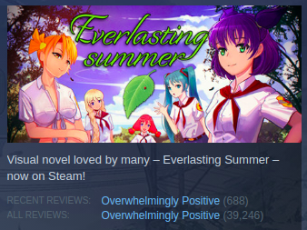
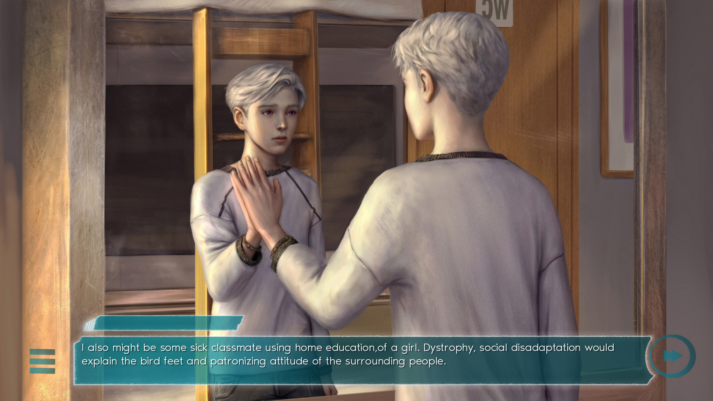
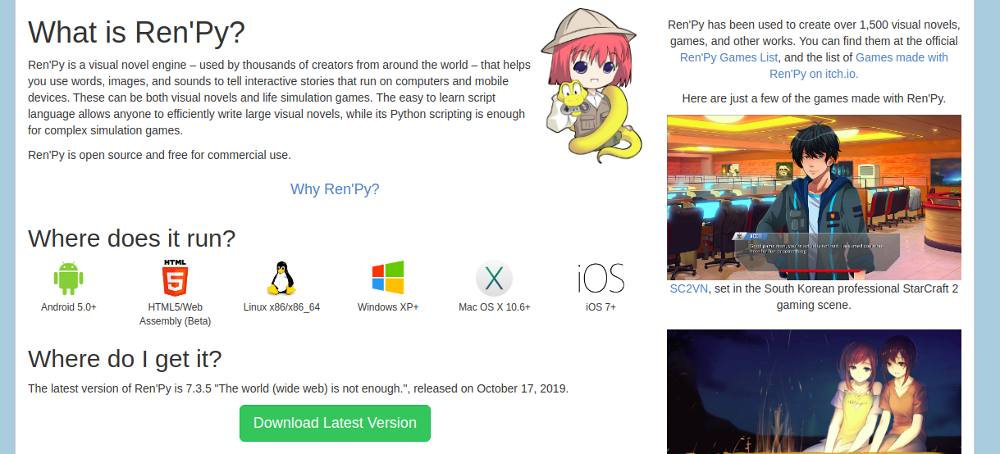
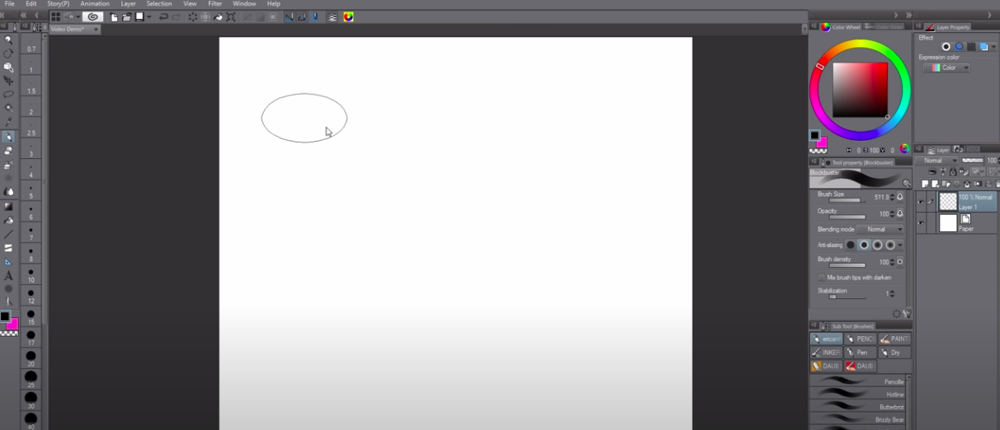
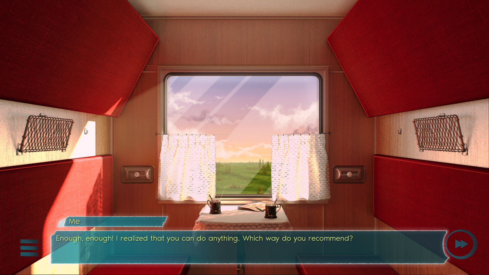
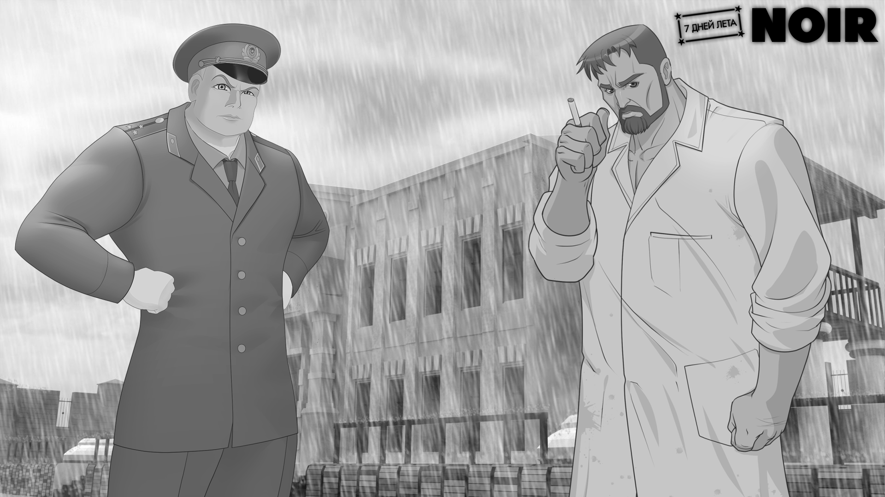

import SevenDays from "../../../src/components/products/steam/7days.js"

"7 summer days: Youth sky" is an upcoming free-to-play visual novel game, focused around the themes of dealing with regrets and growing older.

<SevenDays />

In this interview, he shares how you can create a visual novel game and how he went from being a modder to indie game developer.

## How did you get into game development?

That was a long time ago. Well, when I started creating games all I wanted is to tell some
stories. It's not about the game development process itself, you know. I am more about
writing than creating stuff so I'm unable to make a picture or compose a song. Of course
when I started, I was unable to create a playable build, so I had to learn all of it myself.
And here I am now -- scenario creator, sound/graphical designer and game
programmer.

## What motivated you to make your own game?

There was a game called Everlasting Summer that I used to play, that allowed players to
make their own modifications. So I started out by adding custom scenarios and stories.
One of these scenarios that I created was called 7 summer days and soon enough, it
started to become popular. Long story short: I've started as game modder and am now an
independent game developer.

*[Everlasting Summer](https://store.steampowered.com/app/331470/Everlasting_Summer/) is a very popular free-to-play visual novel game on Steam*

## What is the founding story of your company Sanati Tales?

There are no co-founders or employees except me. I would love to work with some of the
people who're responsible for creating Everlasting Summer, but they have nothing to do
with Sanati Tales at this point – it’s just me.

## What is this game about?

My game is about one unhappy and unlucky guy who got stuck in the past, while the entire
world around him is moving on. He has deep regrets because after becoming an adult, he
has felt that he had not lived out his childhood to the fullest. But he hasn't got a choice --
he has to be an adult and help his mother, who is supporting his gravely ill sister-in-law.
But something unexpected happens and so he finds himself in a mysterious place named
the “Old Road” - that’s where his quest begins.

The game is called "7 summer days: Youth Sky", because it's all about youth and
childhood. It's a visual novel, similar to the likes of Clannad, Everlasting Summer, Yume
Miru Kusuri, etc.

## How was the idea validated?

As an adult myself and someone who has had some regrets in their life, I really made the
game primarily for myself and others who can relate to this feeling. It's not really a “fun”
game as such, but I like to see it as a fairy tale for adults.

## Did any design issues and challenges come up?

Since my game is a visual novel, all I had to do was the writing, most of the other components I outsourced.

## What engine was used to develop the game and why?

I'm using the Ren'Py engine because it is free, very simple and really handy for any my
ideas. I'd say if you are a starting visual novel creator, choose Ren'py!

*[Ren'Py](https://www.renpy.org/) is free to use and open source*

## What were some of the hardest parts to implement?

The hardest part? Frankly, I do not know! I quite enjoy creating the different scenarios and
because that makes up most of the development, I’m enjoying it quite a lot. Since Ren'py
is based on the Python language, which I’m already quite familiar with, engineering wise it
is not too challenging for me to come up with an idea and implement it.

## Did you create tools that helped speed up development?

I developed some tools that enabled me to search for music and graphics much faster. It
wasn't that hard, the python language had a lot of native libraries what I needed to build
them.

## How did you come up with the art style for the game?

As a modder for Everlasting Summer, I would like to see the same style in my story, which
is why I hired the same artist. This is the main art design part. Other aspects of the visuals,
like the user interface and or game the scene composition, I've done by myself. Ultimately,
I am really happy with the fact that the game ended up looking exactly how I wanted it to.

## What tools were used to create art for the game?

I did some designing in a piece of software called Clip Studio, which I bought some years
ago, and some other art in Photoshop. As for what the artists used that I worked with, I am
not sure.

*[Clip Studio](https://www.clipstudio.net/de/) is primarily used for 2D Art, like Mangas or Cartoons*

## Were design systems used to ensure consistency for the look of the game?

Firts things first: I would suggest to create a base view that you use for the rest of the
scenes in the game, using software like Photoshop and make sure it will look good. Since
Ren'py is fully editable, the other parts are on you.

## What tools were used to develop the audio?

I did sound design in the free tool Audacity and ordered music from a freelance musician. I
made sure to have only one artist for this, to ensure that the music is consistent.

## How was the development funded?

They were funded purely from my own money. Fortunately I have some support from
patreon so I have some free funds to spare.

## What monetization strategies have you implemented or explored?

My monetization model based on buyable DLC. I want to create free to play game and if
people love it they will be able to support me via buying story expansions. So any obtained
money will be spent on further development.

## Were investments made to develop certain aspects of the game?

Totally yes. Since Sanati Tales is a one man studio, I'm happy to use freelancers (for art and
music mainly) -- I wouldn’t have been able to finish my game without their help. Fortunately, the people I'm working with are really talented, so I can rely on them 
to do a good job without me needing to give them much guidance. We've got April Rain as the musician, Dr.Smolev as the character artist and Batalist as level
designer.

## What strategies have been used to raise awareness for the game?

None. I have some people love my games so they will be come to see my new project.
Any other people are just free flow steam visitors.

## How did you manage and grow the community around your game?

I built the community around the modifications I made, all of them under the name 7 summer days, which people began to play quite a lot. That 
way, I was able to build a universe that people began to recognize and enjoy. Soon, I got
requests to create a sequel to the modificats, which lead me to making the standalone
game. That initial community has helped me ton, with people checking my scenario,
helping me spot and fix bugs, translating it to other languages like English, etc.... I guess
they just love 7 summer days universe. All I had to do was let them do their job.

*There are other games in the 7 Summer Days series developed by Sanati Tails, like [Noir](https://zlobs.itch.io/7-summer-days-noir)*

## What were some of the biggest lessons learned from the project?

The main lesson from this project is: if people are loving what you are making, let them
collaborate with you and get them involved by helping you in the project - they might
actually end up doing a lot of the work for you!

## What would have been done differently?

I wish that I had started developing my own game (instead of the modification) a lot
sooner!

## What is your advice to aspiring indie game developers?

If you are making a novel or narrative game, start with your story. You can lack good
graphics, music or mechanics/game design. But your players will forgive all that if your
story is good enough. And let the people create some user generated content (modification
as an example) and it will seriously increase the longevity of your game and its community.

