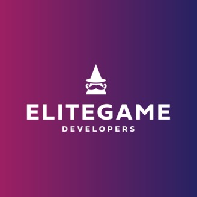

import {PodcastLinks} from "../../../src/components/podcast-links.js"

Podcasts are one of the most efficient ways to consume educational content, because they can be listened to during periods of time where you don't require 100% focus (while travelling, cleaning, etc.). We decided to create a list of the best podcasts that we have learned to love over the years, featuring the best game development advice, insights and interviews.

<PodcastLinks title={"Moonlight Game Devs"} 
applePodcastLink={"https://podcasts.apple.com/de/podcast/moonlight-game-devs/id1511553688"}
    googlePodcastLink={"https://podcasts.google.com/?feed=aHR0cHM6Ly9sZXRzY2FzdC5mbS9wb2RjYXN0cy9tb29ubGlnaHQtZ2FtZS1kZXZzLTEzNDViYTAxL2ZlZWQ&ep=14"}
    spotifyLink={"https://open.spotify.com/show/6aDR2KdCiwPoSySMphy2Ha?si=1Ct3IZSZRWCR4GwqGT_ltg"}
    rssLink={"https://letscast.fm/podcasts/moonlight-game-devs-1345ba01/feed"} />

You got us - this is a **shameless plug**! But then again, if we didn't think our own podcast was awesome, we wouldn't have recorded it, right? In this show, I 
have discussions with game developers on how they made their latest game. These discussions include the origin of the games company, the challenges they faced, what they learned while 
building the game and lots of other interesting and useful pieces of information for aspiring games company founders.

<PodcastLinks title={"Elite Game Developers"} 
applePodcastLink={"https://podcasts.apple.com/gb/podcast/elite-game-developers-podcast/id1463752909"}
    spotifyLink={"https://open.spotify.com/show/6CQO7qIVVQT5baHn3P0ZnS?si=zD7OOGTFTzGzr-zutkZG3Q"} />

A show where business coach Joakim Achren talks to "the entrepeneurs and investors that are building the games companies of the future". It's a really interesting show, 
which focuses on company building more than the actual development process behind making a game - and that is fine! The advice here is often really practical and interesting, 
with a lot of it applying to most startup ventures and not just games.

<PodcastLinks title={"Indie Game Business"} 
    googlePodcastLink={"https://www.google.com/podcasts?feed=aHR0cHM6Ly9hbmNob3IuZm0vcy9iNzYyN2MwL3BvZGNhc3QvcnNz"}
    rssLink={"https://anchor.fm/s/b7627c0/podcast/rss"}
    applePodcastLink={"https://podcasts.apple.com/us/podcast/indie-game-business/id1464597823?uo=4"}
    spotifyLink={"https://open.spotify.com/show/2RJj7I87MsmEKInqFvSZRy"} />

The hilarious hosts make this a very fun and lighthearted podcast to listen to, while still conveying valuable information for aspiring indie developers. Interviews usually focus 
on a particular aspect of running an indie games studio, usually with a guest that is an expert in the matter.

<PodcastLinks title={"Indie Game Business"} 
    googlePodcastLink={"https://podcasts.google.com/feed/aHR0cHM6Ly9hbmNob3IuZm0vcy81MDAwMjZjL3BvZGNhc3QvcnNz"}
    rssLink={"https://anchor.fm/s/500026c/podcast/rss"}
    applePodcastLink={"https://itunes.apple.com/us/podcast/deconstructor-of-fun/id1241195252?mt=2"}
    spotifyLink={"https://open.spotify.com/show/2mWi6kHU4BcN8X92pEPa2i"} />

This is a great podcast if you are in the mobile space of game development. It focuses on discussing different approaches to getting the most out of monetization, user acquisition, etc. 
It also has episodes that focus on current events in the games industry and how they can effect your business.