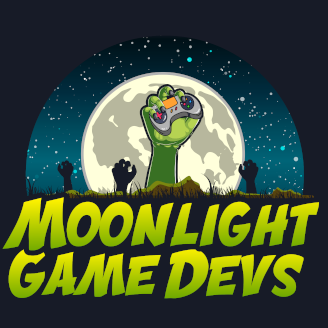
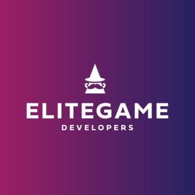
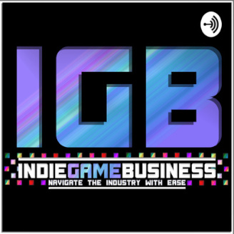
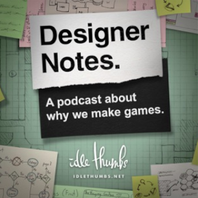
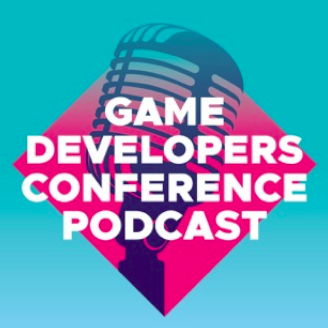
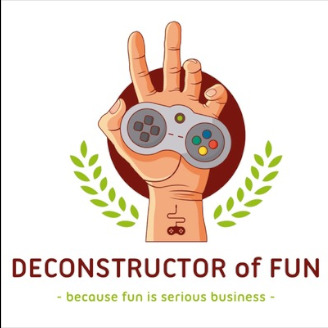
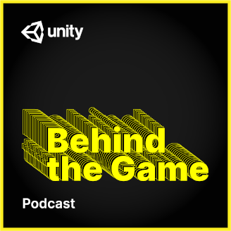
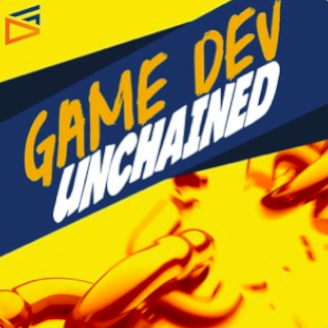
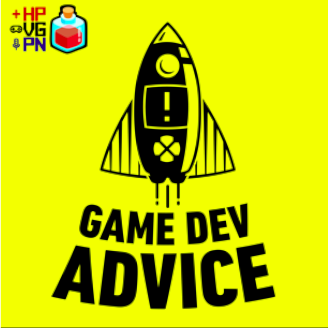

import {PodcastLinks} from "../../../src/components/podcast-links.js"

You want to know that the best game development podcasts are? Well, I can only speak for my personal preference, but I hope you find some in this list that you like just as much as I do! Podcasts are one of the most efficient ways to consume educational content, because they can be listened to during periods of time where you don't require 100% focus (while travelling, cleaning, etc.). I decided to create a list of the best game development podcasts that I have learned to love over the years, featuring the best game development advice, insights and interviews.

<PodcastLinks title={"Moonlight Game Devs"} 
applePodcastLink={"https://podcasts.apple.com/de/podcast/moonlight-game-devs/id1511553688"}
    googlePodcastLink={"https://podcasts.google.com/?feed=aHR0cHM6Ly9sZXRzY2FzdC5mbS9wb2RjYXN0cy9tb29ubGlnaHQtZ2FtZS1kZXZzLTEzNDViYTAxL2ZlZWQ&ep=14"}
    spotifyLink={"https://open.spotify.com/show/6aDR2KdCiwPoSySMphy2Ha?si=1Ct3IZSZRWCR4GwqGT_ltg"}
    rssLink={"https://letscast.fm/podcasts/moonlight-game-devs-1345ba01/feed"} />

You got me - this is a **shameless plug**! But then again, if I didn't think my podcast was valuable to others, I wouldn't have recorded it, right? In this show, I 
have discussions with game developers on how they made their latest game. These discussions include the origin of the games company, the challenges they faced, what they learned while 
building the game and lots of other interesting and useful pieces of information for aspiring games company founders.

<PodcastLinks title={"Elite Game Developers"} 
applePodcastLink={"https://podcasts.apple.com/gb/podcast/elite-game-developers-podcast/id1463752909"}
    spotifyLink={"https://open.spotify.com/show/6CQO7qIVVQT5baHn3P0ZnS?si=zD7OOGTFTzGzr-zutkZG3Q"} />

A show where business coach Joakim Achren talks to "the entrepeneurs and investors that are building the games companies of the future". It's a really interesting show, 
which focuses on company building more than the actual development process behind making a game - and that is fine! The advice here is often really practical and interesting, 
with a lot of it applying to most startup ventures and not just games.

<PodcastLinks title={"Indie Game Business"} 
    googlePodcastLink={"https://www.google.com/podcasts?feed=aHR0cHM6Ly9hbmNob3IuZm0vcy9iNzYyN2MwL3BvZGNhc3QvcnNz"}
    rssLink={"https://anchor.fm/s/b7627c0/podcast/rss"}
    applePodcastLink={"https://podcasts.apple.com/us/podcast/indie-game-business/id1464597823?uo=4"}
    spotifyLink={"https://open.spotify.com/show/2RJj7I87MsmEKInqFvSZRy"} />

The hilarious hosts make this a very fun and lighthearted podcast to listen to, while still conveying valuable information for aspiring indie developers. Interviews usually focus 
on a particular aspect of running an indie games studio with a guest that is an expert in the matter.

<PodcastLinks title={"Designer Notes"} 
    googlePodcastLink={"https://podcasts.google.com/feed/aHR0cHM6Ly93d3cuaWRsZXRodW1icy5uZXQvZmVlZHMvZGVzaWduZXItbm90ZXM?ved=2ahUKEwiWtaWr3cTqAhUO0YUKHae0A2sQ4aUDegQIARAC&hl=de"}
    applePodcastLink={"https://podcasts.apple.com/us/podcast/designer-notes/id935345158"}
    spotifyLink={"https://open.spotify.com/show/1E1MXlshXtvABGgOWbN48N"}
    rssLink={"http://www.idlethumbs.net/feeds/designer-notes"} />

Sorin Johnson is one of the  lead designers on huge strategy game hits like Civ 4 and Old World, as well the host of this podcast. He discusses game design with some of the best in the business.

<PodcastLinks title={"Game Developers Conference Podcast"} 
    googlePodcastLink={"https://play.google.com/music/m/D4zwsodszhq4zc6f4dlvztw4jle?t=6_-_Dealing_with_Burnout_and_Making_Art_with_Drinkboxs_Gabby_DaRienzo-GDC_Podcast"}
    applePodcastLink={"https://podcasts.apple.com/us/podcast/gdc-podcast/id1476405424"}
    spotifyLink={"https://open.spotify.com/episode/3cuIhSPQRK1g2GftbCkP7O"} />

The official GDC podcast has so far been filled with great insights and guests from the games industry, who are clearly experts in their particular area of the game development process.

<PodcastLinks title={"Deconstructor of Fun"} 
    googlePodcastLink={"https://podcasts.google.com/feed/aHR0cHM6Ly9hbmNob3IuZm0vcy81MDAwMjZjL3BvZGNhc3QvcnNz"}
    rssLink={"https://anchor.fm/s/500026c/podcast/rss"}
    applePodcastLink={"https://itunes.apple.com/us/podcast/deconstructor-of-fun/id1241195252?mt=2"}
    spotifyLink={"https://open.spotify.com/show/2mWi6kHU4BcN8X92pEPa2i"} />

This is a great podcast if you are in the mobile space of game development. It focuses on discussing different approaches to getting the most out of monetization, user acquisition, etc. 
It also has episodes that focus on current events in the games industry and how they can affect your business.

<PodcastLinks title={"Unity - Behind the Game"} 
    googlePodcastLink={"https://podcasts.google.com/?feed=aHR0cHM6Ly91bml0eTNkLmxpYnN5bi5jb20vcnNz&ved=2ahUKEwj77Pvs29fpAhVIgnIEHSzwC_MQ4aUDegQIARAC&hl=en"}
    rssLink={"https://anchor.fm/s/500026c/podcast/rss"}
    applePodcastLink={"https://podcasts.apple.com/us/podcast/unity-behind-the-game/id1512474528"}
    spotifyLink={"https://podcasters.spotify.com/podcast/51IAt6DskFp32xs9gEQ8Xu/overview"} />

The official Unity3D podcast. So far I've been really enjoying it, the guests are games entrepeneurs or part of the team, having a chat with the host about how they implemented some feature. This usually does end up in a talk about the Unity engine, as you might expect!

<PodcastLinks title={"Game Dev Unchained"} 
    googlePodcastLink={"https://play.google.com/music/listen?u=0#/ps/Iahmd5mbf2jh3zlwl66ldpbv2qu"}
    applePodcastLink={"https://itunes.apple.com/us/podcast/game-dev-unchained/id1043547750?ls=1&mt=2"}
    spotifyLink={"https://open.spotify.com/show/1E1MXlshXtvABGgOWbN48N"} />

This is a podcast focused primarily around getting or having a career in game dev. That said, there are occasional episodes on indie games entrepeneurship that might be interesting for (aspiring) founders.

<PodcastLinks title={"Game Dev Advice"} 
    googlePodcastLink={"https://podcasts.google.com/feed/aHR0cHM6Ly9mZWVkcy5tZWdhcGhvbmUuZm0vQURMNzAxMjY1Njc1OQ?ved=2ahUKEwitkNKA4MTqAhUO0YUKHae0A2sQ4aUDegQIARAC&hl=de"}
    applePodcastLink={"https://itunes.apple.com/us/podcast/game-dev-advice-the-game-developers-podcast/id1450096263?mt=2"}
    spotifyLink={"https://open.spotify.com/show/5NChfUVhFxV9NCoUVp4uD0"} />

True industry veteran (30+ years experience) John Podlasek interviews game developers of all types, chats with them about their careers and shares the lessons learned. Very good podcast for anyone looking to enter the industry as an employee.

Finally, if you have any of your own podcast suggestions, I would love to hear them here in the comments or on Twitter @MarcBeaujean. I'm always looking for great content to listen to!