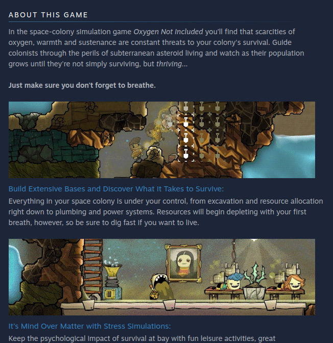
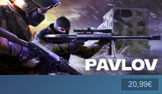
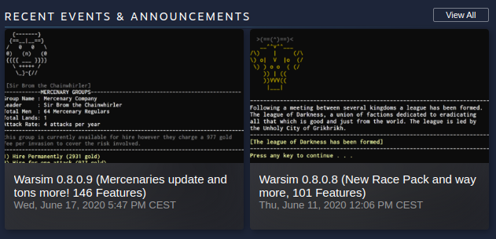
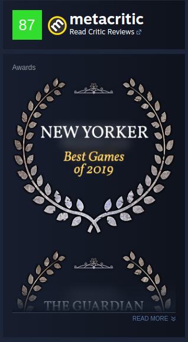
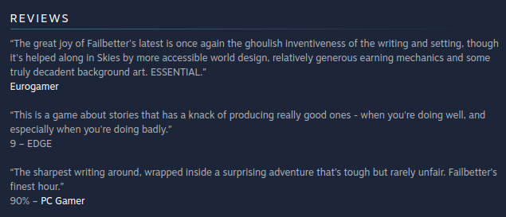

Having a great Steam page is one of the first steps that you should take to increase sales for your
game (outside of making a great game, of course). When a potential customer visits your Steam
page, you only have a few seconds to grab their attention and convince them to 1) buy your game
immediately or 2) continue to read up more information to make up their mind. If your Steam page
does not invoke any interest and lacks a professional, distinct look, you are loosing a lot of money.
To build a great Steam page, you need to be aware of how the average user navigates the store and
how the buyers intent evolves at each stage. In this guide, I’ll be showing you step-by-step how to
make a Steam page that will get customers to pull out their credit cards.

## Have Intriguing Media

### Trailer

In most cases, the first thing that a user will see when entering your store page, is the trailer. That’s
why your trailer not only needs to be good, but captivate the potential customer right away. To do
this, make sure that the first few seconds of your game show it off at its best or surprise them with
some stunning visuals or an exciting cinematic.

Sound is another important very important factor, make sure that your trailer is underline by your
best music or perhaps even a custom piece to make it even more memorable. since a lot of users
have trailers playing on auto-play. This means that the player’s attention might be directed towards
it immediately when they open the store page, even if its NOT the first thing they look at.

### Screenshots

Screenshots help the player affirm that this is a good product to purchase. A good screenshot reel
has a big (at least 8 screenshots), varied selection of images that show off various elements of the
game. Most players look at the screenshots to see how much content there is and try to make
assumptions on how interesting or deep the gameplay is. Make sure that each screenshot shows off
a different part of the game (mechanics, interactions, etc.) in a different setting, highlighting both a
large amount of content and gameplay variation. You are also going to want to start with the best
screenshots at the start of the media reel, again because you want to hook the player.

## Description

Your description is usually what the player looks at once your initial media has got them interested
in finding out more about your product – good! Unfortunately, many indie studios have a bullet
point list of features in their description, which is rarely going to convert into a sale. Instead, create
that bullet point list, then turn each bullet point into its own heading, followed by a short paragraph
going into further detail to explain it. A detailed game description conveys to the player that there is
a lot to the game, while helping them to make a more informed buying decision.

Another important aspect is to include a lot of media in your description as well. Screenshots are
great, GIFs are even better! Highlight what you are talking about with great imagery, so the player
can get a better idea of the gameplay and imagine themselves experiencing it.

*The description section from [Oxygen Not Included](https://store.steampowered.com/app/457140/Oxygen_Not_Included/) features fun GIFs that show off the humerous nature of the gameplay*

Finally, a great way to convert an interested customer who is taking the time to read through your
description already, is to add some flair to your writing. Instead of going for a dry sales pitch that
explains how great the game is, write in a style that truly expresses either you as the developer,
makes some clever reference to the type of game you have made, or just differentiated from what
you find on other store fronts. Distinguishing yourself will not only help increase the potential
customer that this is an interesting product, but also make them more likely to share it with others.

## Game Branding

Your game’s brand is primarily defined by its box art and name, these are also the two main things
that users who are just browsing the store will be judging your game by, as they have no other
points of reference (unless they already know of your game). It’s important to make sure you nail
these two!

### Name

I’m assuming that you are already set on a name given you are reading an article about publishing
on Steam, but it should be mentioned that changing it later on is going to have a really negative
impact on sales, as people might no longer be able to find it or are going to get confused when they
see content using the old name. Make sure you like the name and that it makes sense. A good rule of
thumb is to imagine you were in a loud bar and were trying to tell the person next to you about your
game – would it be easy or hard to convey it to them?

### Box Art

Most people judge a book by its cover (or a game by its box art). Put in a lot of time to make sure
that your box art conveys exactly the type of experience that players can expect when buying your
game, but also looks interesting enough for them to want to find out more and click on the store
page link. Another good idea is to include the name of the game somewhere on the box art and adjust it 
when you make specific content updates or events.

*Even when displayed in this minimal form on the Steam store, [Pavlov](https://store.steampowered.com/app/555160/Pavlov_VR/)'s box art lets you know immediately what game it is and what its about*

## Announcements

The announcement section is particularly important for early access games, but any game can
benefit from a healthy list of written developer updates. Convey to the customer that this game is
not just a throwaway title, but that you are actively listening to the community and consistently
adding small improvements over time. This gives buyers confidence that the developer will address
any bugs that they might encounter and report, or that they can enjoy more content further down the
road.

*Huw Milward's [Warsim](https://store.steampowered.com/app/659540/Warsim_The_Realm_of_Aslona/) is updated regularly, giving early access buyers confidence that potential bugs will be fixed*

Good announcement posts follow a similar structure as the description section (use of high quality
screenshots or GIFs, unique writing style, etc.) but bullet point lists for change logs and similar
pieces are not frowned upon.

## Awards

Any awards your game wins or is nominated for, no matter how insignificant, should be mentioned
in the awards section of your Steam page. This gives your game an additional flair of prestige and
makes it seem like there is wider interest in the title, further enticing a potential customer to make a
purchase. Participated in a smaller competition that does not get listed by Steam? Hit up customer
support and ask them if it can get accredited!

## Reviews

Reviews are an important factor when someone considers buying a game. A game that has been out for a while and lacks reviews, 
or simply has a low score, is going to loose a lot of sales - there is little to impact this other than making a good game! One thing 
you can do, however, is to create a section of handpicked reviews from press or individuals.

*The developers of [Sunless Skies](https://store.steampowered.com/app/596970/SUNLESS_SKIES/) included this custom review section, featuring positive press reviews of their game*

## Keeping an Eye out for new Store Features

Steam is adding more and more features that allow developers to improve or expand the
functionality of their store page. For example, quite recently Steam has enabled developers to show
live footage of streamers playing the game on the store page (which you should definitely do, if
there are enough streamers for there to be live footage consistently). Make sure you are always on
top of these and seeing how you can leverage them – being that first store page that uses feature X
might be enough by itself to get a user excited and share it with their friends!

## Conclusion

I hope that this gave you a good idea of how to improve or build your store page. I wanted to end this article with a few examples 
of store pages that I think are very good:
- [Dead by Daylight](https://store.steampowered.com/app/381210/Dead_by_Daylight/)
- [Sunless Skies](https://store.steampowered.com/app/596970/SUNLESS_SKIES/)
- [Oxygen Not Included](https://store.steampowered.com/app/457140/Oxygen_Not_Included/)
- [Frostpunk](https://store.steampowered.com/app/323190/Frostpunk/)

One of the marketing folks from Failbetter Games (Sunless Skies, Fallen London) shared a lot of great information on Steam store page building, as 
well as other marketing advice, on the [GDC Podcast](https://www.youtube.com/watch?v=uaQP0YY0Eso).