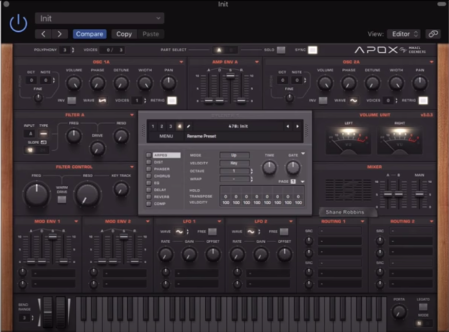

import SnowMicrophone from "../../../src/components/products/amazon/snow-microphone.js"
import RodeM3Microphone from "../../../src/components/products/amazon/rode-m3.js"

Good game sounds effects (also known as SFX) are an integral component of getting your game to have the right feel and immerse the player. There are many ways to find and create new sounds, in this article I will introduce you to some of the ones that I have found most effective.

### Free Sound Websites

Like with most types of digital content on the internet, there are platforms that allow users to upload their own free samples to share with others. Just google “free sounds”, you will find platforms like [freesound](https://freesound.org/browse/tags/sound-effects/), [soundbible](http://soundbible.com/free-sound-effects-1.html), [freesfx](https://freesfx.co.uk/)...the list goes on and on, there are a ton of free samples available that you can use, even commercially. You can browse these libraries for whatever types of sounds you are looking for your game and usually something relevant will show up.

*freesound.org has a wide selection of free and labelled sounds for your game*   

The issue with this approach is that such websites often don’t do much to curate the quality of the sounds. This means that they will vary greatly in volume, clarity, etc. and you will need to figure out how to ensure that these factors remain consistent across your game. I think that free sounds are a great and cheap way to add SFX to your game quickly and with no costs, but I think that you should always have at least some technical understanding of how to work with audio for this to be viable in the long term. If you have the ability to improve and adjust the sounds (or have someone on your team who can), then this is a great approach!
  
### Premium Sound Libraries and Subscriptions
  
In contrast to the free sound platforms, there are the paid sample packs and (what I think is going to gain in popularity) premium sound subscriptions. The benefit of paying for premium sounds is that you can get access to high quality SFX made by professionals, without having hire someone for a long term contract or full-time employment. It seems safe to assume that these sounds require less editing than free alternatives as well.

*Soundsnap lets you download high quality sounds on a subscription base. Made by professional for many categories*  

The downside to this is that you are making an investment while a high degree of uncertainty in regards to whether it will pay off. You can mitigate this by going for a subscription service like [soundsnap](https://www.soundsnap.com/?gclid=CjwKCAjwh472BRAGEiwAvHVfGjVsbguCR6nlthy-Nzo6sGr6jh5yiMclj93Fr1Bqw1vz6xmFkoTp3RoCLbEQAvD_BwE) where you can pay as you go, rather than buying large and expensive sample packs where you might not even use most of the sounds. I think this is the better choice for most studios or individuals considering to pay for audio effects.

### Generating Variations of Existing Sounds

This is ideal for those with advanced skills in audio and sound design. By using existing sound samples and altering them, you can easily create entirely new ones! Some of the methods you might consider for this effect include:  
- Changing the pitch. This is a simple way of creating the illusion that two separate sounds are used, since we often associate different pitches of things with different types of objects (for example, by down-pitching the sound of a gun shot we can give the illusion of it being fired by a different weapon)
- Adding reverb or echo. For sound effects that can be perceived from different distances, this can help make it feel like objects creating them are further away.
- Distortion. This is another technique that can drastically alter a sound, for example it can turn a regular voice recording into a broken radio transmission
- Mixing sounds. By cutting and combining different sounds of a similar timbre you can create new ones. This can also work by layering two different sounds.
- Reversing the sound. This can work pretty well for some, like glass shattering.
- Crossfade sounds to create loops that can help add to the atmosphere of your game.

### Recording your own Sounds
  
If you cant find what you need online, then one alternative is always to simply record your own! Common sounds of objects around the house can be quite easy to record and used to represent other actions than what is being recorded as well (for example, the sound of a sword being drawn can be replicated with a common kitchen knife). Sometimes you will need to get creative by recording a sound and then re-purposing it for something else by modulating it heavily. For example, a blender can easily turn into an experimental machine in a dark warehouse if you apply the right effects and distortion.

To record professionally sounding audio, you will want to look into getting a good microphone. There are generally two types: XLR and USB. USB microphones can sound pretty good and requires a lot less setup – just plug it into your laptop and in most cases, you are good to go! I recommend this type of microphone for anyone who is just getting started in recording their own My first and favorite USB microphone is a pretty popular choice, is from the brand “Blue”. They are renowned for being affordable and having a good sound.

<SnowMicrophone />

A more “professional” alternative are the XLR microphones, which offer higher fidelity sound but also require a lot more setup since they are not supported by most laptops. Usually, you will need an intermediary adapter like a mixer that can then capture the sound of the microphone and transmit it to your laptop. The reason that you might prefer an XLR microphone is because you want to use a mixer anyway and/or are looking for better sound quality, since the cables enable more fidelity recording. The downside is that they can be a bit more expensive and are less portable. I personally use an XLR microphone these days, to record both sounds and my podcast - this is the one that I use, I am very happy with the audio quality:

<RodeM3Microphone />

When you are recording the actual sounds, make sure that you are in a quiet environment and hold the microphone very close to the source of the audio. Small rooms are ideal, as they reduce the amount of echo (or reverb) on the sound. This can also bed reduced by plastering the walls with echo proof material. You probably want to make sure that you are setting up somewhere where you can easily record more than one just one type of object at once, since it can be pretty hard to relocate (especially if you are going for an XLR Microphone setup that usually involves another heavy piece of equipment like an audio mixer). Record multiple variations of the same sounds to make sure that you have a few to choose from or possibly mix and match parts of sounds.

To find out just exactly what kind of results to expect, I highly recommend checking out this sound demo by [Corry Young](https://www.linkedin.com/in/corry-young-55297b171/), sound designer at the Chinese Room (Little Orpheus, Amnesia, etc.).

<iframe width="100%" height="315" style="margin: 0 auto" src="https://www.youtube.com/embed/8yGsrmr4VXI" frameborder="0" allow="accelerometer; autoplay; encrypted-media; gyroscope; picture-in-picture" allowfullscreen></iframe>

### Synthetic Sound Creation

Old school titles that were designed for limited hardware had to rely entirely on synthesized sounds that were programmatically generated and only had a limited range of pitches and frequencies to work with. These limitations no longer exist, but experienced audio engineers will still consider falling back on this method to create some of the more unique sounds for their game. Synthesizing sounds gives you full control over the nature of the sound, but also takes a lot of dedication and skill to create. You will need to understand modulation and master at least one VST, which are pieces of software that let you create your own sounds.  
  

*Sylenth1 is a Synthesizer that is known for great analogue sound*
  
Overall, I think that this is a cumbersome method for generating audio content and the most time intensive. I’d only recommend falling back on this when you know that there are no other sounds available and have no way to record what you need.
  
### Outsourcing
  
Finally, you can opt to outsource the creation of your audio to a freelancer or hire someone on. The good thing about sound design for games is that it rarely requires a single person to oversee the audio for your entire project. This is because keeping audio consistent is less of an issue than, say, keeping the art style of a game consistent (which might only be possible when the same artists are working on the project for its entire duration). There are many ways you can hire freelance audio designers for smaller gigs, for example you could go for a professional sound designer studio like [Sinusaur](https://www.sinusaur.com/). I tend to use Fiverr to outsource all kinds of smaller tasks including sound design, for example when I just need a generic sound that I don’t want to invest too much money into developing.

*You can find all types of different audio designers on Fiverr, ranging in quality and price*

I hope that these techniques were helpful and that you managed to improve the audio for your game. Are there any other methods that you use for your game? I’d love to hear from you!