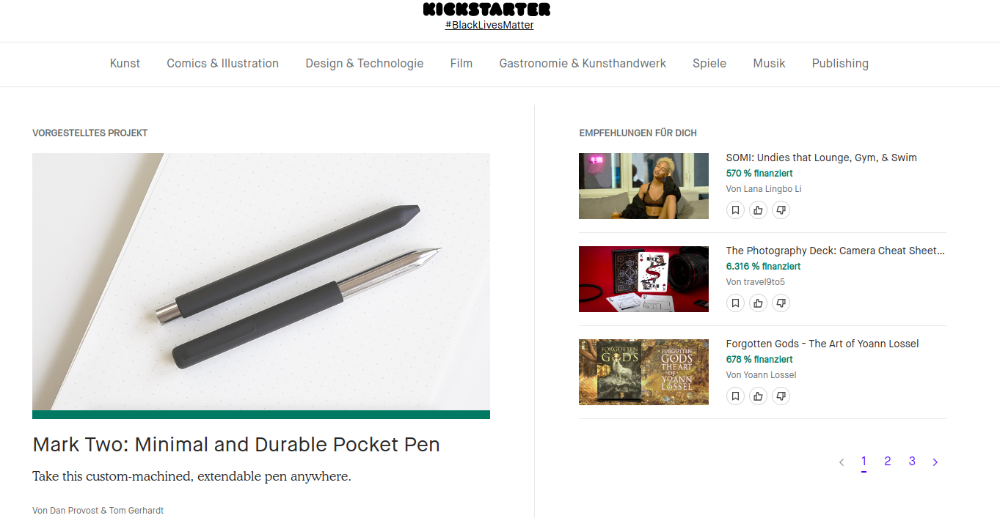
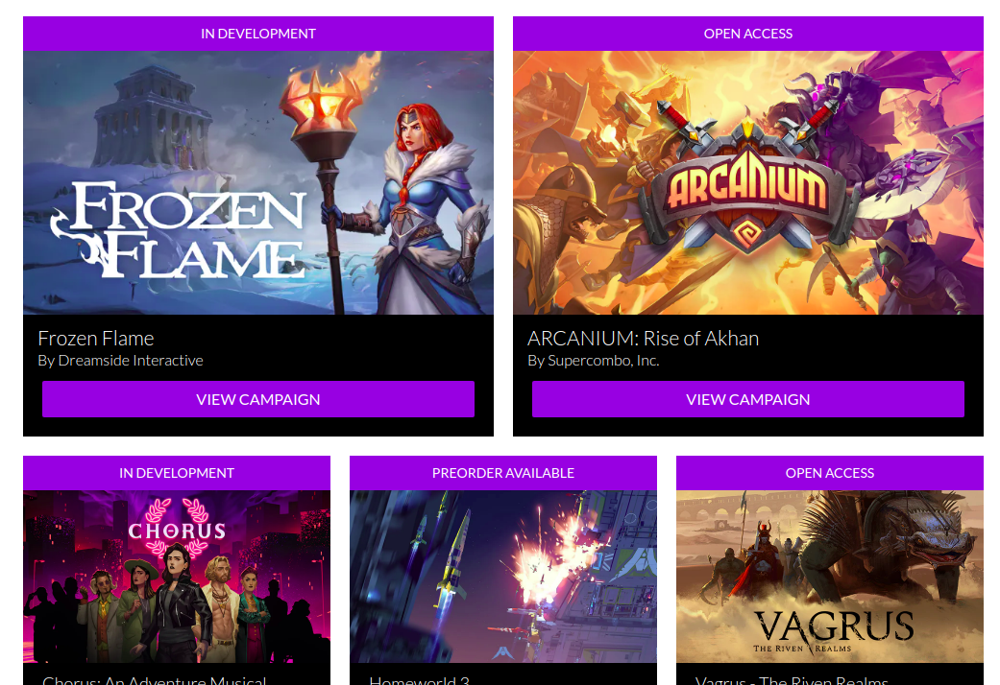
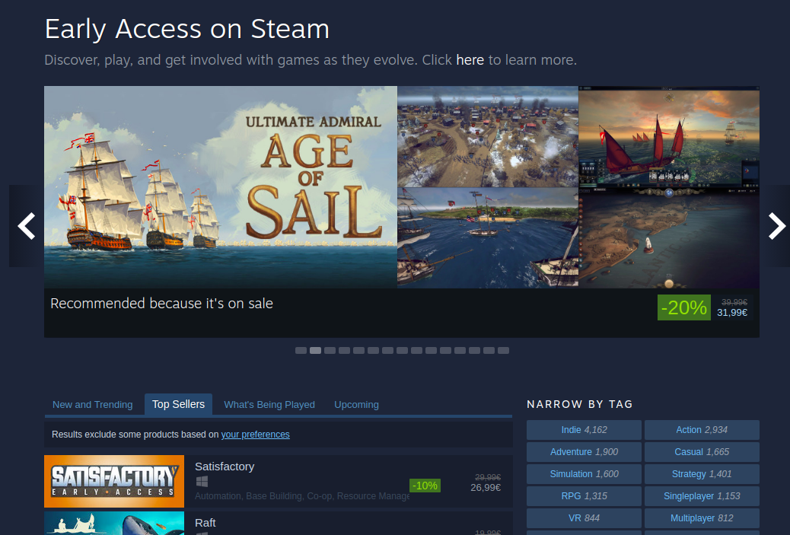

You got a great and ambitious idea for your next big game? Great! What you are going to need next
is programmers, artists, designers – in other words, a lot of money. In the following guide, I’ll be
giving you an overview of the different paths you can take when trying to raise money for your next
project.

## Crowdfunding

### What is it?

Crowdfunding platforms like Kickstarter allow you to pitch your product directly to the consumers,
who then offer to donate money to help you develop it. You have to define the amount needed to
develop the product beforehand, but only if the amount raised exceeds your goal do you actually get
ANY money (to protect backers from financing a project that does not have a chance of
succeeding). Individuals get backer pledges as rewards for supporting the project, some common
examples would be merchandise, early access to the product, etc. The rewards that a backer gets
varies depending on the amount they donated.

### Why it might be interesting for you

Crowdfunding is first on this list because in theory, it is ideal for consumer products like games.
Not only do you get to money to build your game directly from the players, but will also benefit
from some free marketing and exposure through the buzz around your campaign. Even if your
crowdfunding campaign fails and you do not raise any money, you get valuable feedback from your
target audience which will allow you to work on your game idea. Finally, after you got your game
in a pre-release state, you have access to a pool of excited alpha or beta testers for your game that
will help polish it before a public release.

### What you should be aware of

Raising money through crowdfunding is not a piece of cake – people have gotten burned hard in the
past from scammers who raised money and then vanished, never releasing a product. This means
that you need to convey that you are legit (branding is very important) and have the expertise to
create the product. The best way to do this is to have a solid prototype to show when releasing your
campaign. Your pledges and rewards also need to be appealing, but beware: if you do not take the
costs of fulfilling these pledges into account, for example material and shipping costs for physical
goods that you want to send out to backers, then you can end up with less money remaining than
you expected! This makes crowdfunding a difficult balancing act to pull off.

### The most common Crowdfunding Platforms for Games

#### Kickstarter
Biggest crowdfunding platform, there are all kinds of products on here, including thousands of
games. This is going to be where you can reach the biggest audience, but also face the most
competition.

*Kickstarter hosts a wide range of products and has millions of users, so finding an audience for your indie game could be challenging*

[Visit Website](https://www.kickstarter.com/)

#### IndieGogo
Smaller than Kickstarter, but more or less the same idea.

[Visit Website](https://www.indiegogo.com/)

#### Fig
New kid on the block, focused specifically on gaming. This might be a great choice to promote a
game without a large following, as you have the lowest competition here. They were also recently bought 
by [Republic](https://republic.co), a venture fund that focuses on making startup investments accessible 
to everyone.

*Fig is focused on games, so it can be easier to get noticed here and find the right audience (Gamers)*

[Visit Website](https://www.fig.co/)

## Publisher

### What is it?

Game publishers have been the traditional way of raising money for a game. The publisher, besides providing you with funding for your game, usually also provide a multitude of other great services for a games company. These include marketing, testing, localization and the production of trailers and other promotional material. There is a good chance that a publisher will also provide you with a producer, who will make sure that your game is going to hit certain milestones on time.    
  
A publisher will take some percentage of the game’s revenue share, usually around 15 – 35%, which will vary based on how much work the publisher does for you. Some companies get bought up by publishers if they are successful, but it is quite unlikely that this is going to be the case when you are just pitching your first game idea. 

### Why it might be interesting for you

Game publishers are great for most indie developers working on their first title, simply because they offer many essential services outside of the actual development of the game. They also have better relations than the developer themselves with the distribution platforms like Steam, meaning they are more likely to get you into important game sales and the front page. Finally, they also have relations with press or influencers that can help you gain traction for your game.

### What you should be aware of

Publishers are easier to work with when you are releasing a game that only requires customers to make a one-of purchase (also known as the “premium” revenue model),
 because if the collaboration doesn’t work out you can always go your separate ways after the game is released.  

 In addition, this makes it easier for the publisher to calculate the time frame for which they have to provide 
 you with additional services. That said, for recurring revenue based games like free to play, some initial startup 
 investment for marketing are going to be essential and one great option is having a publisher take care of this.
To get funded by a publisher, you need to make them aware that you exist and have a great game that is worth funding. 
Anyone can start a fundraiser on a crowdfunding page (baring a few basic quality checks from the platform), but getting 
noticed by a publisher is a challenge in itself. The most popular publishers get swamped with applications, while the less 
popular or newer publishers are less likely to be able to offer you the same level of support. The best way you can get the 
attention of a publisher is by doing your research on them – find out if they have published games similar to the one you are 
hoping to release, otherwise the chances of you getting funded by them is very low.  

Once you’ve identified a list of potential publishers, the best way to reach them is by having connections connect you with 
the team or writing a cold email that is personalised and gives a brief overview of your game idea. Make sure to focus on the things 
that will increase your chances drastically, like beautiful screenshots and GIFs of a prototypes you made or impressive credentials of 
people in the team. Sometimes, a concise idea pitch with some great selling points and an intriguing GIF will go way further than a long 
essay, outlining all the things that make your idea great.  

Next, if you are able to stand out enough and the publisher is interested in learning more about your game, you will get invited to pitch it. For this, you will need to provide what is called a “pitch deck” for your game! A pitch deck is short presentation that you can give to the publisher, to help convey your vision and get them excited about it. your best shot at scoring a publishing deal is by having a great games pitch, so we are going to go into more detail about that in an upcoming post.  
Here are a few of the many great indie game publishers out there:

#### Devolver Digital

Founded in 2009, they are well established as one of the biggest indie games publishers and well
known for their E3 shows, where things often escalate quite quickly. These guys know how to
market games using witty humour and have some very impressive titles in their portfolio (Enter the
Gungeon, Hotline Miami).

[Visit Website](https://www.devolverdigital.com/)

#### Curve Digital

Founded in 2013, this UK publisher is one of the more proven in the game industry and has recently
been working with some of the biggest IPs in the TV industry (Narcos, Peaky Blinders). They
helped realize massive hits like Thomas was Alone and Dear Esther.

[Visit Website](http://www.curve-digital.com/)

#### Tiny Build

These guys got into the publishing business by co-creating the mega-success Speed Runners and
have published a large number of hits since then, including Hello Neighbour, Party Hard and Streets
of Rogue.

[Visit Website](https://www.tinybuild.com/)

#### Team17

Known for the Worms games series, this development studio and publisher has had a lot of success
helping release games like Overcooked and Blasphemous.

[Visit Website](https://www.team17.com/)

## Venture Capital

### What is it?

This option is deceptively similar to going with a publisher and thus a lot of the advice from the
previous section still applies here, but there are some key differences that can alter the course of
your game development process considerably. Just like a publisher, a venture capitalist (VC) or VC
firm is going to supply you with money up front to build your game and you will need to convince
the VC to provide you the funding with a pitch, just like you would for a publisher. Unlike the
publisher however, the VC will not want to have a percentage share of your current game’s revenue,
but rather a share of your entire company. It’s important to understand the VC’s objective: to buy
stocks of the company in the early stages for comparatively little money and then sell it at a very
high price, when it’s profitable or has a lot of buzz around it. This is why it is important that you
focus on pitching the company and its vision, not just a single game.

### Why it might be interesting for you

The VC will want to see that your business plan favours to grow the company for the long term, as
this will raise the company value. This also means that VC are much more suited for certain types
of games than others. For example, “Free to Play” or “Games as a Service” titles have a much
higher chance of reaching a sustainable, predictable and scalable income, what the VC will be
looking for, than a company that is just trying to create one-of PC and console games. Experimental
or novel ideas that leverage upcoming technologies (like Crypto, Metaverse or AI) are often
something that excites VC, since these offer untapped potential that could lead to high profitability.

Because the VC does not rely on the success of a single game that you make, but rather the “end
result”, i.e. your company being successful or going bankrupt, it’s encouraged for VC backed games
founders to experiment and release as many games as they can before the money runs out or one of
their games finds market fit. This can be very valuable for first-time games founders with a less
experienced team.

### What you should be aware of

Its important to understand the ramifications of the VC model and selling part of your company for
funding. If you give away too much of your company, then the VC holds a lot of power, potentially
enabling them to make drastic decisions if they disagree with the way that you run the company.
This is why its important to choose very wisely what VC you approach for an investment. Your
vision and that of the VC need to be well aligned, since it is extremely challenging to get rid of
them once they own part of your company. Make sure they know a lot about the games industry,
which will make it easier for you to negotiate with them and means that they can advise you when
necessary – remember, however, that VCs prefer to be fairly hands off, as they invest in a lot of
companies and only expect a few to succeed. VCs also generally do not provide you with additional
services like marketing which a publisher would, so you have to make sure you are allocating funds
to take care of it yourself, either by hiring full-time employees or outsourcing it to another
company.

### These are some of the biggest VC funds that invest in Games Companies

#### Galaxy Interactive
Venture fund interested in exploring the ramifications of integrating technologies like Crypto to
provide real ownership of digital goods in games or build large scale metaverses.

[Visit Website](https://galaxyinteractive.io/)

#### Play Ventures
One of the biggest games-focused venture funds, focused on games with scalable business models
(Free to Play, Games as a Service, etc.) or software solutions for the games industry.

[Visit Website](https://playventures.vc/)

#### Bitkraft

One of Bitkraft’s biggest focuses lie in ESports and Digital Events, but are
also interested in the opportunities revolving around XR experiences (developing technology for
devices or the software/games themselves).

[Visit Website](https://www.bitkraft.vc/)

#### Game Seer

Game Seer is one of the few funds that focuses on premium Steam and console games. This makes
them closer to a traditional games publishing company!

[Visit Website](https://www.game-seer.com/)

## Game Development Grants or Donations

### What it is?

A grant is some amount of money that is paid out and does not need to be reimbursed - a donation, essentially. There is a surprisingly high number of companies that provide grants for game developers.

### Why it might be interesting for you

This should be interesting to anyone looking for funding - it is a way to fund your game with very little risk.

### What you should be aware of

Most grants have requirements to determine who is eligible for receiving them. Make sure that you meet the requirements for funding before applying, otherwise you might just be wasting your time. In addition, you will want to have a prototype and pitch ready, since most grants receive thousands of applications and require you to have something to show when applying.

### Examples of Grants for Games Companies

#### Patreon

Patreon lets consumers support creators through small, monthly donations. Though not theoretically a games grant, it is a typical way for games companies with a community to support themselves. In return, you should provide your supporters with exclusive content like game art or behind-the-scenes insights. 

[Visit Website](https://www.patreon.com/)

#### Epic MegaGrants

Epic Games, the creators of Unreal Engine, provide funding to many games studios every year. It is one of the biggest games grants, but you can only apply if you are working with their engine.

[Visit Website](https://www.unrealengine.com/en-US/megagrants)

#### UK Games Fund

An example of a big games fund that is provided by a non-profit institution for the local games industry. This one is exclusive to the UK, but many countries have similar initiatives that support games, creatives and the arts (they do not necessarily have to be exclusive to gaming).

[Visit Website](https://ukgamesfund.com/)

## Going on an Early Access Program

### What is it?

The concept of “early access” is that the player can purchase a game that is still in development,
funding the developers so they can release and improve it. The incentive for the player is that they
get to play the game early and provide feedback. Early access programs have been evolving over
the last decade, but are now available on all major phone and PC game stores.

*Early Access is already very big on platforms like Steam*

### Why it might be interesting for you

If you already have a game built to the point where it is a fun, playable prototype that you feel
already has the potential to sell, then it might be a good idea to go for an early access program.

### What you should be aware of

Just like crowdfunding, bad actors have given this funding method a bad name. Some early access
games are sold and then never fully released, ending up in “early access hell”. That said, the reasons
for this are usually not because the developers had ill intentions. One of the most common is that
the game simply does not get enough traction and thus development cannot be continued because
there is not enough money left.

Because of all the unfinished or poor quality games coming out of early access, players are less
forgiving these days and don’t hesitate to give bad reviews, even if the game is still in development.
That in turn can lead to less sales and demotivation amongst members of the team. Make sure that
when you release on early access, you focus on polish over content. A great game that lacks content
is going to be enjoyable for the short time that it is played, but a bad game with a lot of content is
not going to be enjoyed or played at all. In addition, early access players are going to be more
excited about the release of new content, rather than a list of bug fixes and minor improvements
made to get it to release quality.

## Bootstrapping

### What is it?

Game developers or companies that build their games without getting external funding are said to
be “bootstrapping”, with means “to build something using one’s own resources and experience”.
Quite a few games companies start out this way for their initial prototypes, but later look towards
external investment to be able to finish the game with the desired level of polish. Because

bootstrapping is so popular in the initial stages of a games development, crowdfunding is so popular
for games – many developers use the platform to get the funding necessary to go fulltime for the
final months, after developing a solid prototype using their own time and money.

### Why it might be interesting for you

Bootstrapping is primarily for people who cannot find funding through other means, but strongly
believe in the vision of their game. Rather than giving up on the idea, they decide to start building
the game by financing it themselves, usually by doing freelance/consulting work for other
companies or by building it part-time next to their job. Another reason might be because they don’t
like to give up creative freedom or power to a third party like a publisher or investor.

### What you should be aware of

In many ways, bootstrapping is when you want to go true “indie”, but usually there is a point where
getting at least some funding is the rational choice. For example, when you have already
bootstrapped the game to a point where its presentable but benefit from some additional funding to
really polish it, there are little arguments that speak against starting a crowdfunding campaign or
going on an early access program to get player feedback and income that will help you make drastic
improvements before launch.

Finally, bootstrapping requires very strong willpower. Maintaining another source of income while
working on your game is very difficult and means you need to be very good at time management,
otherwise you will not be able to work productively. Allocate time to both your game and potential
main source of income that you use to pay your expenses (consulting, a job, etc.).

