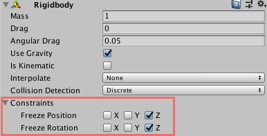
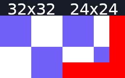
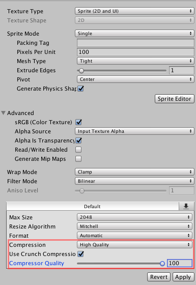
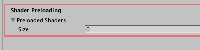
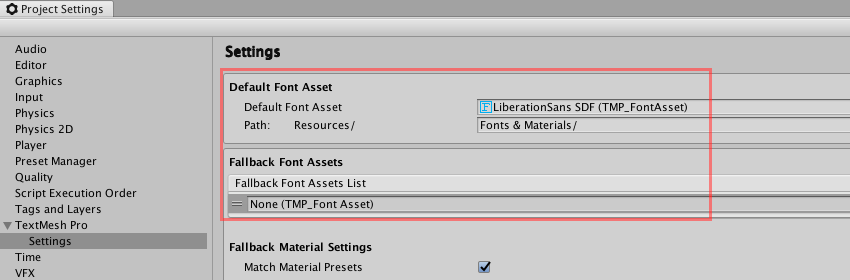

import BloodRallyShow from "../../../src/components/products/steam/brs.js"

The solo indie game developer of the title Blood Rally Show shares the things he wished he had known before starting development. His game has recently launched on Steam!

<BloodRallyShow />

This guide is focused around getting the most from developing 2D games with the Unity3D engine and some things to consider when preparing for long-term development, starting as early as creating your project.

## Use the latest Beta Version for your Project

By the time you finished your game (which will always be longer than you expected), experimental versions of the engine are probably going to be stable. 
Given that these will probably contain performance optimisations, graphical improvements and other features that could improve your game at little to no 
cost or energy from your part, this could warrant dealing with a few editor bugs. Try to keep your editor up to date regardless and upgrade to the latest 
stable release if you start falling behind.

## Avoid Using 2D Physics

The 2D physics are not as performant as their 3D alternative, so even if you are developing a 2D game you should opt for the latter. This is because the 
3D Physics are multithreaded and developed with performance in mind. The simplest way to implement this is by adding a standard Rigidbody to your game 
objects and disabling the influence of the physics on the rotation as well as positioning along an axis of your choice.

## Optimise your Sprites

Like most game engines, Unity works best with textures that have a "Power of Two" (POT) resolution. If your textures don't conform to this rule (having a 
resolution that is power of 2 i.e. 8x8, 16x16, 32x32...) the engine needs to compensate and fix the resolution, decrementing the quality of the texture, 
increasing its file size and worsening your games performance. If you already created assets that do no conform to this rule, you can add some transparent 
padding to fix this. Here is an example diagram showing a POT conform pattern (left) versus a non-conform one, with the required padding shown in red.

Enable crunch compression on all the sprites you can, to decrease the build time and size. This is just a matter of selecting the sprite in the editor and 
adjusting the settings.

Unity also offers a Sprite Atlas component (read up more on  it  [here](https://docs.unity3d.com/Manual/SpriteAtlasWorkflow.html)), which combines textures and sprites so that you only need to draw them with a single call. This is good to know about if you were planning to split some of your sprites up into different parts, since this can reduce your build size and performance overhead.

## Preload Shaders

You can preload some of the shaders that you don't need to to get a significant build speedup, by heading down to Edit > Project Settings > Graphics and 
scrolling down to the very bottom, where there is a customisable dropdown. Increase the number of shaders you want to preload and add them to the list.

## Assign Variables in the Code instead of relying on Serialization all the Time

Unity encourages modularity by exposing variables to the editor (also known as variable "serialization"), where the user can easily modify them with GUI. 
It's important to distinguish when this makes sense and when it doesn't. Some variables, like a player's movement speed for example, are not going to require 
you to adjust them for serveral prefabs, so there is no need to expose them to the editor. Instead, adjust these variables in the code. In general, you don't 
want to expose constants to the editor at all. These steps make you less prone to accidental changes to prefabs or the Unity asset files (Unity stores all 
information on assigned variables in the ".meta" versions of your objects). The author of the Reddit post also mentioned that he suggest using the SerializeField 
tag instead of making a variable public if you need to expose it to the editor, which helps with keeping things capsulated in the actual code. 

## Understand the Unity Measurements

Using the right scaling for your assets is going to be an immense advantage and reduces the need for you to configure the physics for new objects. In Unity, 
1 unit equates to 1 meter. When you are using the art tool of your choice or working with a freelancers, keep this in mind to make sure your assets are scaled 
correctly.

## Set default and fallback TextMeshPro fonts early on

TextMeshPro is Unity's solution for creating high quality text for your HUDs and GUIs (GameObject > UI > Text - TextMeshPro). It can also be placed in the level, 
where it is rendered with the mesh renderer (GameObject > 3D > Text - TextMeshPro). Due to the performance benefit, its suggested that you use TextMeshPro if your 
version of the engine supports it. If you haven't already, head down to Edit > Project Setttings > TextMesh Pro and click "Import TMP Essentials". After that, you 
should be able to see "Settings" appear under "TextMesh Pro" in the preferences.

By having good default font settings, you are saving yourself a lot of time in the long run where you are manually returning to each asset and changing the font. 
By the way: sometimes your originally selected font will be missing an implementation for a given character, forcing Unity to display a placeholder character instead. 
You can use a fallback font, which will insert a character from that font (assuming that it has an implementation) instead.

## Avoid Player Prefs

Player Prefs refers to the default interface that Unity encourages developers to use to store game data (player save information, configurations, etc.). Plain text 
is more flexible, so you should probably opt for that instead, primarily for flexibility and the added benefits of being able to control and understand how that data 
is saved. It allows you to pick a serialization method of your choice (a good choice would be an open standard like XML, JSON, etc.), which could be useful if you want 
to implement features that require you to send them over the web and makes it easier for users to be able to manually edit the files themselves.

## Use the Unity Test Framework

Automated tests are programmatic ways of checking whether a given method or object produces the desired result when certain parameters are provided and an essential part 
of any software-or game development process. These tests are designed to simulate a player going through actions in your game and are designed to reduce the need of manual 
testing i.e. starting the editor in play mode to try or creating a compiled build to search for potential bugs. 

For example, if I wanted to deduct 50 HP from the player when they are hit by a fireball, I'd write a test where I create a fireball and a player instance, then invoke 
the methods that would be called when the fireball hits the player. After that, I can create a simple conditional statement that confirms everything was calculated as 
expected ("does the players health equal to their previous health minus 50?") - if that's not the case, I'm notified by Unity that my test failed and I have a potential 
bug in my code! 

By starting early on these tests, you can develop a critical mass of test coverage, which hereby refers to the amount of features that are automatically tested each 
time. This can save you time, headaches and reduce the chance of shipping a build with game breaking bugs, as any changes that could break or cause unwanted behaviour 
are more likely to be detected immediately (usually caused by one change unintentionally affecting something completely else). Read more on test in Unity [here](https://docs.unity3d.com/Packages/com.unity.test-framework@1.1/manual/getting-started.html).

## If you want to enable modding, develop with it in mind from the Beginning

A topic that will be covered in more depth in a future post, but worth mentioning here. Building your game assets in a way that they can be easily modified or extended 
by the community is going to save you the hastle of shoehorning these systems in at a later stage of development.  
  
Want to learn more from his insights after making the game? Check out his [post on reddit](https://www.reddit.com/r/gamedev/comments/g2affk/things_i_wish_someone_told_me_when_i_started/) 
filled with valuable, concise tips and reflections!