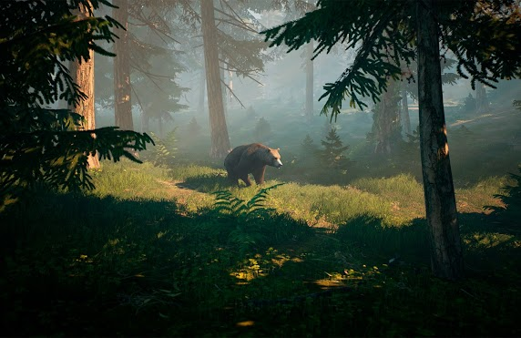
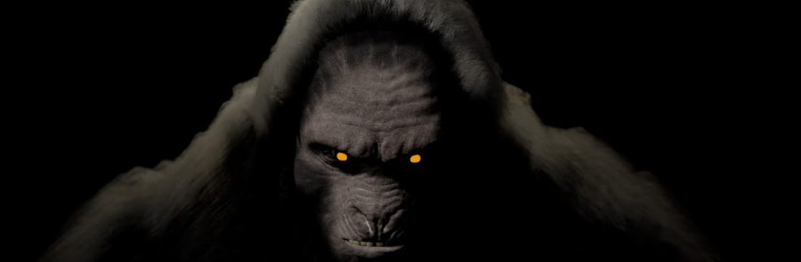
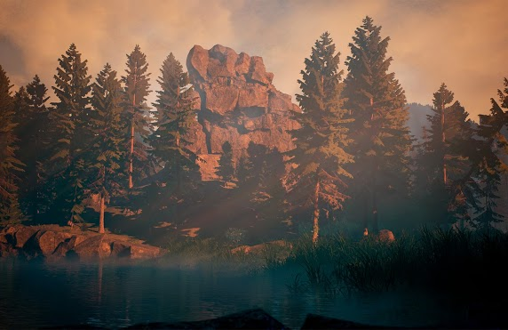
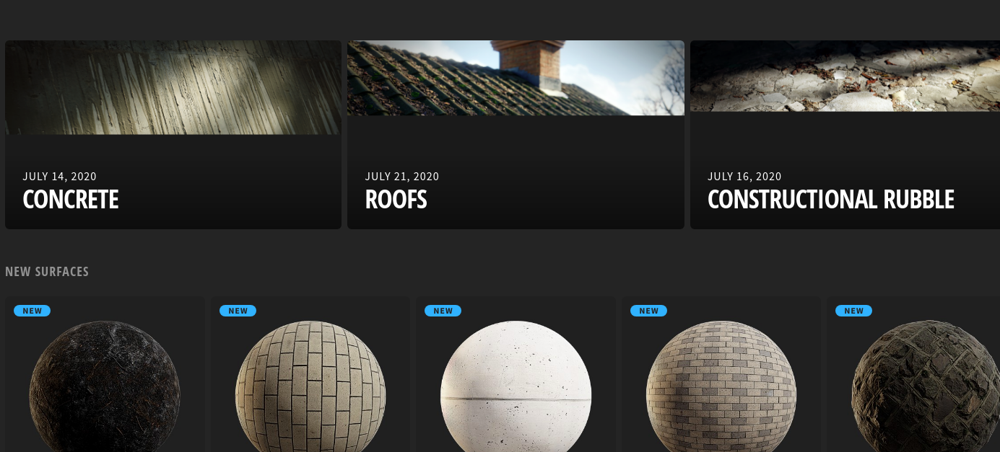

import Bigfoot from "../../../src/components/products/steam/bigfoot.js"

CyberLight Studio is a small games company from Ukraine, who have been building their latest hunting game that is doing really well on early access.

<Bigfoot />

They shared how they got started as a team and the story behind the development of the game.

## Can you introduce yourself and your background?

The foundation of the Cyber​​Light studio is two brothers Dmitry and Stanislav Zinchenko. We are the founders of the studio. We are now 22 years old. Since childhood, we have been interested in everything related to graphic effects, films and games. We decided to focus on games, because games involve freedom of decision. In fact, we had the opportunity to create our own world, plot, heroes, manage, and also interact in every possible way. But unlike movies, games are more interactive, so our choice was to make games.

## What motivated you to make your own game?

We were not attracted by the idea of ​​looking for work in other studios and working on other projects, we wanted to immediately start creating our own game. Therefore, immediately after entering the university in 2016, we started developing our project "BIGFOOT". At the beginning of development, we had very little experience and it was extremely difficult to do basic things. 
But after a year of hard work and development of our skills, we got the first version of the game.  

## How does the development timeline look like?

After a year and releasing that early prototype, we felt that the game was already at the stage when it could be shown to people and get some feedback. Therefore, we decided to go through the Steam Greenlight and were successful. 
At the same time, some bloggers noticed us and after a few months our game became quite famous (in particular, PewDiePie made a "let's play", which greatly helped us in promotion). YouTubers loved 
the concept of the game, and it helped a lot to get its first fans.  

We could have stopped and released the game at that stage, but we were not happy with the quality and gameplay. So, we decided to continue development until the moment when we will be proud of our first project. 
Subsequent development took 4 years. And now we are preparing a global update, which will significantly improve the gameplay and fix the shortcomings of the game.  

At the moment there are 4 permanent people working in our studio. A year ago we hired a 3D modeler and marketer.

## What is this game about?

You have a unique opportunity to gather a team of friends or go on a solo expedition to the forests of wild reserves and feel like a real Bigfoot hunter! You can use modern gadgets, hunting traps and various weapons to lure and capture this terrible mystical animal.
You will have to hunt in different weather conditions, explore deep caves and abandoned tourist camps day and night. You can also hunt foxes, bears, wolves, raccoons and even deer in order to set baits, because Bigfoot loves fresh meat the most.

*In BIGFOOT, the monster itself is not the only game you will be hunting*

In the game, Bigfoot can be controlled by artificial intelligence, while users play as hunters (there is both a solo mode and multiplayer for 4 players).

## How did the idea for the game come into fruition?
We always liked watching shows and scientific programmes about legendary animals, in particular about Bigfoot, and then realized that this topic was not covered in the gaming industry and we would like to embody an exciting, but at the same time frightening project about this forest creature.

*BIGFOOT concept art for the design of the creature*

## What design issues and challenges came up when developing the game?

To begin with, the development of the game was started with absolutely no budget. All we spent before Early Access was $100 for Steam Greenlight. 
It's very hard to make games without money. Also, at the beginning we did not have experience in development and the implementation of literally any system in the game caused difficulties for us. 
When the profit from sales began to flow, we immediately began to reinvest so that the players received a quality product.

We are constantly improving the architecture of the project, learning from our own and others' mistakes. We often had to refactor the code, but now the game looks very stable and reliable. 
We are proud of our knowledge we acquired and progress we made during this journey!

## What engine was used to develop the game and why?
We use Unreal Engine 4 to create Bigfoot. We were attracted to this engine for the most part by the ease of development. Unreal is very convenient for writing code at high speed because it is the only engine on the market that has a sufficiently high-quality visual programming language. It's easy to write new logic and fix existing ones.
Also UE4 has good graphics from the box. This is very important for small teams like ours.

## What are some workflow tips and tricks that you guys used?
We often resort to developing tools that speed up manual labor and automate routine processes. For example, we developed a script for placing steps on paths in the forest, which saved time.

## What criteria were used to determine and come up with the final style for the game?
We didn't have a question about the style of the game, we started development without even discussing the possibility of styling. Immediately we got down to realistic graphics, realistic interactions, events, and Bigfoot behavior.
  

*Beautiful and immersive natural environments make up a big portion of BIGFOOT's graphical appeal*

That said, if the question arises to make it beautifully or realistically, then we would rather choose the first one, so our game does not have completely realistic graphics. In BIGFOOT, you will not find pale colors, especially when it comes to lighting.

## What tools were used to create art for the game? 
For the visual development we use Maya, 3ds Max, Photoshop, Substance Painter.

## What tools were used to develop the audio?
Most of the audio we bought or found in free access. We also worked with freelancers, so it's hard to answer exactly what was used to create the sounds as there was many tools and sources. We also use Audacity for minor fixes.

## Are project management frameworks used for the project?
We use Agile methodology tools, but we are not tied to a specific framework. At this stage, we are testing different options and approaches in work, looking for our "ideal".

## Were tools used to help organize the project?
Recently, we started using Jira, which is a very useful tool for streamlining the game development process. We also used Trello, but chose Jira because it is a more complex tool.

## How did you guys approach hiring new employees?
Our team is small, but very well-coordinated. Besides us, the team has a 2D / 3D Artist and a marketer. We also have some freelance staff such as UX / UI Designer, Animator. We connected different ways of finding the people we needed, in particular through friends and recommendations, on social networks, on freelance exchanges, as well as popular platforms such as Behance, LinkedIn and others.
We are lucky because we are not just a team of enthusiasts and game lovers, but also friends. We have gathered to embody an interesting idea, and we dream of delighting the players further with positive emotions through games!

## How was the development funded?
For sure, we didn't have a lot of resources. We were students who received a scholarship and lived like ordinary students. In terms of development, BIGFOOT started with no budget at all, and already with the start of sales, we were able to allocate a budget for quality content.

## Were assets used to speed up the development of the game?
We use Megascans Library, Unreal Marketplace. There's a ton of quality content out there that speeds up development significantly.

*Quixel Megascans is a huge collection of high quality environment textures, free to use for Unreal Engine users*

## What strategies have been used to raise awareness of the game?
There was a lot of attention from YouTubers from the very beginning, so we had no problems with promotion. We simply gave access to the game to everyone who wanted to film the letsplay, and after that we ourselves offered to review the game.
We also ran many contests on various social networks, had several integrations with pastry shops. We also had experience participating in the Indie Cup developer competition, which attracted more attention from the media and industry professionals.

## How did you manage the community around your game?
One of the best promotion solutions was the creation of a Discord channel, where we brought together game lovers from all over the world. We made our participation in the channel in a game format, where everyone can receive titles and some opportunities with each level. We also hold contests there, share new, and sometimes "insider" information. We try to form a strong community of fans, intrigue with news, share the details of the development process.
We also have other communication channels, including Reddit, Instagram, Twitter and others.

## What were some of the biggest lessons learned from the project? 
### Lesson 1
Even with a zero budget and knowledge, with a lot of desire and hard work, it is possible to create a complex project that will get thousands of fans around the world.

### Lesson 2
Always add 3 times more time to the estimated completion date of a process or deadline.

## What would have been done differently if given the chance to undo some mistakes made?
Of course there were many mistakes, but doing nothing is the biggest mistake someone can make in our opinion! We can't really think of one particular thing we would have done differently, since we are happier with where we ended up.

## What do you think went well?
This is the first game, and it has managed to become quite popular and sold. It has a lot of fans and has given us a pretty good start, so of course this aspect is good news for us - like the upcoming update!

## What is your advice to aspiring games entrepreneurs?
Believe that your work will bring success, and constantly improve your skills in everything that can help your business.

