import DeathAndTaxes from "../../../src/components/products/steam/death-and-taxes.js"

**TL;DR: Releasing a Demo has had a very positive impact on our exposure and game sales.**

Bear with me if you want to know why. In the following, granted very long, game post mortem, I'll be going to be giving a detailed accounts of how the release of our demo (among other things) impacted the store performance of our game. So, if you like numbers and statistics, you are going to love this one.
  
Lets rewind a couple of months.

### First Demo Exposure ###
    
I join the team for Death and Taxes on the 1st of June, 2019.

<DeathAndTaxes />

Not much happened in June aside from making a first ever completely, fully playable demo, to be shown locally in an art gallery in Estonia (this is a whole separate story). We would then use this same demo as a base for a fully public version.
  
End of August, we open a store page on [itch.io](https://itch.io) and decided to bundle the aforementioned demo into the store page as well. From the positive feedback we got from people during our live demos, we were confident that it would do well.
    
This is what our first weeks looked like.
  
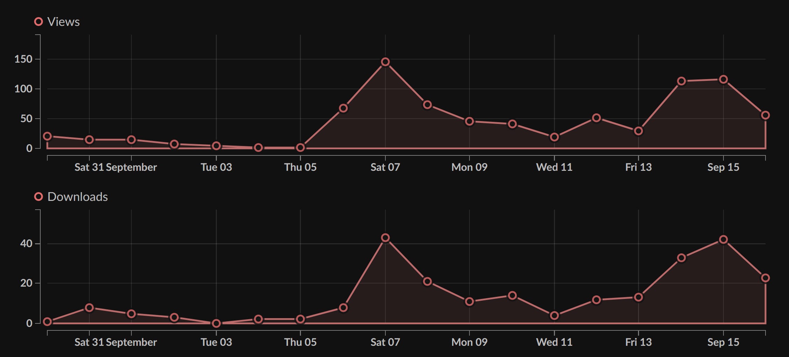
  
In the first days we were lucky to get more than 20 views (which was once) and more than a couple of downloads. This was to be expected. We had no presence on itch beforehand and social media. Regardless, it was motivating and promising validation that strangers were downloading and playing the demo.
  
A week later we ended up having a view peak of 146 and a download peak of 43. 
This came as a surprise given we only had a handful of followers on Twitter and Facebook page, so after some investigation were discovered that we 
were featured in the top 30 (or so) of itch.io's *Most Recent* section. As a result, we decided to publish devlogs on itch every week 
on Wednesdays and we'd release them right when *#IndieDevHour* is happening on Twitter and other social media sites.
   
We got a few hundred views in total from all of that and then we have a dip (see the 11th of September). You might notice the later increment in downloads, this was because 
we were later featured in the *New & Popular* section as well. This resulted in another 100 downloads, another 300 views, with a Click-Through Rate (CTR) that was ridiculously high (for us) at 1.3% 
and the conversion rate from view to download was something around 35%. On top of that, we were signal-boosted by itch, which allowed us to surpase 500 views and 200 downloads.
    
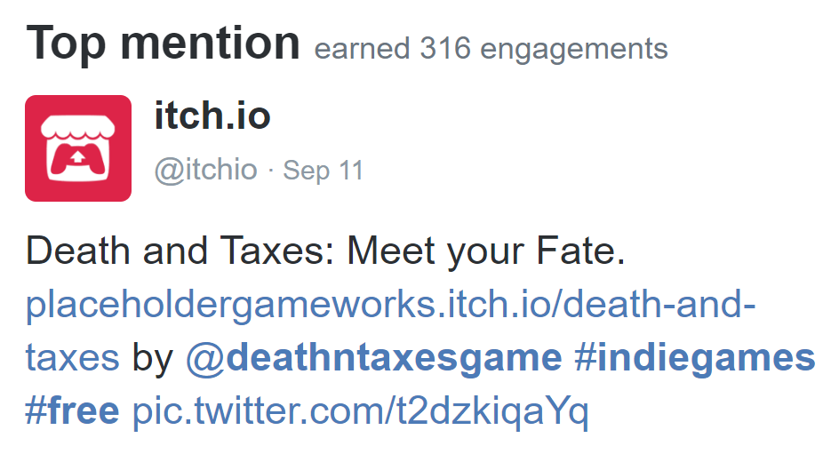
  
#### Key takeaways ####
  
*Did uploading a demo help with motivation?*  
Yes.
  
*Did uploading a demo help with visibility?*  
Yes.
  
*Would we have done anything differently?*  
No. Limited time and resources meant that we wanted to focus on the development of the full game as much as possible.
  
### Exposure through YouTube ###
  
Later that month, we witnessed another big surge in downloads and received several requests on Facebook asking for downloads of the game. A YouTuber called GrayStillPlays created a video that, at the time we discovered it, had 200k views. 
  
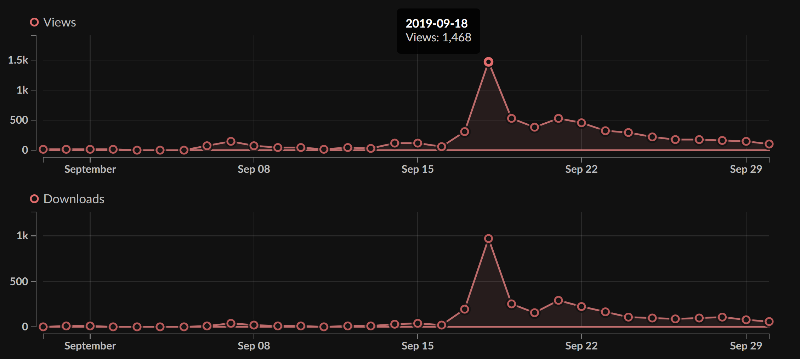

While this can be attributed to luck, it needs to be mentioned that appeal for content creators was heavily considered when designing the game right from the beginning. This was done by focusing on making the gameplay humourous, the art high quality and simply ensuring that gameplay was fun to spectate, in other words ideal for streaming and let's plays. 
As days came by, more and more videos about our game started to pop up. We're at 6 (I think) so far. And note that this has been completely organic. At this point we haven't done practically anything other than tweeting about our demo being available on itch.io and people finding it on their own.
  
That said, our first and foremost goal is to release on Steam and we couldn't capitalize on the exposure that effectively because we hadn't setup a Steam store page. The website was also quite lackluster, with the only option for potential customers to interact being a newsletter (it was even missing a link to the itch.io store page).

#### Key takeaways ###
  
*Would we have had the same kind of exposure if it would have been covered by a smaller content creator?*
No.
  
*Would we have had the same kind of exposure if we hadn't released a demo?*  
Nope.
  
*Would we have had the chance for this kind of exposure without a demo?*  
Absolutely not.
  
*Would we do something differently?*  
UM. **YES.** Have a better landing page, have a Steam page up, have the infrastructure ready to funnel views into the Steam page.
  
At this point we're getting a view-to-download conversion rate on itch.io of about 65%. That is remarkable engagement. The initial blitz brought us 1500 downloads alone and we got around 400-500 views daily. 
We scrambled to get our pages linking to all the relevant stuff (our itch.io page at the time) to make sure people were seeing what they needed to see if they were interested in the game. And then we also relocated to Sweden. Yay.
  
### Maintaining Download Counts ###
  
#### Analyzing Consistent Exposure ####

During October, video views continued to increase and the game was able to retain its position in the itch.io categories that it had began to appear in. It also made an appearance at the landing page of the site. All of this led to a consistent amount of daily downloads and a quick peak throghout the month and a view-to-download ratio of 30%.  

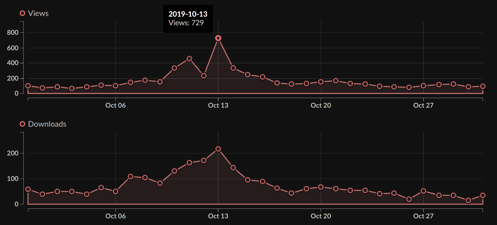
    
At this point we're asking ourselves why are we doing so well. We came up with the following:
  
1. YouTube content
2. The free demo
3. Unique and polished graphical assets
4. Game controversy (death is still a controversial topic!)
5. **Devlogs**
  
#### Written Content ####

Here is some data on the lifetime performance of our devlog:
  
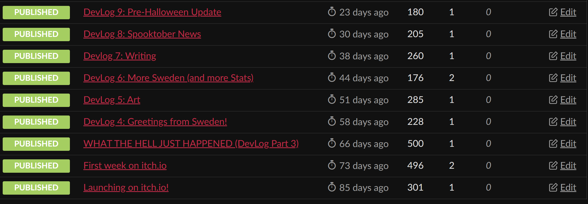
  
Granted, it's not much, but in hindsight, this is what kept our tail going during September-October. Twitter was a very different story, with interaction being significanlty lower.
      
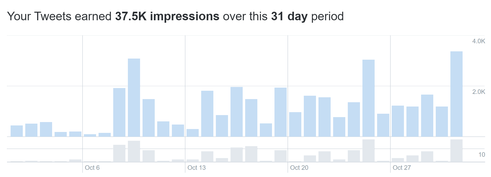
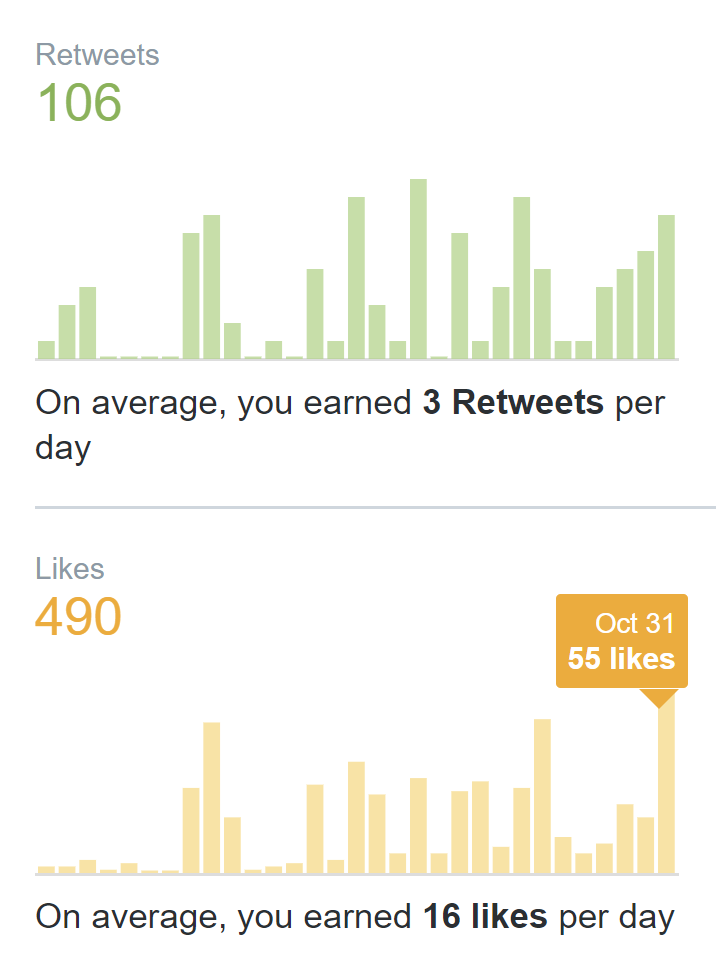
    
For one month of performance this is not a lot, with only 3 retweets per day and little to no store conversion. 

#### Announcements ####

Apart from posting more frequently on social media, we wanted to boost the current growth by creating a new demo. This was definitely a big tradeoff, because it meant we had to stop working on the main game.
  
We planned to make a big announcement featuring the fact that we had created our Steam page, a new demo and the release date. We identified that interactions on Twitter for the current time of year were particularly high on Halloween, so we planned to post on the 31st of October. After building up to the announcment using devlogs and other content, 
we ended up with 100 wishlists in the first 24h of the Steam page being up, we had higher-than-ever numbers for our tweets and we were showing up on itch again.
  
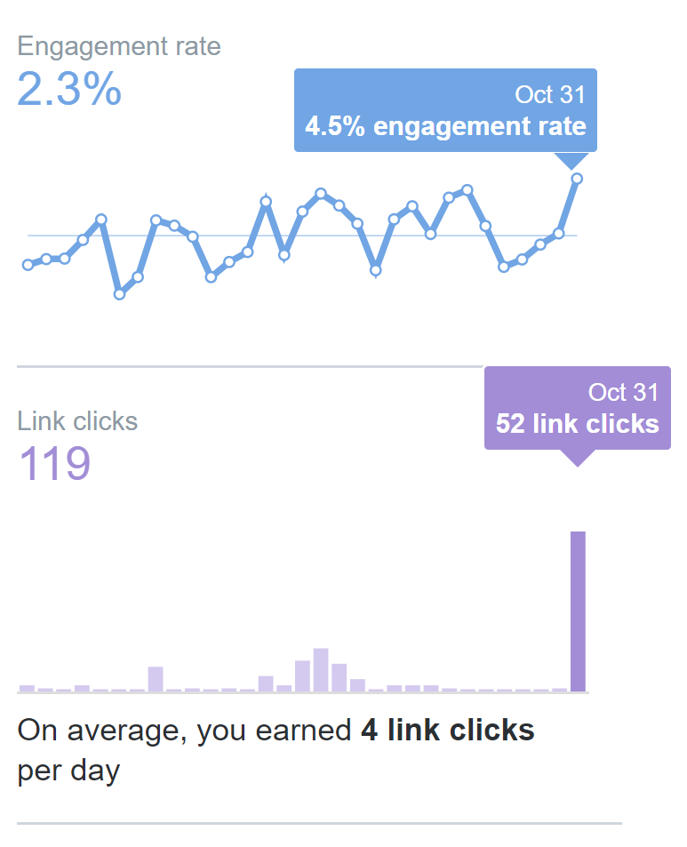
  
The article about our launch also did well on itch.
  
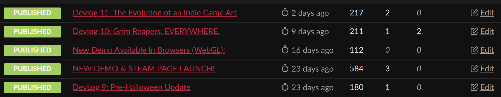
    
#### Key takeaways ####
  
*Did it make sense to update the demo?*
Yes.
  
*Did it make sense to make one big announcement for all 3 things?*
Yes.
  
  
### Releasing a new Demo ###
  
#### Launch Statistics ####

So we released the demo right after Halloween on the 1st of November and while we were really happy with our first week Steam stats (2,665 impressions, 2,191 visits, 82% clickthrough rate and 180 wishlists), our updated demo did worse than the initial one with about 10-20 downloads a day. 
  
So what gives? We believe that people who have played the first demo probably already made up their mind about the game, and people who haven't played the demo aren't seeing it because we're already tailing again due to visibility algorithms.
  
#### Porting the Demo to run in the Browser ####

Meanwhile, leading up to Halloween we had participated in a local game jam and I had an interesting idea. We released our game jam game on itch.io for 4 platforms: Windows, Mac, Linux and as well as the browser using WebGL. It got a LOT of hits (free horror games tend to do well on itch). 
And where did most of the players come from? WebGL. And yes, I have the numbers to back it up!
   
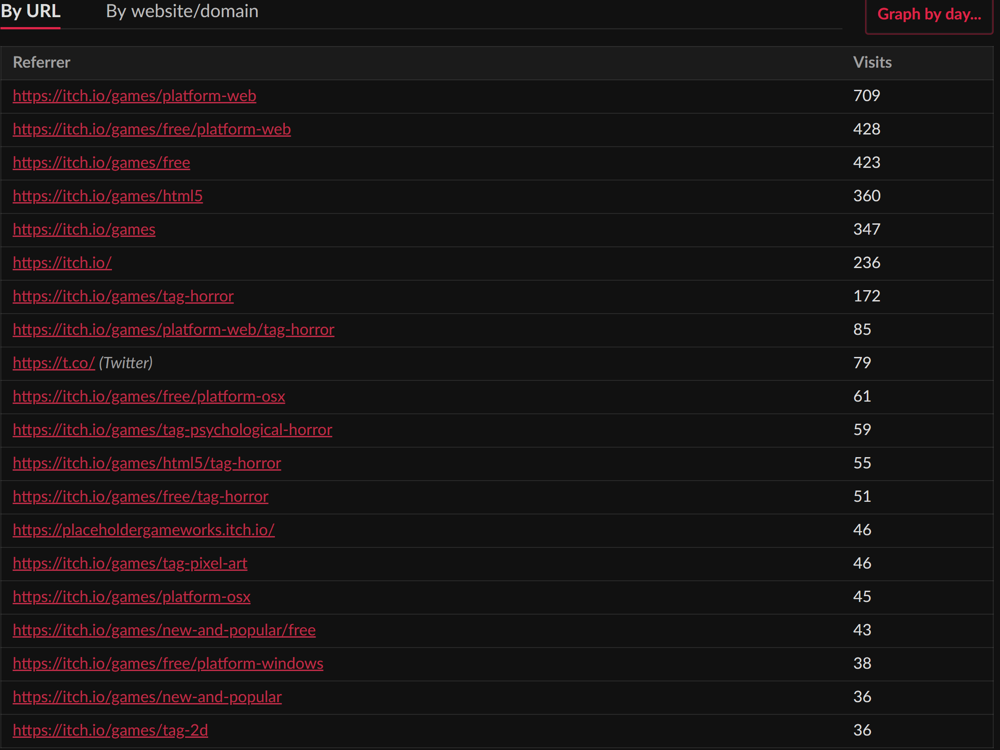
  
Based on these results, we decided to port our new demo to run in the browser and distribute that way. It's important to note that this conversion was not easy, as performance issues reduced the quality of the gameplay. We launched the WebGL demo on 5th November. The first week was great:
  
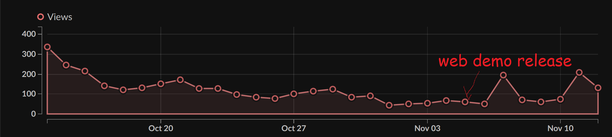
  
So how did it affect our overall visibility? Well I'll tell you what: *pretty damn well*. It's been almost 3 weeks since we did that and it is just now starting to tail off. Not as good as our previous pushes in Sept/Oct, but still very good.
  
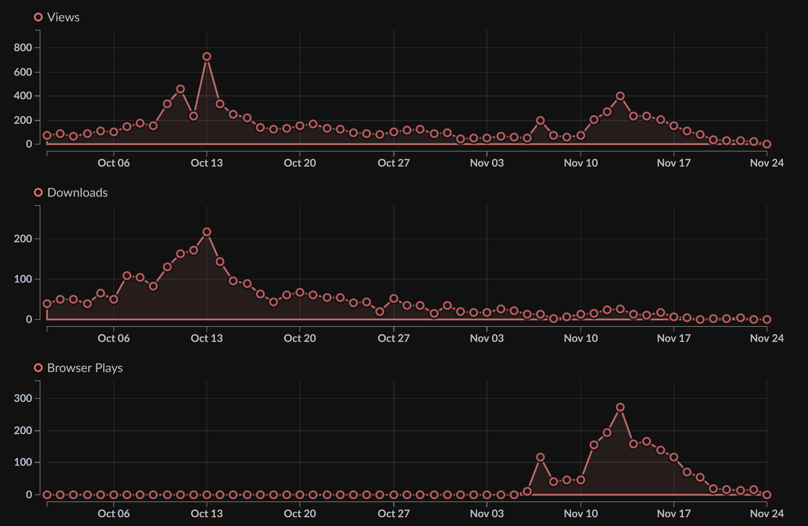
  
We ended up with around ~1000 Browser Plays, ~1500 views and ~200 standalone demo downloads just because we released on WebGL. I can confidently call that a success.
  
#### Key takeaways ####  
*Would we have had more success with the demo if we put more time into it?*
Probably not. (spoiler: you'll see when I get to the next part)
  
*Was it worth 6 hours of time to get the WebGL demo out?*  
Yes.
  
*Would the effort that went into the demo have been worth it without the WebGL demo?*  
No. (But with Steam it's a completely different story)
  
*What did we learn?*  
Updating your demo does not seem to have a big effect unless you start targeting new platforms.
  
### Conclusion ###

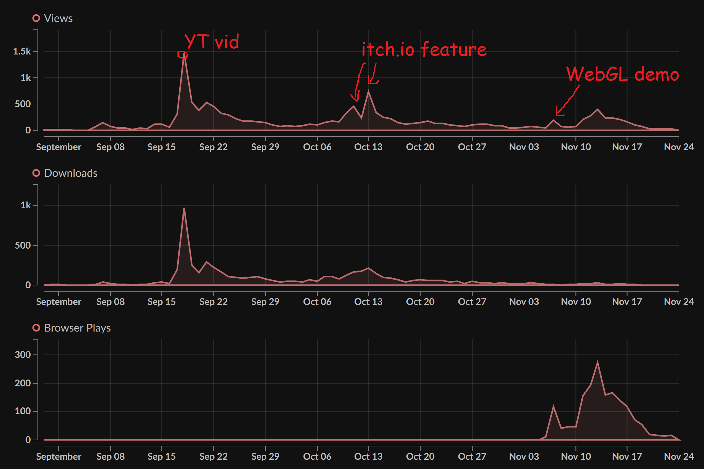
  
1. The demo has been more valuable than we can put into words in terms of building visibility AND our community
2. Seeing our game do well validated a lot of design choices and kept motivation very high throughout the team
3. The time invested into building a demo has always been calculated and limited
4. Having a game that's designed to catch visibility and target content creators helps
5. If you have a demo that's suitable for WebGL (on itch.io), it will increase your chances of getting noticed
  
And finally: **Yes, you should probably release a demo.**
  
The last one comes with a big BUT. You should probably release a demo if you have no other way of generating visibility for your game and/or if you have a very 
limited marketing budget. If you're an indie dev and you have a first playable version out, at this point, unless you're being published, you probably will have zero 
resources to actually generate traction for your game. Posting into gamedev groups, social media accounts, etc. is going to be an uphill battle because you're probably 
going to start out with no traction (just as we did at the end of August). 
  
We had no other marketing plan other than railing the game into the public consciousness for 6 months before release with using as many low-effort/high-reward tools as 
possible and betting on exposure through content creators from the get-go. We were initially skeptical of having a demo, because there had been a lot of hearsay about 
how having a demo hurts your sales and whatnot. I do not believe this is true. If you have to choose between 100 views (without a demo) and 10000 views (with a demo), 
I will pick the latter option ten times out of ten. It will help engage your community, because you can ask for feedback (we did, and it worked for us) and present regular 
content updates so people can follow the game's progress. When you do decide to make a demo, make sure that you are showing enough of the game for your players to be interested in it, 
so you leave them wanting more: don't show off everything you have. And likely, you won't be able to, because when you're thinking about a demo, a lot of your game is probably still unfinished.
  
Is there a winning formula for when to release a demo? Well, no. From other examples that I've seen, for example from [u/koderski](https://www.reddit.com/user/koderski/) on reddit, or [Crying Suns](https://store.steampowered.com/app/873940/Crying_Suns/) or 
[Book of Demons](https://store.steampowered.com/app/449960/Book_of_Demons/): you should be releasing your demo before you release your full game, and then consider whether or not to keep it up after 
your game releases. If your objective is to generate traction I suggest getting a demo out sooner rather than later, but not at the expense of the full game.
  
As always, your mileage may vary (YMMV), but this worked for us. It worked for us so well that we decided to bite the bullet and release our demo on Steam, too. We did this only a 
few days ago as of the writing of this post, so results are still preliminary, but I can just say that it skyrocketed our visibility and it's giving us visits, installs and most importantly: wishlists. 
I will tackle the topics of demos on Steam in a future post.
  
If anyone has ANY sort of numbers, stats, experiences, etc. that they are willing to share, please do so in the comments. When I was doing research on this subject, there was simply not enough data to make 
a strong enough case, but having tried this out ourselves, we can see that the numbers simply do not lie - **having a demo helps with your visibility.**  
  
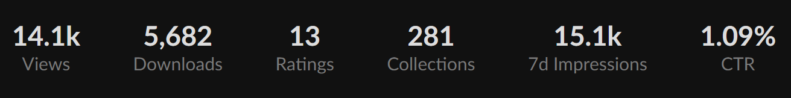
  
**Thank you for reading <3**