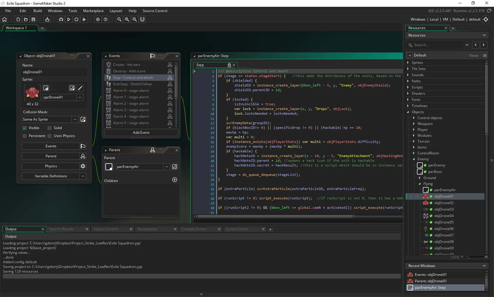
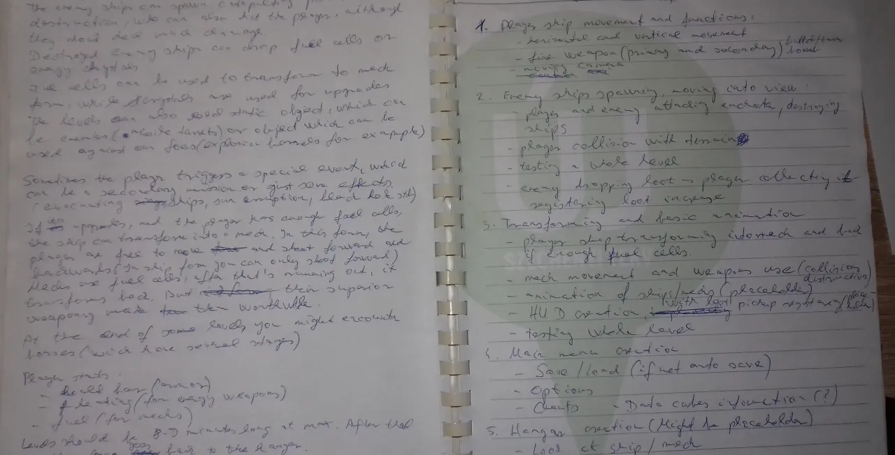
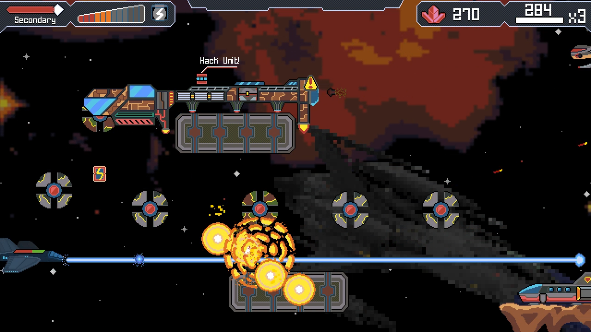
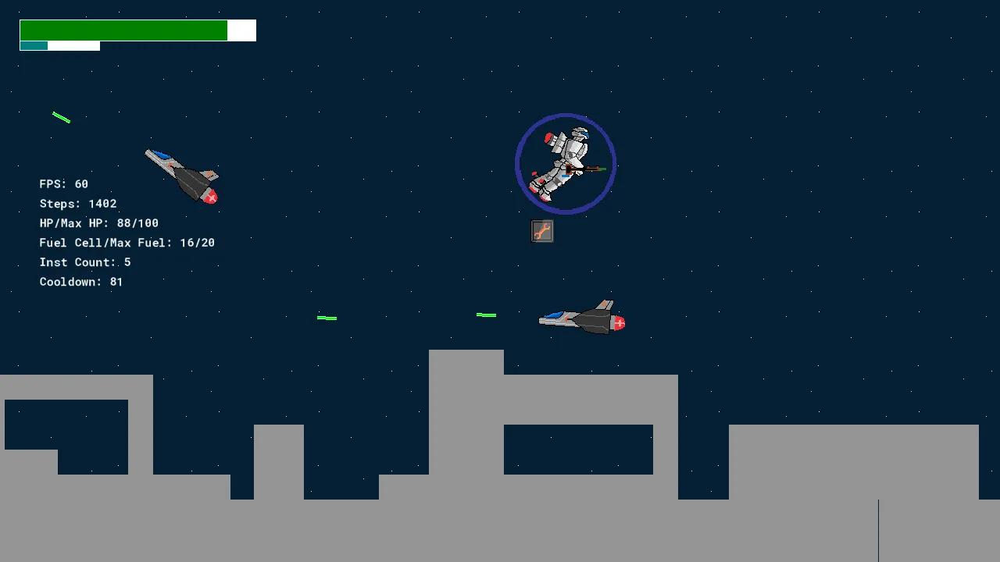
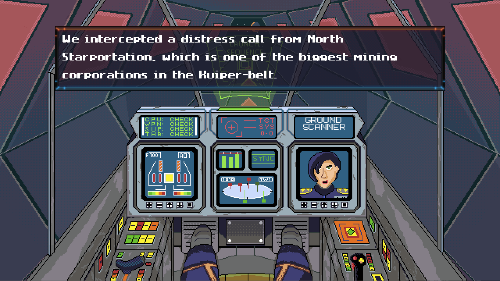
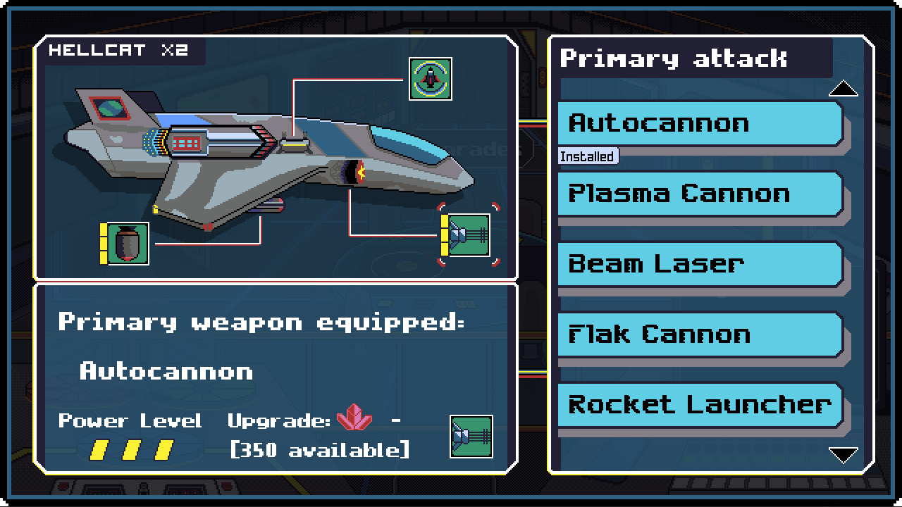
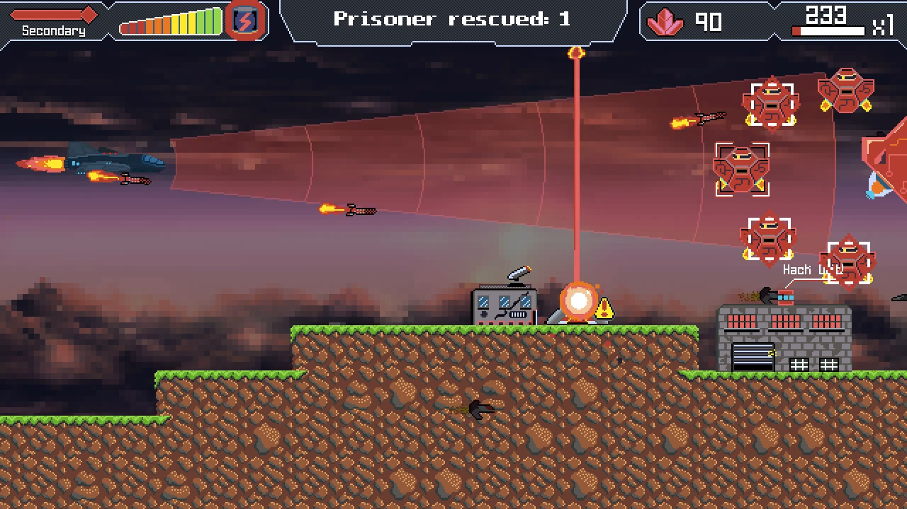
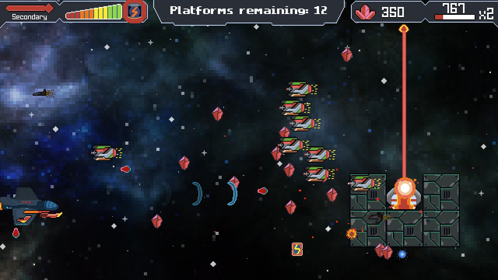
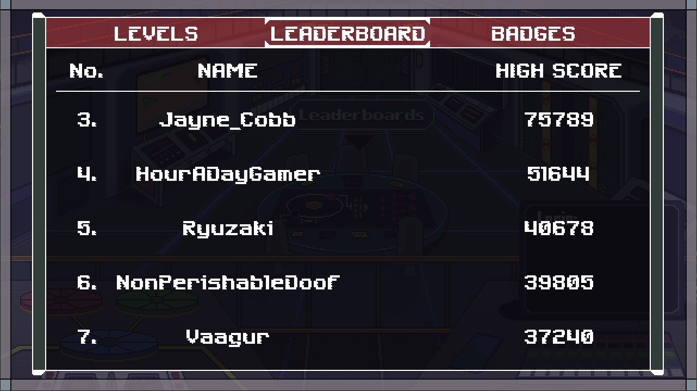

The day I’m writing this post-mortem, it’s been only a few months since the release of my second game, called Exile Squadron. 

<iframe src="https://store.steampowered.com/widget/1161910/" frameborder="0" width="100%" height="200"></iframe>

Although I was working on the game in December and January, ironing out some bugs and making a Linux version, I considered it finished in November 2019. Now I am ready to continue my gamedev journey, figuring out a new project. But before I do that I wanted to wrap up Exile Squadron with a few thoughts.

Even though it was my second game, creating Exile Squadron was a daunting task for me. My first project – A Long Road Home – took me one year to make from scratch, while the new game took two and a half. The reason for this is that A Long Road Home was made in the RPG Maker VX Ace engine, which is a beginner tool in the sense that you don’t have to code anything in it (although you can, to push the engine to its limits). I also used a lot of stock assets in my first game, both for graphics and sound/music. This basically meant that I only had to design the gameplay, write the story, figure out the puzzles and of course bring these into the engine. And even with a simpler engine, it was tough to create this adventure game, it being my very first project.

When it came to Exile Squadron, I wanted to improve myself and step up my game, so I decided that I will design, code, draw and compose the game from zero. I wanted to create everything myself. And although I didn’t succeed 100%, I came close. The reason for this was that I really wanted to be better, and I know that if I wanted to create unique and different games in the future, I have to learn and improve some skills of mine.

### New Engine
For this project, I needed a new engine, since RPG Maker didn’t do it for me anymore. Don’t get me wrong, it is a great engine, and some great games were done with it, but the truth is that if you want to create anything else than a classic JRPG with it, you really have to break down the engine with scripts to overcome its limitations. And if I have to fiddle around with scripts, I might as well code a game from zero in a more freeform engine. That’s how I arrived to Gamemaker Studio. I didn’t hear about this engine before, but one day there was a great Humble Bundle sale, where you could buy the whole engine package for a very low price. This is an engine which is used for 2D games first and foremost, some really great games were created with is. Things like Hotline Miami, Hyperlight Drifter and Undertale.

Although the game’s scripting has a Drag and Drop interface (which means you build up code logic with dropping down elements, similarly to Unreal 4), people recommended me to learn the programming language, called GML (GameMaker Language). So I started to do just that, and with the help of some great Youtube tutorials from Shaun Spalding, I managed to be more and more confident with it. Parallelly I started learning some Python, which is one of the most popular programming languages in the world, to understand programming logic a bit more, and get the hang of basic programming structure. This helped me a lot to code in GML, especially since there are some similarities between the languages. While I was learning GameMaker Studio version 1.4, the new version came out, so I switched to GameMaker Studio 2, and I’m using that since that point.
  

### Design
When I started to get the hang of this engine, I started to brainstorm some ideas regarding my next game. I had a lot of ideas, which I scribbled down in my notebook, so in the future, I can come back to them. In the end, I decided that I will try to create an old-school shoot ’em up (SHMUP for short). I was playing with Jets ’n Guns at that time, which provided me a lot of inspiration, and made me enthusiastic about this genre. I always liked these games, although I can safely say that I was never a „pro” in them. Unfortunately, this will come back to me, biting me in the ass. More on this later.

So I started to get some ideas about the game, I was thinking about the style of the game the gameplay etc. I wrote these down, creating some kind of design document. I can highly recommend creating this document if you are doing a serious project. Even though the details you write in them might change during development, in the beginning it provides great reference for you and helps to keep yourself on track. I wrote down the basic story, the style of graphics I want to use, the type of weapons, things like that. Using this document, I created the workflow of the project. I’m a kind of person who likes to plan everything in advance, which is exactly what I have done.
  

About graphics… As I’ve mentioned, I wanted to create every art asset in the game myself. Sigh… How should I put this? I suck at drawing. So you can imagine this was a huge hurdle for me. But just like coding, I started to practice some, drew spaceships, some logos to get the hang of it. After I decided that the game will use pixelart, I started creating pixelart ships. Well, you can see from the game that I didn’t actually succeed in creating high-quality art but I succeeded in creating my own art. I knew my limitations and quickly realized that I won’t be able to create a very good looking game, but it felt good that it was me who created the assets in Exile Squadron. And actually, I got some compliments about the pixelart, which was really heartwarming.
  

### Cutting features
As for the design of the game, I obviously overscoped in the beginning, like most indie developers. In my early prototypes, I gave the player the ability to transform between a spaceship form and a robot form. Also wanted space battles and land battles, a big story, and lots of weapons.
  

**What was I thinking?**

I started to flash out these ideas but thankfully I quickly realized that I won’t be able to achieve these goals. The game would never be finished if I sticked to these original ideas. So I scoped down the game. No transforming spaceship. No land battles. Although I kept the story, it was more static than I originally designed it. From dynamic cutscenes, I went to pre-mission briefings and backstory bits, which you could collect during missions.
  

I cut down the number of weapons, but I made them more distinct from eachother. I didn’t want to have similarly working weapons, like different types of lasers. My goal was to have equipment which all work differently and requires different tactics. So I made lasers, flak cannons, machine guns, bombs, EMP weapons, shields, attack drones etc. 
  

I think I succeeded in creating these weapons unique even though I had a problem with balancing them and making each of them meaningful. I also had to downscope the number of levels in the game. Originally I wanted to have at least 20 levels. From that, I went to 10, and from that, I went to six. Not to mention that at first I created levels which took at least 10 minutes to finish (that’s not bad for a shoot ‘em up), before I realized that it was more fun to have shorter (4-5 minutes long), but more adrenaline-pumping levels...

...who am I kidding? The truth is that I started to burn out when I created these long levels. This is why I cut back on some features. I remember that I already worked on the game for a year, and I didn’t have too much to show. This is where I started to lose steam, I became less and less enthusiast about my own project. That is the point where many developers just throw their project into the bin and start a new one. This is where the experience from my first game came in handy. As I learned there, you have to push through during these stressful times, you have to be persistent and not fall victim to the shiny object syndrome. So I cut features from the game, cut levels, accepted that this is the best graphics I can do at this moment, and continued to work on the game.

Because let’s be honest, most of us won’t be able to make the perfect game, the dream game, especially not as a second project. I just had to teach myself to let things go. I know each project is like one’s baby, but this is just a game. I’m not saying that you shouldn’t try to create the best game you can, but you have to realize which are the points where spending more time on a project is not worth the extra time. Either because the game probably won’t be more fun, or you risk not finishing the game at all. After I accepted that I have to cut stuff and won’t be able to realize my original vision, it was easier to continue development.

As a result, the game has been finished during September 2019, and I could start looking for game testers. I never had too much luck with these, since I only got a few testers. I don’t know what I’m doing wrong to be honest. I posted on social media, I posted on the game’s website, but I could only find a handful of them. Thankfully the testers I managed to contact gave me great feedback regarding the game. I couldn’t implement everything they suggested, but I think I managed to improve the game. 
  

The biggest problem arose from the fact that although I always liked shoot ‘em up games, I was never really, really good at them, which meant that the pacing of the levels, the enemy spawns and movement was far from the perfection of games like Jets ‘n Guns, Gradius and similar classics. Of course, I’m just a lone indie developer, but it still bugged me that the flow of the game was not as good as I hoped, and this stemmed from my lack of knowledge of the intricacies of the genre. Lesson learned: it’s not enough to like certain types of games, you have to understand the mechanics and their structure. I know this is basic, but I still managed to fall into this trap.

### What went wrong?

Ending a project which lasts for years is never easy. You are building a game from the ground up, adding new features every week, and you really want to make your dream game. As a game developer, I also had a lot of ideas I wanted to implement in Exile Squadron, but guess what, not everything made it into the game. Some of the ideas were easy to let go, but others caused me a lot of headaches. Should I still spend days or even weeks implementing them, or just cut them instead? The first thing I cut from the game was one of the basic ideas I had. As I mentioned earlier, the player had the ability to transform from a spaceship into a huge robot and vice versa. But I realized that I couldn’t make the two options different enough, so I thought that instead of making two half-baked gameplay elements, I should concentrate on one of them and make that as good as I can.

This was actually quite easy to let go, opposite to the background art and music cuts, which I really felt bad about. Unfortunately, both the background art and the background music is quite limited in the game. Since I’m not a good artist or composer, I couldn’t make quality assets, and I had a limited budget to pay for external help. This resulted in only one background music and a few very basic background sprites. I think this hurt the overall presentation of the game, but I realized at one point that I won’t be able to improve this part of the game.

Last but not least, I really regret that I couldn’t do localizations to other foreign languages, which also came down to the lack of resources.

### Always look at the bright side!

Not everything is bad though, there are a lot of things which I managed to implement in the game. I could say that most of my original ideas made it into Exile Squadron in one form or another. I’m glad that a basic story mode is available, which makes a nice background for all the action. And although I’m not a graphic designer, I’m glad that I managed to create a lot of enemy spaceship art, which come in a lot of different styles and sizes. I made so many assets in fact, that half of them didn’t even make it into the game, so I could even use them for a sequel (if I ever make it).
  

What I am most proud of though, is the weapon upgrade system, which was one of the most important gameplay elements for me. I’m not saying it couldn’t use some improvement, but I’m satisfied with all the different kinds of weapons and their upgrades. They are all very different in their use and effects, and that was my goal from the beginning. Unlocking everything also required the player to replay the game several times, trying to improve their skills.

I also wanted to create a leaderboard, because this element always was an essential part of the retro shmups, so obviously I wanted it in Exile Squadron as well. It’s in the game and works pretty good. Sometimes I take a look at it, just to see how do the players perform in my game, and I have to say, there are a few very good players, who achieved a higher score than I ever could even with debug cheats.
  

So what’s the main takeaway from this? There will always be ideas which won’t make into your games, because if you want to finish and ship them to the players, you have to say STOP at a certain point. Don’t feel bad about this! The challenge is to figure out which ideas should you send to the cutting floor, the ones that add no real value to the project. And of course one has to pinpoint the core elements, and spend resources on these instead because these are the ones which make the games fun. I just hope I made the right decisions during the development of Exile Squadron.
