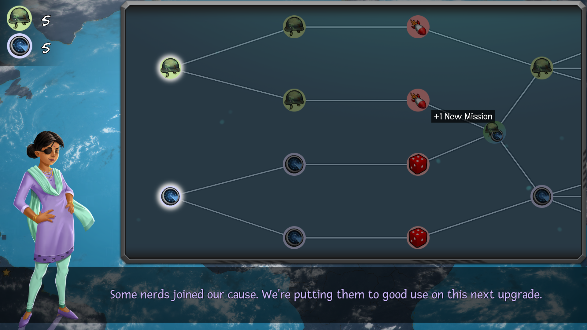
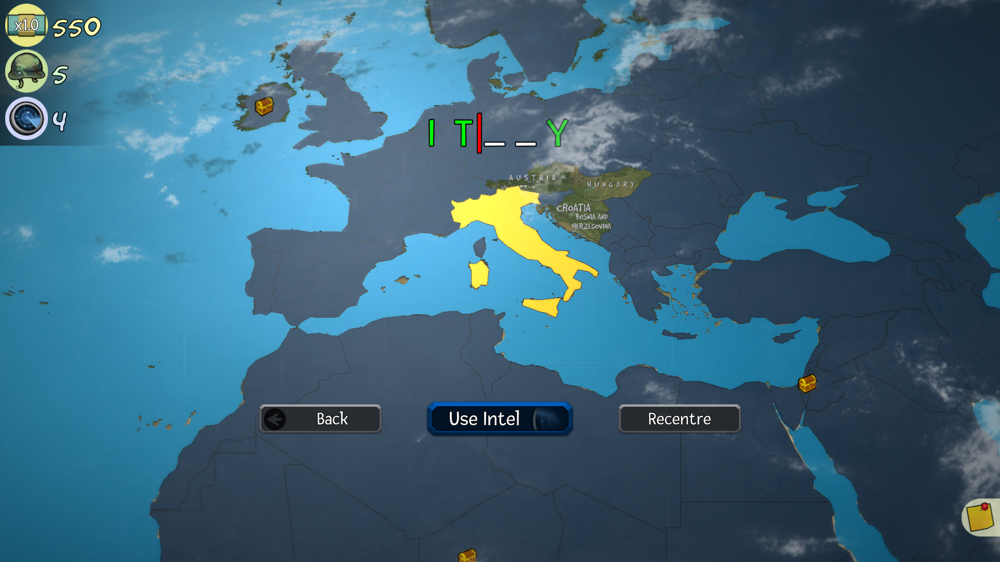
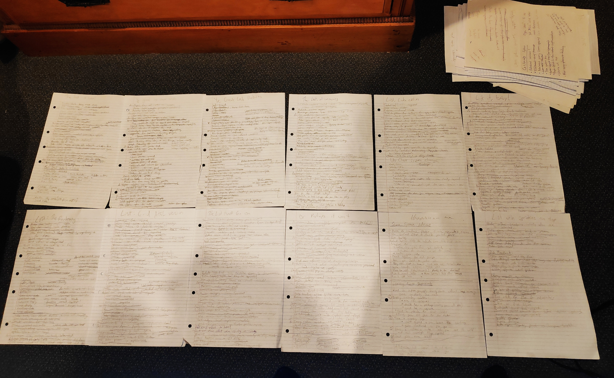

import ForgetfulDictatorSteam from "../../../src/components/products/steam/forgetful-dictator.js"
import WorldMapStrategy from "../../../src/components/products/unity/world-strategy-map.js"

**TLDR: Making educational games is a lot of work but very fulfilling. Please consider it!**

Hey folks! I'm Eben, the developer who made Forgetful Dictator - an educational game about conquering the world. It plays like a simple strategy game, but the primary mechanics are based around naming countries, capitals, flags, and other geography trivia. In this post I'd like to detail what the development was like and try to convince others to join me in making them!
<ForgetfulDictatorSteam />

## My background

Although I work in the games industry, I'm technically not a developer. During my day job I make trailers and other videos for Path of Exile, so this has been a hobby project that I've been doing on evenings and weekends. I have no formal training in programming or art. With this in mind I kept the scope small and outsourced some parts of the development process. 

## Motivation for Creating the Game

The prospect of teaching through a game is enticing, it feels like you're doing some good for the world. I'd tried making various games before and always burnt out after a few months. Forgetful Dictator was the first game I was motivated to finish, because it felt like I was doing something positive. For that reason I decided to make it free for educators (which on PC is as simple as giving out keys on Itch.io).
Another enticing reason is the "extra-curricular" learning. You're not just getting better at game development, you're also learning a lot about your chosen topic of education. After researching and writing hundreds of trivia questions, my geography knowledge is so much better than it was before!

## Designing Forgetful Dictator

I knew that if I wanted to turn any heads with an educational game, it'd need to be a bit ridiculous, so I began with a ridiculous theme: a clueless dictator trying to conquer the world. I built it up from there. 
I went with geography because my own knowledge was poor; I knew I should have a better grasp of countries, flags, and capitals. I’m sure others feel that way too, especially considering the popularity of quiz sites such as Sporcle.  
  
I have a design philosophy that can be summed up with this Picasso quote: "Art is the elimination of the unnecessary." I think this can be applied to educational game design. I wanted to design mechanics that serve the sole purpose of teaching geography in a fun way. Any mechanical fluff that doesn't help with that would have to go. I don’t think I achieved this perfectly but it helps to have an ideal to aspire to.  
  
I initially had an “Upgrade Tree” in my game, à la Civilization or other strategy games. I thought a familiar mechanic like that could help draw in strategy-game players. However after some testing and feedback I realised it was quite uninteresting and distracting. I replaced it with a much simpler system of random upgrades - of which you can choose between two. It was much quicker to understand and engage with, and that little endorphin hit of opening a chest of random loot works as much better incentive than an ill-fitting tree system. 
  

  
I also knew that kids would be playing the game, so I did my best to keep it intuitive and simple. Mechanical complexity would just get in the way of the geography. I designed the game so that a supervisor (parent or teacher for example) could instantly pick up what's happening and help you with the trivia questions. 
  

## Developing it

I knew from the start that my success in finishing the game would depend on whether or not I could get it before losing interest in development, so good time management was essential. I tried a few approaches to self-discipline, but the best results simply came from making a habit of working on it every day. I didn’t always adhere to this, but it helped. It was also a nice boost when I could offer a playable game to friends - feedback is excellent fuel. My issue-tracking was very low-tech, I simply wrote out massive to-do lists on refill. It’s just very satisfying to cross things out.
  

  
I cut a lot of corners using paid assets, primarily UI assets such as icons and panels. You can get loads of icons for only a few dollars, which was lovely. I did my best to find art styles that would compliment the character art.   
  
The most important asset however was the World Map Strategy Kit.  
  
<WorldMapStrategy />
  
It was the base for my game. Thanks to that asset, even though I'm not a good programmer I found that adding new features didn't take too long. The biggest single time sink in an educational game like this is the research- I spent months writing trivia questions.   
  
It can be difficult to hunt down a good trivia question. I tried looking up ready-made facts and trivia questions but many of those websites had sketchy claims and information. In the end I opted for trawling through wikipedia and picking out what caught my eye. I did my best to double check facts, and that took even more time!

## Outsourcing

I hired voice actors through Voice123.com, checking their profiles for the kind of boisterous performances I was looking for. I found both the character artist and the composer on reddit by posting the gig in the relevant subreddits and choosing from portfolios that appealed to me. These were both short term jobs - Jonathan Munro made the character portraits, a win and lose screen, and the main menu art. Jacob McNatt made three music tracks for me, and I purchased a few more from asset stores to pad out the soundtrack.  
  
All-in-all it was a frugal way to hire talent, as the game allowed it.
My advice from this process is about the same as you’d read on any blog about it: 
  
**1. Make a post and let people come to you, rather than trying to message people out of the blue. This way you can quickly tell who is the most interested in the project, and who’s available.**  
**2. Before hiring anyone, commission a sample of someone’s work (such as a quick pencil sketch) to ensure they can listen to your instructions and respond in a timely way**  
**3. Be careful to make a contract that works for you**  
  
If it’s financially viable I’d definitely recommend outsourcing the art and music if you can’t do these things yourself. The experts will have years of experience and their work will elevate your own immeasurably. Unless you’re very keen on learning, the time investment to learn it yourself simply may not be possible if you’re working a day job.

## Sales Analysis

In terms of cash returns, it did okay for my first indie game and the fact that I developed it in my spare time. As of now I've sold around 1000 copies on Steam and I have yet to release on mobile, where I suspect the game will do better. 
Most of my sales happened in the release month, but I did get a few bursts during Steam sales later. From a business perspective I’d say I made back a bit more than what money I spent, but it certainly wasn’t enough to cover all the time I spent on it. It did alright for a hobby project.

## Reflection

### What I did wrong

From various reviews I've discovered that the game really needed more trivia questions at launch. It can take a long time to write them - they ate up months of development and still I did not have nearly enough. A good question can take over an hour to write and 5 seconds to read and answer. I think perhaps this is the stuff that scares off developers from educational games, so I'd recommend keeping everything else simple so you have time for the research.
  
The UI of Forgetful Dictator wasn't great either, I think it might've been worth hiring a professional for this aspect of the game. Mechanically speaking, the score system in the game is a bit boring and I haven't yet figured out what to do with it.
  
I also think that I should have done more to promote the game. With better marketing, I could've gained more exposure for the game and thus more sales. 
I tried a few approaches to marketing but the most effective was simply making posts the relevant subreddits. There are a lot of rules on Reddit, so I would suggest making sure you’re well aware of them all before you start doing this. I’m also very familiar with Reddit myself, which probably helped. I’d also recommend searching for popular posts in each subreddit and copying the format and posting time. Let someone else’s success do the legwork for you. 
  
Contacting youtubers also proved successful - Northernlion and Alex the Rambler both played my game which was a huge boost. There are plenty of excellent guides online about how to approach this.
I have a Twitter and Facebook account but neither of those really amounted to much. I think what I really needed was a community of keen fans - perhaps built up on Discord. I wasn’t sure how to approach this however, and I was intimidated by the concept, so I never really tried. 

### What I did right

I finished it! As someone who has abandoned many projects in the past this was a big deal for me. I’m also proud of the fun premise of the game which makes it an easy sell in a conversation. I wasn’t afraid to act on feedback, and I did manage to reign in the scope despite having many crazy ideas about what to add to the game. My development was a bit messy but I stuck with it and learned a lot in the process.

I also think taking the risk to make something educational was rewarding - I feel like I’ve found my niche. Overall, I'm very happy to have created the game. Here's a message I received from one teacher who tried it with their class:
"Lastly I would like to congratulate you on making an engaging and fun educational game. Honestly I haven't seen children so engaged with an educational game since I was in elementary school and we played the Oregon Trail on our Apple IIs.”

## Looking ahead

I'm not completely burnt out from making games, which is a good sign. I'd like to release the mobile version and look into other significant features such as multiplayer (although this is super daunting).
Thanks for reading! If you’re like me and struggling to finish a game project because nothing feels worthwhile, do consider making an educational game. Those extra elements, although challenging, might just be motivating enough to get you through.