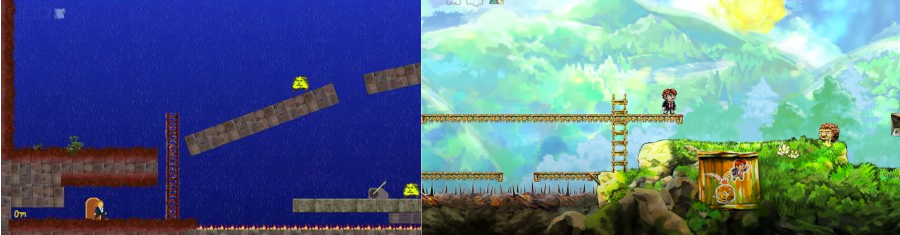
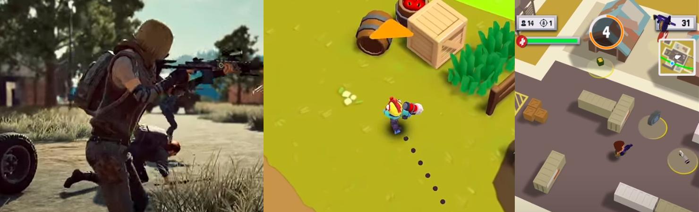
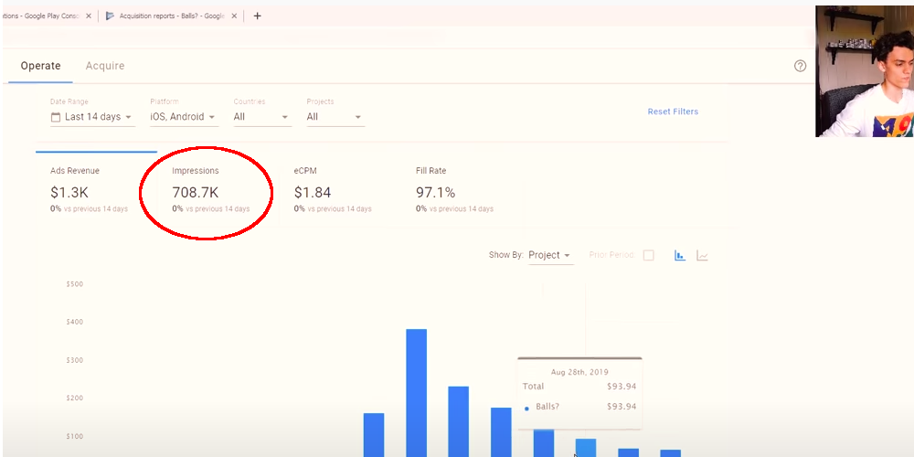
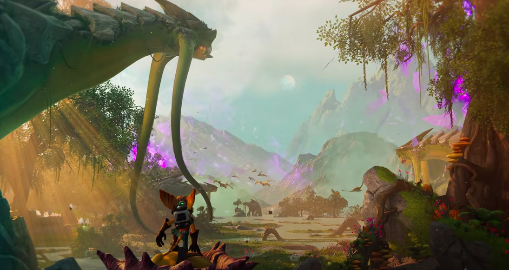

import Tweet from "../../../src/components/tweets.js"

My first games pitch was a failure. It was for a student games accelerator competition, where
the teams that had the best pitch decks (a “pitch deck” is just a fancy term for a presentation where
you explain why your game/business/product idea is worth funding) would be allowed to work on
their game with mentors for 3 months. They would be heading to one of the biggest
games conferences in Europe, where the winners were announced. The
problem was that we didn’t even make it through the first round of pitching – I was devastated!

In this article, I am going to outline what I learned from my failures and research, to show you how
to pitch your game to investors or publishers. It is going to include the exact structure and
information, in chronological order, that I wish I had known for my first games pitch deck! Finally,
I will be analyzing my own pitch and dissect the mistakes that I made.

## The Game Idea

### Idea Breakdown

Try to keep the actual idea breakdown very concise, think about how you can convey the concepts using
as little words as possible. You should include the following information:

- Genre (or combination of genres)
- Theme
- Insights into the game loop and economy
- List of similar games
- Target platform
- Who the game is for (target audience)

### Market Research

One thing that the investors will be really interested in is the target market for this game idea, so
you should go into extra detail. You should have data proving to the investor that there are a lot of 
potential players in your target market there is room for another game to be successful. 
Ultimately, the investor wants to get a feel for the maximum earning potential they can expect from
investing in your game.

## Prototype

Having a prototype to show is great, because as the saying goes: show, don’t tell. Nothing conveys
the concept of your game quite like a basic video or demo that shows the investor the core of your
game idea. It’s a great idea to let the investors play the game, so make sure you have
the necessary hardware setup to make this seamless.

#### Explain what parts are work in progress

With a prototype, there are almost always some tradeoffs that had to be made to complete it. For
example, it could be that the founding team lacks artists right now and thus, the prototype only uses
placeholder art from free game asset packs. You need to point this out!

*Legendary game designer Jonathan Blow had very sloppy game art in the first version (left) of Braid, before outsourcing it entirely for the release*

#### Early Validation Metrics

Consider putting your prototype into the hands of real players and gathering insights with some
analytics software. Here are the metrics I’d track in the early stages:

- Number of daily play sessions - how often during the day are people playing your game?
- Average play session length - are people playing the game for as long as you expect them to
    at a time?
- Retention - are players starting up your game after the first day? If they are not, perhaps
    your idea does not hook them enough and you need to adjust it.
- Marketing costs - How much do you need to spend on ads to get someone to download and
    play your prototype? This can tell you a lot about how easy it is to market your game, if the
    market is over-saturated, etc.

If the following metrics are not looking good, it could be worth reconsidering the idea. That way
you saved your own and the investors time! If they are what you expect, then you have a great way
to argue with and convince the investors.

### The “Why now?” question

Video games companies are plentiful and have existed for several decades now. It’s very hard to
find an idea that is truly unique, so a better question to ask when someone presents you with an idea
is: why now? What makes the current games market a great time to launch the type of game that
you are proposing?

- A new gaming platform (interactive headset, mobile device, console) was just released, that
    has some capabilities that enables your game idea or lets you port an idea from a previous
    platform to this new one, creating a very open market
- You are proposing an idea that uses new, fairly unexplored technology (quantum, AI,
    blockchain) which lets you create unique experiences that were previously not possible
- A current consumer trend in the market indicates that there is a new audience for your type
    of game, where there has not been one previously
- A new genre or interaction was just discovered and you are hoping to capitalize on this by
    creating your own version or spin-off

 
*The Battle Royale genre and platform changes opened opportunities for games companies on PC/Console with PUBG (left), then mobile with games like Butter Royale (middle) and recently on Snapchat with TinyRoyale*

## Introducing the Team

### Put every individual on a pedestal

The investors want to fund games that are made by competent people, so make sure you show off
everyone in the best light possible and highlight their strengths. Show off their previous games
industry experience, expertise, portfolio, etc. and why they are a perfect fit for this games project.

### The team constellation should make sense

The reason that a particular person is on the team should be clear, without having to point it out to
the audience. For example, if you are a team of all artists, the audience might be concerned with the
lack of technology or business related expertise.

Another great thing to mention is if members of the team have already worked on games projects
together. This gives the investors the reassurance that the company won’t fail due to founder
disagreements, which often happens and leads to the downfall of many startups.

### Mention plans on growing the company

Chances are that if you plan to raise money, you are going to use that money to grow the company
and hire employees. One valid argument would be to mention that you hope to use funding to hire
individuals that have skills your current team lacks. Investors are also looking for insights into the
hiring strategy and the company culture that you are trying to cultivate as a founder.

## Execution Plan

### Roadmap

You should outline the timeline that you are planning to follow when developing the game and
highlight any potential challenges or risks that you might run into along the way. Give the investor
an idea of the different milestones that you are planning to reach and when, so they can be confident
about when to expect a return on investment.

### Marketing Strategy

Some investors will want to know how you want to raise awareness of the game. It’s good to show
that you thought about these things by presenting a marketing strategy or by doing a small case
study with some social media ads, creating a mailing list, etc.

## Business Model

When somebody is looking to invest in your company or game, they are looking to make a **return**
on that investment, with profits. This means they will want to know how much you thought about
maximizing the amount of money that you can make with the game. You absolutely need to have a
good explanation for why you chose a certain model (free-to-play, premium, subscription, etc.) over
another.

## “Unfair” Advantages

Not something I would necessarily turn into a specific section of the pitch, though you definitely could, 
it's something you should think about when putting it together. An unfair advantage is something 
that gives your team an edge over the rest of the market. Here is an example list of unfair advantages that 
would help a company succeed:

- One of your team members has early access to an SDK of some upcoming hardware that
    only few other companies can develop games for at the given moment
- Someone on your team has rare expertise that will help you create the game in some manner
    that cannot be emulated by others (unique art style, PHD technology, etc.)
- A team member is an influencer in your target market with a big audience, meaning you
    immediately start off development with direct access to a bunch of potential customers
- Your connections have lined you up to work with a famous entertainment partner, who has
    agreed to partner up with you by letting you use their IP in the game
- One of the founders has a game idea patent, requiring competitors to jump through legal
    loopholes to copy your game

*YouTuber [Danii](https://www.youtube.com/watch?v=54GoOsHQQD0&t=185s) got over 700k impressions on his mobile game in the first few days, without paying for ads. His unfair advantage? Over 1 million Subscribers on YouTube*

## The Story of a failed Games Pitch

Our game idea was to create a game that included the sphere world mechanic from Mario Galaxy,
combined with procedural level exploration. As you will notice, we made many mistakes that could
have been avoided if I had access to the information I shared with you in this post.

### Rushing the pitch video editing phase

It is important to note that this was a video pitch – this means that we had to record ourselves, edit
the video, etc. We did a lot of this last minute, because we thought our idea was that good (note:
everyone thinks their ideas are great!). We had too little time to really edit the video and most
importantly, many of the team members (myself included) did not see the final edit before it was
submitted – this would have prevented a lot of the issues!

### Not focusing on the "Why now?"

Our initial claim was that the platformer gameplay inspired by the old school titles of the early 3D
consoles would awake some nostalgia in older players and that this would be a fairly sizable
market when combining it with a younger audience that would be discovering this style of game.
The judges made the counter claim that these games had died out for a reason and there was no real
interest for them. A few years later, it’s safe to say that we were on to something with our
claims!

*Games like **Ratchet and Clank: Rifts Apart** are looking to bring back the old school platformer to next gen consoles*

The issue was: we really had no data to back any of this up. We simply claimed that the market
probably existed, without providing any data like a sample size. Numbers like how many people
played those old school titles or a game like Mario Galaxy would be very easy to present, for
example. None of this made it into our pitch and its understandable that this was not enough to get
funding.

### Presenting the Prototype poorly

I remember sitting in the universities computer lab with a team member, trying to figure out the 
mathematics needed to get the player to run around the globe (a basic Unity sphere at the time). 
It felt amazing when we finally made it and we were sure that if we showed this to the judges, 
their jaws would crack the floor boards!

<Tweet tweetData={<blockquote class="twitter-tweet">
Around the world in 20 seconds! <a href="https://twitter.com/hashtag/Unity?src=hash&amp;ref_src=twsrc%5Etfw">#Unity</a> <a href="https://twitter.com/hashtag/GameDev?src=hash&amp;ref_src=twsrc%5Etfw">#GameDev</a> <a href="https://twitter.com/hashtag/DareAcademy?src=hash&amp;ref_src=twsrc%5Etfw">#DareAcademy</a> <a href="https://twitter.com/hashtag/Abertay?src=hash&amp;ref_src=twsrc%5Etfw">#Abertay</a> <a href="https://t.co/q87GaLIQ3T">pic.twitter.com/q87GaLIQ3T</a>
&mdash; Marc Philippe Beaujean (@MarcBeaujean) <a href="https://twitter.com/MarcBeaujean/status/986653503459414017?ref_src=twsrc%5Etfw">April 18, 2018</a></blockquote>} />

The issue was that neither of us had any video editing skills and were completely
omitted from the process. This way, what ended up happening was that rather than focusing on
showing a cool demo of the player running around the globe, we got a character jumping around on
some boxes while standing on what appears to be a curved platform. We didn't know that our team members 
didn't understand the tech proposition here!

### Not highlighting the Team's Skills

Our team was very good and full of talented people, it would have been easy to highlight this 
and also make the case that many of us had worked on projects together in the past - unfortunately, we did neither.
If there is a ever a bad time to be humble, it is definitely when pitching a product or business idea 
to an investor!

## Conclusion

I hope you guys were able to take something away from this article - if you feel like you have some of your own advice 
to share, please feel free to do so in the comments! Pitching is something that any indie game developer can benefit from, as it 
is an essential skill for any aspiring entrepeneur to be able to sell your ideas well.

