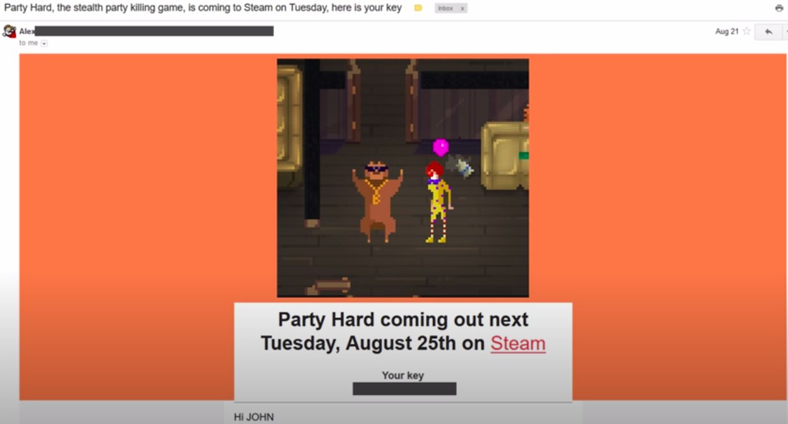
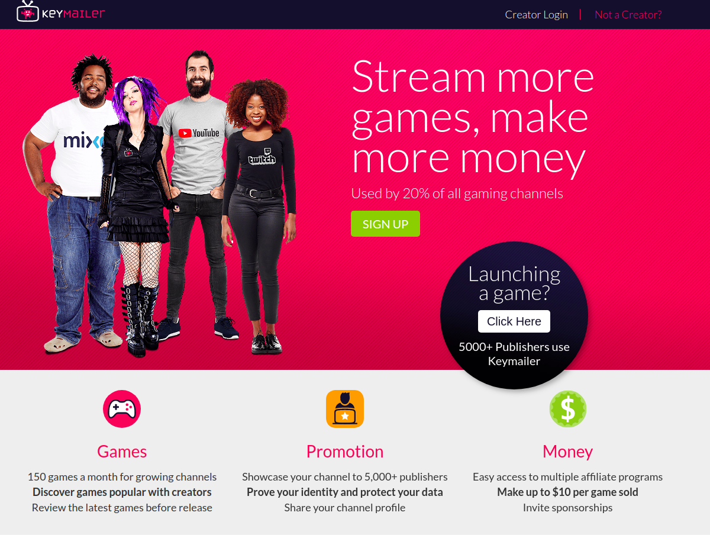
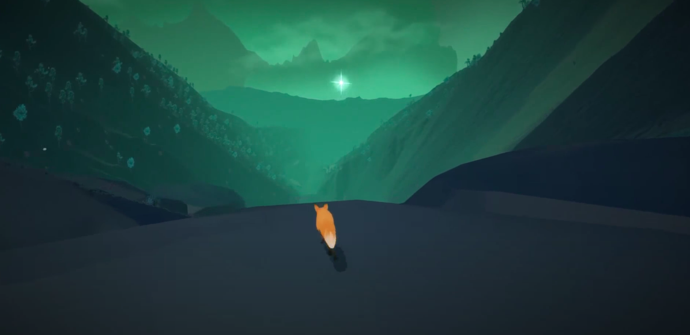
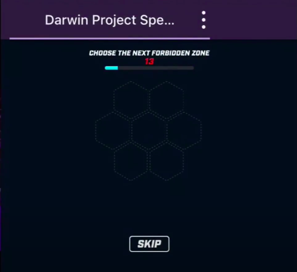
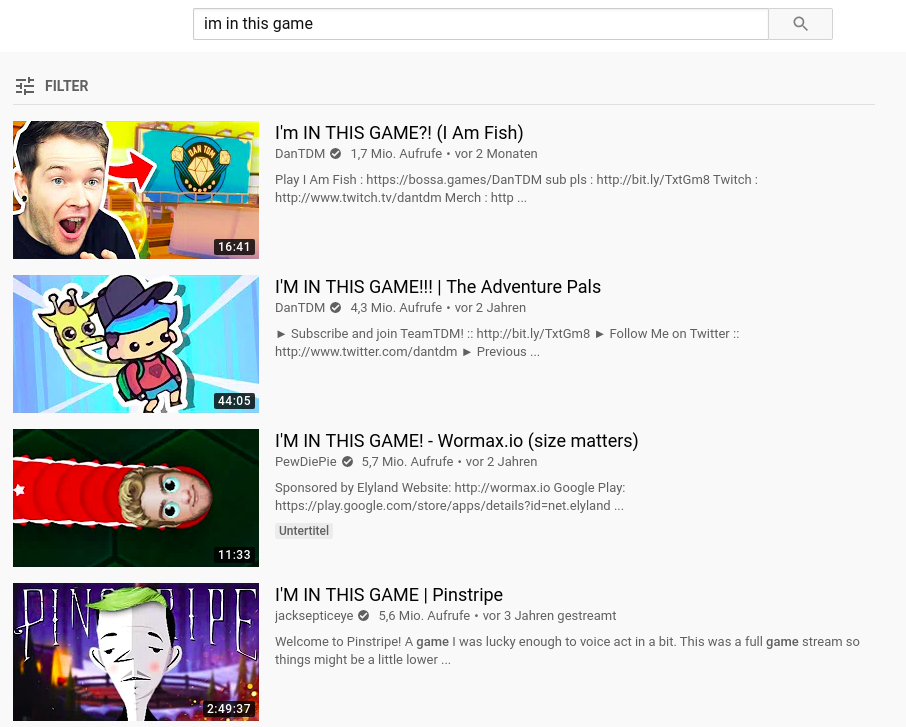

Having just one gaming influencer (Streamer, YouTuber, etc.) with a large following play your game on camera could expose it to thousands (or even millions) of potential customers. In this article, I'll be going over some of the most effective ways to get content creators to cover your game.

## Sending out a cold Email/DM

Of course the best way to reach someone directly with a business request is by sending them a message.

### Research: Create a list of Creators that fit your Game

There are many content creators out there and reaching out to every single one is probably not the best use of your time. Instead, you are going to want to reach out to content creators that are known for covering the same type of game that you are about to publish. Fortunately, there are all kinds of niches when it comes to games content creators – think of PewDiePie for example, he started experiencing massive growth on his channel by focusing on just creating content for a single game (Amnesia, the Dark Descent)! The more well aligned your game is with the niche of that content creator, the higher the chances of them picking it up.  

That said, you don’t necessarily need to find a super niche YouTuber. Another important aspect is the hardware. If you are making a VR or mobile game, you have to make sure that the given content creator has the right hardware to record content for your game (if they haven’t done so in the past, you are probably wasting your time).  

Find some games that are similar to yours and search for “Let’s Plays” of that game. What YouTubers come up? Now, do the same for streamers. One reason I would start with YouTube is because its easier to browse and with both platforms, you are likely to target the other by default (streamers often have YouTube channels and vice versa). Create an Excel spreadsheet with some of the contact information that you can find and communities that they are active in.  

At this point, you want to review the spreadsheet you compiled and take a look at the different ways you can contact them to determine what the best avenue is. Email? Discord? Twitter? Make sure its the most personal and where they are active the most. Don’t try to spam them on every possible platform at once, since this gives off a bad, pushy vibe.  

Start sharing news with your contacts list as soon as you have something to show, make them aware of this game! They are probably not going to cover the fact that you got your announcement trailer out, but seeing the name of your game show up in the inbox makes them aware of its existence and ensures that it rings a bell when it is mentioned elsewhere.  

### How to write a good Email to Content Creators

When send out emails to YouTubers/Streamers/etc., make sure to keep the message concise and not too formal. Make sure you are not pampering the content creator and treating it like a formal business email – these guys are just normal people who like playing games and are in the fortunate situation of making money from it.  

Before you send your message, make sure it has a good structure. YouTuber TotalBuiscuit made a [video](https://www.youtube.com/watch?v=4pRDRCorx14) about this and mentioned that he appreciated when he was sent the Steam key as the first thing in the message, so he can check out the game right away. Another good tip if you are sending an email is to add images or other interesting things to make it stand out. Make sure you are not overdoing it and thus distracting or annoying the reader Here is an example TotalBuiscuit outlined as a good cold outreach email, notice the interesting game art and steam key right at the top of the email, as well as the subject mentioning that the game key is included:  
  

If you are cold emailing/messaging, be prepared to face a lot of rejection! That said, do not fear following up on your emails despite not getting a response. It is not too unlikely that the content creator did not see your message (they probably get very many) or simply did not deem it that interesting at the time. Remember: you want to be sharing news of your game early.  

### Optional: If you want to pay Creators Money, make it really clear in your Message!
The simplest way to get a content creator to play their game? Pay them! If you have a high marketing budget, than this is certainly viable, since having content creators promote your game is one of the best ways to gain exposure for it. Make sure that you mention this early in your message, because this is something that will most likely get their attention. That said, getting a content creator to play your game organically is not only a good way to validate your game, but also more likely to turn into viewers into customers. Remember: in many countries, content creators are legally obliged to mention that they are paid to display certain content, so that will automatically count against your game as the audience knows they didn’t voluntarily choose to feature it.  

## Outsourcing the Outreach to a Third Party

### Using a Marketing Agency or Publisher
If you don't feel confident contacting creators or simply cannot be motivated to do it yourself, you could consider working with an agency. These often have huge, currated mailing lists that let them reach out to creators effectively. Be warry that this can get very expensive and there is no good guarantee that you will get valuable coverage! A publisher would probably do something similar as well or collaborate with a marketing company.  

### Using a Key Distribution Marketplace
Marketplaces that let game developers distribute keys have been around for a while. They allow content creators to join and get free keys from games looking to gain some exposure. The issue is that you, as the developer, are on the short end of the straw herre - you will need to pay to be visible on these sites, while there are definitely users that will try to use the service to grab free copies of games and you have no good way to ensure that you are getting quality coverage. Some common examples of such services are [indieboost](https://indieboost.com/) or [Keymailer](https://www.keymailer.co/) (the latter is free!).
  

## Create a Content Creator friendly Game
You can make an active attempt at increasing the attractiveness of a game for content creators.   

### Make sure it is fun to watch, not just play 
Text based games can be great fun! But to watch? Not so much. A games “watchability” has a lot to do with how well the player's actions are reflected by the visuals and/or gameplay experience. One thing that makes gameplay fun to watch is decisions – wondering what the content creator is going to do next, while thinking about what you would have done yourself. That’s why successful games don’t necessarily have to be action games, narrative games with lots of decisions that impact the story are great content for YouTubers and Streamers. Games that are skill intensiv or competitive can also make for great material (a popular phenomenon to support this: esports!).  

### Ensure it has intriguing visuals 
Visuals are very important in grasping the attention of any consumer, content creators are no exception. If the game does not look interesting or unique to them, they might perceive that creating content on it will lead to a smaller chance of growing their own audience. Make sure your game’s graphics and marketing material (trailers, store front, screenshots, etc.) stand out when they take a look at the store page or demo link you sent, otherwise they are probably not going to bother covering it.  

*Games like "The First Tree" use graphical fidelity to get the attention of players and content creators*

### The game should invoke emotions 
Games that lead to extreme emotions are going to make for interesting (and at more genuine) content, hence why horror games were very popular in the YouTube scene as they invoke the emotion of fear. Another popular type of game among content creators were so-called “rage games”, titles that were designed to be unfair and have an absurd level of difficulty, thus invoking the emotion of anger. There are many ways to make your game more emotional, considering how you want the player to feel is always important.  

### Include built-in Streaming Features
Most streaming platforms have interfaces that let you create features in your game that allow the streamer or viewers to interact with the gameplay. This can be a deciding factor for a streamer deciding what to play next, as they will probably tend to choose the game with streaming features over one without.  

*Battle Royal "The Darwin Project" lets the Twitch audience decide what zones to lock off*

## Host Events for Streamers
Some games companies have hosted special streaming events that encourage more people to stream their game. For example, the developers of Sunless Skies [hosted an event](https://www.destructoid.com/failbetter-to-donate-to-charity-for-every-person-streaming-sunless-skies-on-launch-day-535059.phtml) donating money to charity for every person that streamed their game.

## Become a Member of their Community (or advertise to them)
Most content creators, just like games companies, try to build a list of followers and a community around them. If you are part of or make a name for yourself in that community, you are more likely to get the attention of that content creator. If not, then perhaps their fans are more likely to request coverage of your game!  

## Include the Content Creator in your Game
This is another radical tactic – many game developers have added content around a big streamer or YouTuber, in order for them to play it. While I think this is viable, it can mean that you are potentially investing a lot of time creating that additional content and also making sure the content creator actually sees it (the latter probably being the bigger problem, depending on the creator’s popularity).  
  

  
Be aware that this is something that can seem like an obvious PR stunt to your players and leave a bad aftertaste. In addition, it looks pretty silly if the content creator does NOT end up playing the game, which is quite likely if they are a very popular persona that has many sutdios fighting for their attention. So overall, I don’t advise this strategy unless you are sure that the content creator will see that you added that content to their game, perhaps because you already talked to them beforehand and agreed to collaborate in this manner.  
  
On the flipside, it can be a great idea to actively collaborate with a content creator if they are down. For example, you can offer them to do voice acting for your game, which is a sure way to get their fans excited and increase the chances of them becoming customers.  

## Conclusion
Thanks for reading! I hope you learned something from this tutorial and get some exposure for your game. You have your own tricks on how to reach content creators? Please leave a comment if you don't mind sharing it!
