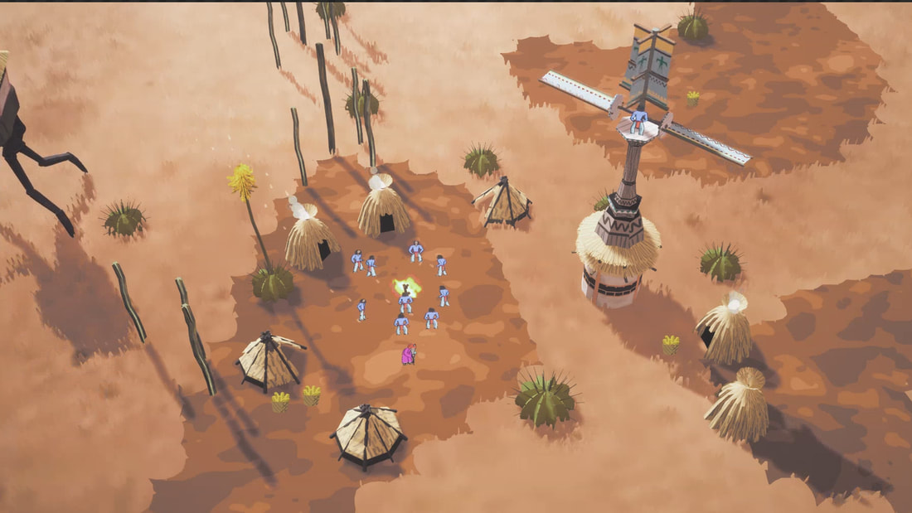
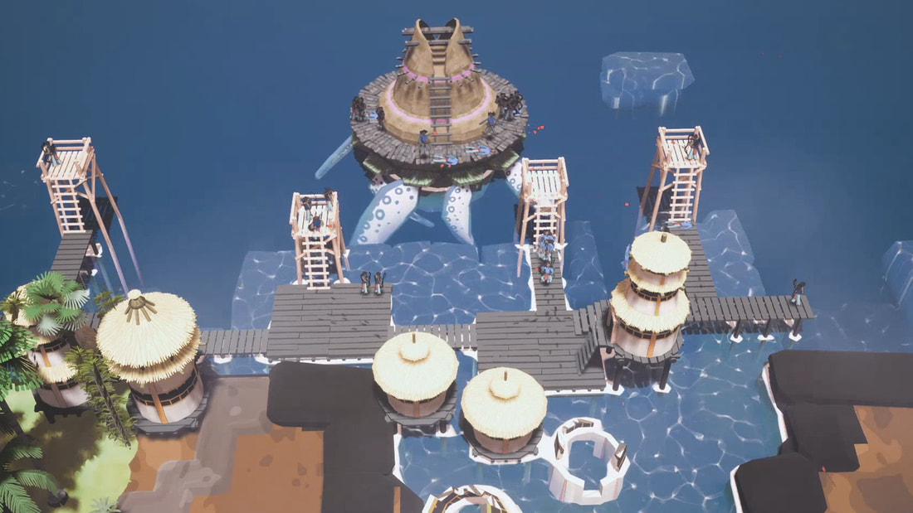
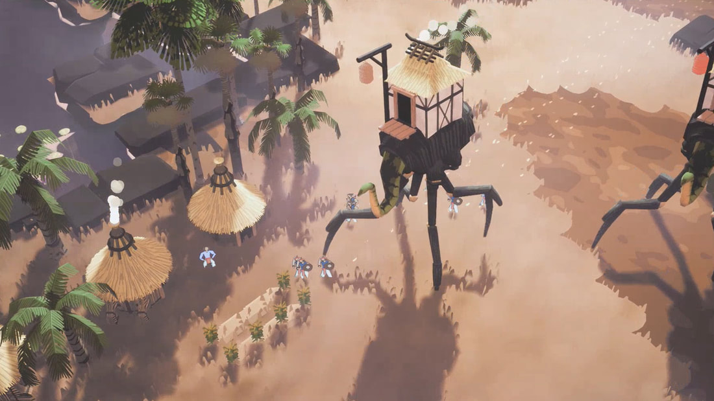

import Kainga from "../../../src/components/products/steam/kainga.js"

Erik Rempen is creating the unique village building game Kainga, inspired by one of his favourite childhood games. We had a discussion about his game, including how 
he went from having no game development experience and teaching himself everything from art to blueprint programming. He is also working a full time job and dedicating most of his free time to the game! Kainga is set to release on Steam Early Access only a couple years later. 
<Kainga />

## Can you tell us a bit about how you got into game development before working on Kainga? ##
  
Game development has been part of what I liked to do for a long time. I used to create maps for games like Morrowind as a kid and took great enjoyment out of that. The reason I eventually moved onto 
to create my own standalone game was because that seemed like the next logical step. I was inspired by Populous, an old retro game, which I had always hoped would be remastered or get a sequel, but that 
never happened so I decided to take matters into my own hands.  
  
 ## Did you have any game development skills when you got started? ##   
  
No, actually I didn't! I'm a painter by trade, so I had to teach most things myself. I ended up using Unreal Engine for this reason, one of the main selling points was that I didn't know how to code 
and the blueprint visual scripting system seemed a little be less intimidating. This was a tough choice and I looked at other options via blog posts, most argued that either Unity or Unreal was better 
but I just decided to go with Unreal at one point. Gamemaker also had the visual scripting but was primarily recommended for 2D games.
  
I actually struggled a lot with figuring out how to implement some of the core mechanics, because even common strategy game features like clicking on units or drag selecting were not that well documented 
and lacked tutorials for Unreal Engine. But persistence eventually got me there!  
  
 ## Can you explain what the game is about and maybe take us through the main game loop? ##   
  
Sure! I think some people might categorise it as a city building game, but I prefer to use the term village building game, because you are only in control of a few dozen people. You try to direct a tribe, 
and in the process you are constantly faced with different challenges (floods and other natural disasters for example or rival tribes). To evolve your tribe and overcome these, you need to use your character "the thinker", 
which serves as a progress tree of sorts and lets you discover new technologies. After each discovery, the thinker runs out of energy which can be replenished by having the villagers organise rituals.
  
  

 ## Could you go into a bit more detail as to how this progression system works? ##  
   
The thinker will allow you to discover new technologies that inherently change the way you build your village i.e. to overcome a flood, you might need to build your entire village on stilts.  
  

  
Many of these decisions are procedurally generated, to keep things fresh each playthrough. One thing I had in early iterations was that when a certain disaster occurred, the thinker would come up with a solution based on their event or other factors 
like the environment around the village. This really streamlined many player decisions, so I took it out.  
  
 ## Some strategy Games are large scale tactics games with focus on building vast Economies, others are more focused on realtime Action - where does Kainga fall on this scale? ##   
  
It's definitely more on the "Age of Empires" side of things in that regard. I actually am not a very big fan of games that require heavy UI and menus, so my initial goal was to have absolutely no HUD! 
During the development process, I realised that certain elements needed to added, things like the building menu and displaying the technology choices I simply couldn't get around.
  
Speaking of resources, an important design aspect was to make your people the key resource. This means that they are both expendable but also very valuable. There are other resources like wood and stone, which can be processed 
into others like adobe, but initially the villagers will actually not be storing resources unless you have designated storage buildings. Instead, they will build buildings from nearby resources in the environment. Once you have 
storage buildings, you'll be able to see what you gathered via the UI, since I reckoned that stuff is quite interesting to track. 
  
 ## You describe Kainga as a "roguelite". What categorises it as such? ##   
  
I mentioned Populous as one of the game's big inspirations, but another one was Enter the Gungeon. I really love how you can play that game for a few hours, feel like you are improving and making progress - despite only playing for a few minutes 
and probably dying, forcing you to start over. I added similar elements to my game, like perma-death, unlocks for your next playthrough and the procedural environments and technology trees. I think that this should qualify it to meet the specifications 
for a roguelite!  
  
 ## You have a 2D-in-3D art style going on in your game, how did you decide on that? ##   
  
As I mentioned, I'm a illustrator, so I felt it would help me speed up development if I made most of the people in the game 2D sprites. I got the sprites to face the camera correctly using the bill-boarding technique. I quickly 
realised that making all the assets 2D was going to cause some problems, especially as objects reached a certain size in the game world or were a certain  distance away. 
  
For example, I wanted to give the player's villagers a sense of insignificance by creating huge fantasy beasts that tower over them (these can actually be tamed and buildings built on top of them). 
  

  
The issue was that these simply did not look good as 2D sprites, so I ended up learning 3D as well! I started with Blender and taught myself primarily through YouTube courses. It's incredible how you can learn pretty much everything online these days.  
  
 ## We touched on pretty much all aspects of game development except audio. How did you handle that? ##   
  
Yeah, those are pretty much the three pillars of game development in my eyes: code, art and audio. The latter I ended up outsourcing to a friend, who sent me a soundtrack he came up with for the game that got me hooked instantly. 
For the latest trailer, I quickly got some free sounds in since I really didn't have any, but I think I'll be getting professional help with those too. I didn't want to halt development for however long it would take for me to learn that part of the process as well!  
  
 ## You are working on the game part time - how are you managing that? Any tips for others hoping to the same thing? ##   
  
That's right, I spend most of my time after work and on the weekends working on the game. I'd say it's important to set yourself small, achievable goals and make sure you are doing something everyday, no matter how small of a task that might be. I got a trello for the game that I released recently, to track my progress. In addition, I have one of those pin boards they have at restaurants to track orders and use it for my todos - its really been stacking up!  
  
 ## What does the future for Kainga look like? ##   
  
I'm hoping to get funding from the Epic Megagrant, which Epic (developers of Unreal Engine) give out to promising projects. I mentioned that I wanted to outsource the audio but I would also love to get some help with the programming. In the meantime, I'm preparing to launch the game on early access this winter.  
  
I'm also working on raising more exposure for the game. I've been trying to focus more on social media, posting on Reddit and doing guest content for various blogs. I also have generated an email list of press that could be interested in featuring the game. The trailer also just recently released, [check it out](https://www.youtube.com/watch?v=kCyab1xZtCs)!  
