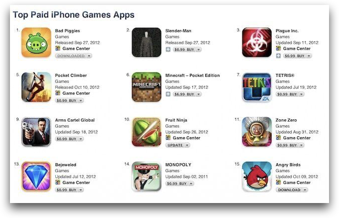
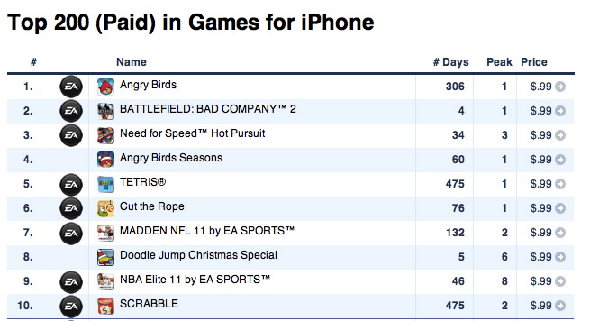
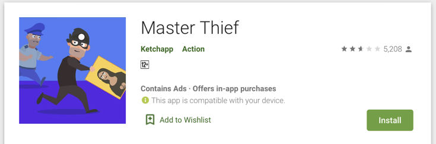
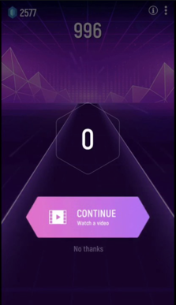
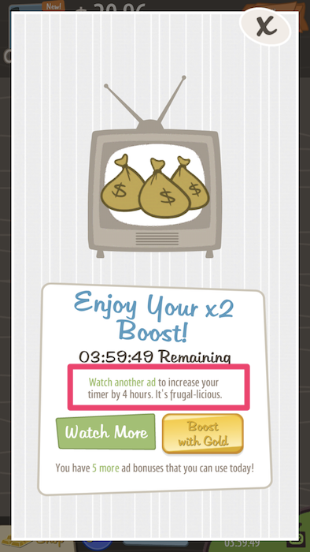
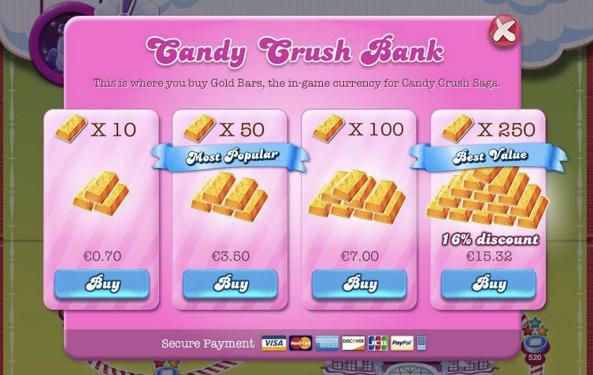
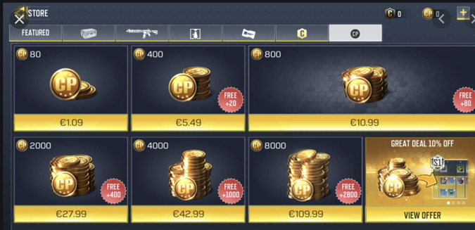
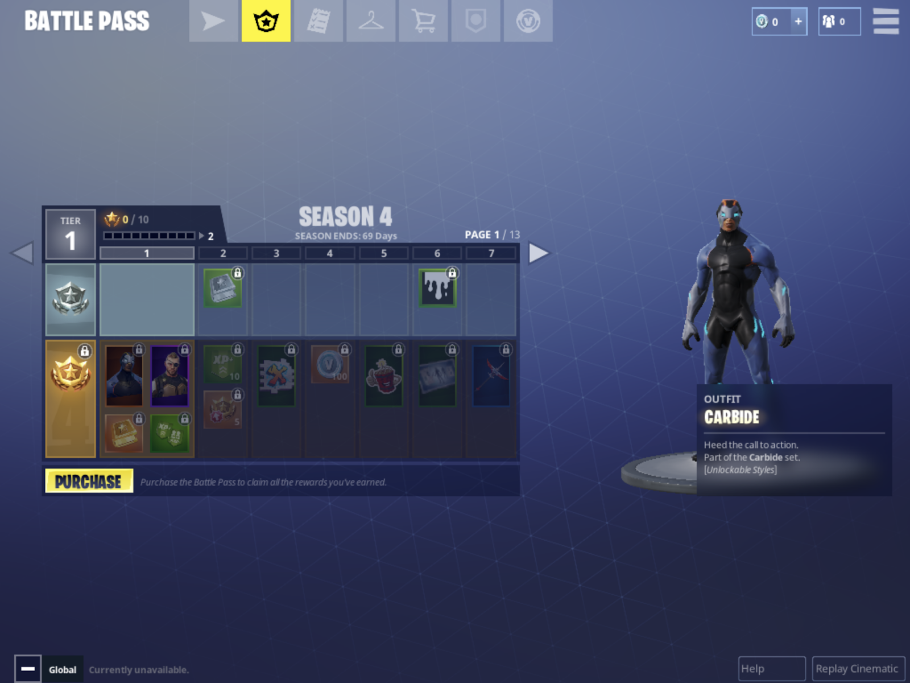

One of the most frequently asked question about the mobile game market is how
they actually monetize. Since most of the gaming apps are free nowadays, it’s hard to
imagine the huge amounts of money that this industry is generating. In 2019 alone, the
mobile game industry had $49 billion in revenue and $16.9 billion in revenue, which takes
up 60% of the total gaming industry’s revenue! So how are the games doing it when most
of the games are free? And which models is the one for your game? Let’s find out.

## 1. Premium model

Just as the traditional gaming model, a small portion of the mobile game industry
stay to their root and sell their games for a fixed price. Even though this side of the
market is quite small, both the Google play store and Apple’s Appstore have created
great ways to get your premium mobile game visible. Not only do paid games have their
own top games list, they are also quite often featured. However, nowadays a lot of
developers put a minimal price tag on their game to reach the top of the paid chart.

*The Apple Appstore Top Paid Apps Section*

When it comes to mobile game monetization, the premium model can be seen as
the most simplest. The developer only needs to create a product that the user can use
from start to finish, and sell it at a fixed price. But this is much harder to be done than on
traditional gaming platforms such as PC and Consoles. Since most other games are free,
the user does not feel the necessity to lose any money to purchase games, and picks the
more available free stuff first.

And so, developers have created another way of monetizing their premium games:
free to try, pay to continue playing. By setting up their games as free, and requiring the
player to pay for either the full game, or for each individual level, the games can be
considered as old school demos. Games now can convert players who used to be
shunned by the price tag, to try the game out first.

#### This model is for you

If you are a more traditional game developer, and don’t want to think of ways of improving
your monetization model, this is for you. All you need to do is to create a game, which the
player can play from start to finish.

#### But

If you follow the mobile game industry closely, you will see right away that so few studios
are actually taking this approach. So why might this be?

First of all, the mobile market itself is crowded with free games, and the user base is not
exactly knowledgable in gaming. So when they see those free AAA games from huge
studios such as Candy Crush and Supercell, they won’t think even twice which game to
pick.

Second of all, the premium market is full of IPs and PC/console ports. So even with
knowledgable gamers, it is hard to compete against games like Journey and Final
Fantasy.

*The top paid games are all already popular games*

Last of all, premium games are just not scaleable. The cost to acquire a user is quite high,
and after you have acquired that user, you won’t receive any further revenue from them
anymore.

## 2. Ads

This is probably the most known mobile game monetization technique of them all.
What people don’t realize however, is that there are different types of ads, with different
revenues and purposes.

### a. Interstitial

Between a specific numbers of levels, you can put in interstitial ads. These are
those short ads that either run for only about 5 seconds, or is skippable after a short time.
These are mandatory for the user to watch, and are usually placed between game levels,
or changing of menus.

Since they are so short, and most of the revenue you get from click throughs and
conversions, they give out a much lower revenue stream for each ad you are showing.
But even so, since they are mandatory for the user to watch, you could create a sure way
to get some revenue across, with the only price of retention and game rating.

#### This model is for you

If you have a short gameplay loop and can show an ad after each loop. As long as you
keep the player happy, the player won’t be too annoyed to lose a few seconds of ad
watching.

Since they require a short gameplay loop to stack effectively, this monetization models is
used most in Hyper-casual games.

#### But

Since the revenue of these ads are quite low, you are going to need a huge player base to
be able to scale up your game.

By adding fewer ads, you would annoy your players less, but your revenue would go
down a lot. Add too many, and your retention might suffer. It is quite hard to find the
balance.

*Hyper Casual Games that make use of lots of Ads tend to have lower Ratings*

### b. Rewarded

Rewarded ads are video ads that run for about 30 seconds, which are unskippable.
The user would voluntary watch a rewarded ad in exchange for in-game goods such as
currency or game continues.

*Games like Tiles Hop let you continue a song or buy new songs by watching video ads*

Opposite from interstitial ads, rewarded ads are long and unskippable, and hence
bring in much more revenue. But since they are not mandatory, the number of ads the
user is watching also depends on how you design your game.

#### This model is for you

If your game has consumable items, which the player has the need to constantly buy, like
hearts and in-game currency. The player has to keep spending your consumable items
and have the need to get more.

In contrast of interstitial ads, the player not only chooses themselves to watch an ad, they
get something in return, be it a time saver or a neat in-game item. This causes the player
not to become upset at all, even though they have to watch an even longer ad.

Rewarded ads are also longer, allowing you to have a higher revenue for each ad
watched.

#### But

For a game to create higher revenue through rewarded video ads, you will have to keep
the game’s economy in mind. Create an economy, where the player gets a lot of value,
just by watching ads over and over again would break it. While creating an economy
where the player doesn’t get much after watching a rewarded ad, would give the player
less of a reason to watch it in the first place.

*Adventure Capitalist limits the number of ads you can watch each day*

Another thing to keep in mind is that even though the revenue you receive of rewarded
ads is higher than interstitial, it is way harder to have players watch them. While with
interstitial ads, the player is pretty much forced to watch them; with rewarded ads you
have to convert them. Not everyone is going to watch the rewarded ads, and they will
definitely not watch them as much as interstitial ads.

### c. Banner

Banner ads are probably the oldest form of ads in the digital age. They are
constant ad stripes that show either on top of the screen, or on the bottom. While they
are still used quite often on the web, games are using them rarer and rarer.

#### This model is for you

If you still have some screen space you can sacrifice. If you don’t have the screen space
in your gameplay, some devs even put the banner ads in pause menu, main menus, etc.

#### But

The revenue is seriously not worth it. The click through rates and conversion rates are low
since there is just not much information that can be given through a small banner ad
space. The developer would have to sacrifice screen space, visibility and user experience.

## 3. In app purchases

Another well known monetization technique, which can also slowly be seen appearing in
PC and Console games. You pretty much just sell in-game items for real life money. This
monetization model can be seen from casual games up to the most hardcore games.

*In App Purchases are detrimental to the monetization of Candy Crush...*

*...or Call of Duty*

Games like this get most of their revenue from Sharks, dolphins and whales - users that
single handedly spend a lot in your game and create most of your revenue.

#### This model is for you

If your game has a bigger game loop and requires the player to constantly stock up on
those items. The revenue of this is also much higher than from ads, giving you a much
higher revenue per purchase.

#### But

Since the conversion rate for these purchases are quite low, you are going to need a lot of
users to be able to get those whales and dolphins in your game. If you can’t handle that,
it might be better to stick to those rewarded ads, which the users are more willing to use.

## 4. Subscription

A newer monetization model. Subscriptions have been around way longer than games,
but only recently have mobile games added them to their arsenal of monetization
techniques.

The gist of it is that users pay in a regular interval for special access to your game’s
features. The features might be special content like special music lists such as in
Amanotes games, to battle passes in games like Fortnite and Archero.

*Pay extra for a battle pass that grants you extra loot in Fortnite*

#### This model is for you

If your game is already big and needs a way to scale up even more. This is a good way to
distribute that extra content that takes forever to sell in IAP and rewarded videos. Users
who have already subscribed to your service before, have a higher chance of returning.

#### But

As having said before, the game needs to be already big and having a lot of content. To
convert users to buy your subscription the content has to be really lucrative.

## 5. Apple Arcade and Google Play Pass

Another rather new monetization model. For those who are not familiar with Apple Arcade
and Google Play pass yet, they are pretty much Netflix subscriptions for mobile games.
The user pays for a subscription monthly, and is able to play any game from a large
selection of premium and high quality games without any ads.

But how does Apple and Google share the revenue you might ask. The way they do it, is
by tracking the user’s playtime in your app, and dividing the revenue to the developers
based on it.

#### This model is for you

If your game has a higher quality and you intended the game to use the premium model,
you might have a much higher chance here. The games are fewer in-between, your game
is often featured, and you don’t really have to worry much marketing wise, as Apple and
Google are doing that by themselves.

#### But

To get your game into Apple Arcade and Google Play Pass in the first place might be
quite difficult. You would have to get Apple’s and Google’s attention first. And if you get
in, you will have to compete with Apple’s and Google’s handpicked products from top
developers.

