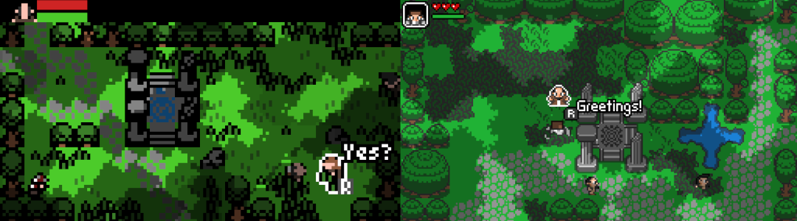

Mystiqa is an action RPG developed by a first year computer science student. In this interview, he shares how he designed and created his game, as well as some of the things that he learned from launching a successful Kickstarter campaign. His game is set to release on Steam Early Access this September.

<iframe src="https://store.steampowered.com/widget/1265500/" frameborder="0" width="100%" height="200"></iframe>

**Please tell us a bit about your background, how you got into game development and how you taught yourself the skills needed to create your game.**

I was a gamer for as long as I can remember. At 3 years old, I got a gameboy and one of my favorite games was the original Legend of Zelda, which is also the main source of inspiration for Mystiqa. 

As I grew older, I became fond of learning how to code to make my own games. Initially, I started experimenting with GameMaker, which had a user interface, a beginner friendly coding language as well as some no-code tools. As I got more advanced and started working with other languages, one of my biggest areas of interest became procedural generation. 

I consider myself a very self-motivated person who is fast at learning things when I enjoy them a lot and I am passionate about it. That is why coding came very naturally to me, I think the practical aspects and that I had a clear goal in mind helped me a lot in learning it faster than my peers. I struggled much more with pixel art, which I chose as the art style due to my lack of experience, but it still took a lot of practice to get right. This is especially due to the high standards that are set by the players and even myself. I’m still not fully confident in my ability to create pixel art, but I think that I have learned a lot along the way.

**Tell us a bit about the game – how did you come up with the idea? What were some of the inspirations behind the design?**

The rough, initial concept for the game was to create an experience reminiscent of the original Zelda, but with proceduraly generated elements to increase replayability. 
The ideas I ended up borrowing from that game were primarily the dungeon crawling theme, top down perspective and art style.

Many other games also inspired the gameplay, especially Final Fantasy Adventure for the weapon combat mechanics, with a little bit of Dark Souls sprinkled in for good measure (dodge rolling, flask based health regeneration, etc.). The items system was also something that deviated drastically from the Zelda games. Whereas the jump between upgrading from a regular sword to the master sword is quite drastic, Mystiqa is littered with generated weapons and items. Folks who love Diablo style looting and grinding will feel right at home here.

 

**How did you refine your game's design? Did you do some prototyping? Did the scope and focus of your game change over time, as you developed it more?**

The original idea was more heavily inspired by the first Zelda game than it is now. Initially, I wanted to focus heavily on those challenging puzzles that were popular in games back then (think writing codes onto a piece of paper so you can recall them at some later point in the game). I began realizing that this style of game was probably too niche for a modern audience. Right now, the game is streamlined a lot more around the combat, which I do think is still very challenging and has a lot of depth, but does not require too much attention from the player. That said, I do have the urge to add some elements of the puzzles back in, so don’t be surprised when you find one in the final release.

**What were some of the tools that you used to create the game and its content?**

My first game engine was GameMaker and I began creating early prototypes with that, however quickly became dissatisfied with some of the limitations that it imposed upon me. I started learning Java and began creating the game with the LibGDX framework, however I really wanted to port the title to the switch console, which would only be possible if I used C#.  This lead to another switch from LibGDX to C# Mono Game with the XNA framework, which is very popular for 2D games (Terrraria is based on it as well). It gave me the flexibility to implement some of the more technical aspects, like the procedural level generation, more easily and since I didn’t need a GUI for the level design, it made more sense to focus on a code-only approach. 

For the art, I switched from Pyxel Edit to Asprite (both tools used primarily for pixel art sprites), mainly because the former hasn’t received updates in a while and I fear that it has been deprecated. I don’t really feel that the particular tool in this case has much impact on the final result, it really is primarily a matter of your skill when it comes to creating pixel art.

**Your game recently got some funding via Kickstarter. Can you give us a quick overview of the current state, shortly after you got your game funded?**

The game is currently about 70% done, but of course it always hard to give a percentage because that always fluctuates. In terms of mechanics, there is nothing missing (apart from the puzzles).

**What was your motivation for going on Kickstarter? How are you hoping to spend the money?**

Primarily, the money was to be used to increase the quality of the game. I want to outsource the audio and music, because that is the one thing that I was not able to learn and did not want to invest half a year mastering it on top of creating my game and university work. I actually got contacted by a big music label, which  was working with the composer for Secret of Mana and asked if I would be interested in having him create music for the game. This would require much more money than I had at the time and unfortunately, I did not raise enough to make this possible. The thought was awesome nonetheless. I also wanted to use some of the money to get the Switch developer kit, as porting to that console has been a goal since the early days.

 

**When creating the campaign, what were some ways that you prepared?**

Posting on Twitter for 3 years has helped a lot. On Twitter there are weekly hashtag events (like #screenshotsaturday or #indiedevhour) and I made sure to post there as often as possible, which allowed me to grow a following over time. I think one issue is that there are many devs on Twitter looking out for these hashtags, but not many players, so I’m a bit worried about how much of these followers will convert into actual sales. I recently created a subreddit for my game, I regret not having done this earlier because I think that this is where the players are! Email lists would have also been a great choice. I prepared by reviewing kickstarter post mortems on gamasutra, which gave me some insights into the do’s and dont’s.

**Coming up with pledge bonuses is challenging, because you need to make them appealing while ensuring that fulfilling them still leaves you with a profit. How did you come up with the pledge perks?**

I wanted to keep the costs low, so I focused mainly on digital tiers. My biggest risk or concern was that someone would pay for a custom content tier and request to add something I don't like.

**You mentioned on Twitter that you are adding support for modding. Can you explain how players will be able to create or manipulate content for Mystiqa and how you in turn designed the game to make this easier?**

The idea came when I switched to mono game and started serializing almost every aspect of the game content. Everything in the game (items, bosses, biomes, etc.) is stored in JSON (JavaScript Object Notation), so its easy to read and modify. Now a user can just go in and customize the levels, enemies, items and pretty much anything else they want just by editing these files. I suggest doing this for everyone making a larger game, because it helps manage all of these aspects, with easier modding being a very big benefit on top.

**What element of the game are you most proud of?**

I am really happy with how the level generator turned out. The entire world is generated procedurally and consists of 3 biomes, which consist of several sub biomes. The rooms within the biomes are all generated using a brute force attempt, that is designed around a procedural level component system. The components are classes that can handle some aspect of the room generation, for example the basic layout and connections, object spawning, etc. Cellular automata is used for the generation of the room layouts, I spent a lot of time to make it modular and allow for things like smooth out the walls of the level. I also used some procedural generation for visual effects, like perlin noise to generate a cloud effect for some of the biomes.
 

**Being a student and focusing on developing a game must be challenging. How did you manage your time to pull this off? Do you have some tips for other students who want to develop a game in their free time?**

I found that skipping lectures helped increase my productivity and time I had available substantially. I found most of them boring and didn’t learn as much as I did when doing the exercises or teaching myself the material. In Computer Science, the benefit is that it’s less about memorizing things and more about understanding them.

**You’ve been working on Mystiqa for three years. What have you learned in that time and how would your approach to the development of the game be different if you were to restart today?**

One of the biggest lessons was the importance of graphics and listening to player feedback. 14 days into the Kickstarter campaign (so pretty much halfway), I drastically changed the displayed art on the website after receiving some feedback on reddit.
 
 

This had a huge impact and saved the entire campaign! Again, I wish I had started posting on Reddit earlier to get that player feedback before launch, since that would have possibly led to me reaching my higher funding goals. Regardless, I’m insanely happy that I was able to succeed in my first Kickstarter, especially given my inexperience and that its the first game.

Finally, I’d say that it’s important to never give up on developing your game till it’s done. I paused the development for half a year because I wasn’t sure if it was the direction I wanted to take and I regret this. That said, who knows if that break didn’t prevent a bigger burnout down the line.