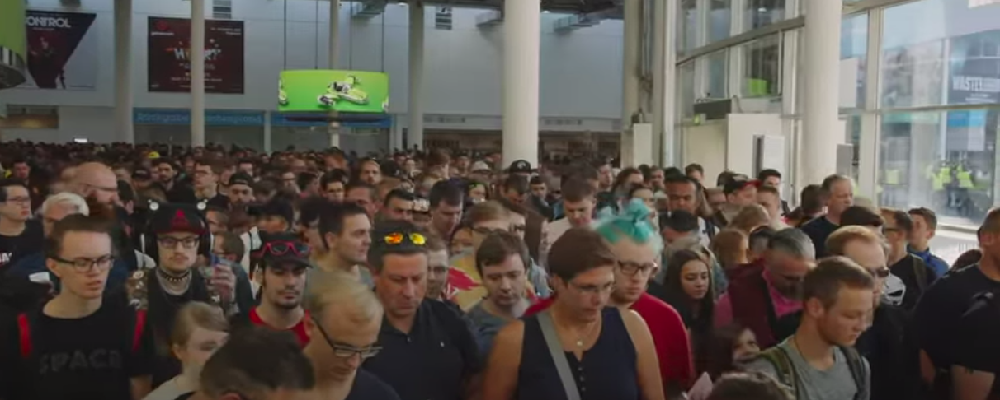
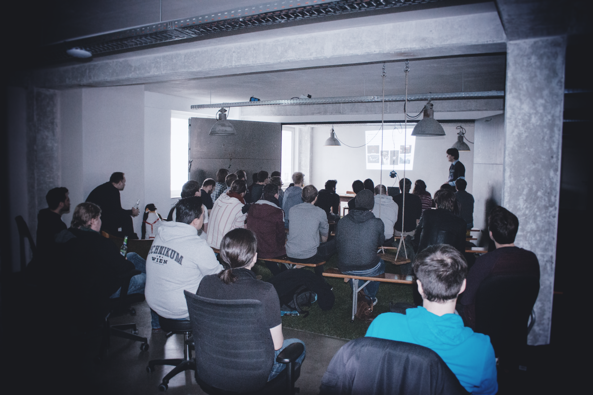
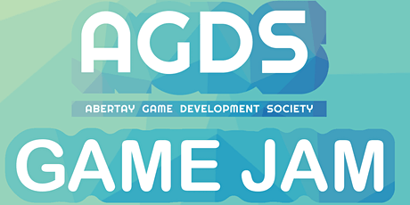
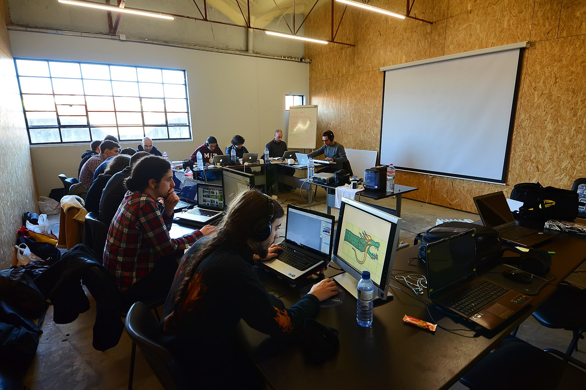

When I started looking for jobs in the games industry as a student, networking was something everyone told me is super important - but what does that mean exactly? 
Networking is the act of creating or improving professional connections with other people, usually
from the same line of work. This guide is going to show you how to network as a game developer and meet others who are interested in forming connections. 
If you aren't sure why you should bother with this, here is a list of some of the many benefits:

- landing a job is much easier if you have a referral from someone you already know within
    the company
- when looking to hire talent for a specific purpose, you have a much bigger pool of people to
    choose from of which you already know the skills and strengths
- finding a potential co-founder for a games startup becomes much easier
- you can learn valuable insights from others in areas where you might not be as knowledgeable
- it helps increase your own credibility and influence within your given industry (gaming, for this
    purpose)
- you can cross-promote games with other developers
- raising money can be much easier if you or someone in your network has a personal connection to the potential investor

  
Putting yourself out there and actively engaging in conversations with others is the first and most
important step to networking. When you have no network, its very unlikely that someone will tell
you to attend an event or join a community of like-minded individuals.

In the following guide, I’ll listing the best places to network with other game developers and some of the methods you can use to 
increase your chances of success.

## Connect through LinkedIn

One of the most obvious places for professional networking is LinkedIn, a social media for
professionals. If you don’t have an account, you should definitely make one and ensure your profile looks as appealing as
possible to anyone visiting it. This will not only be beneficial when applying to jobs, but also when
messaging others that have matching profiles, that you want to connect with.

Another great feature of LinkedIn are the groups, which make it much easier to meet new game
developers online, with the intention of connecting on a professional level. 

### The best LinkedIn groups for Game Developers
There are many game development groups on LinkedIn, here is a list of the groups that I found to be the biggest (**Note: you need to be a LinkedIn member to see them**):
- [Game Developers](https://www.linkedin.com/groups/59205/) This is the least focused, but also the biggest, game dev group on LinkedIn
- [Game Developer Group](https://www.linkedin.com/groups/129018/) Second largest game dev group, focus supposedly lies on mobile and console games but its not apparent
- [Indie Game Developers](https://www.linkedin.com/groups/4433494/) A group where indie game entrepeneurs and people looking for jobs at indie games companies can connect
- [Video Game / Graphics Programmers, Designers & Developers](https://www.linkedin.com/groups/3702691/) This is a group where a lot of companies post game developer job openings
- [Video Game Professionals](https://www.linkedin.com/groups/87078/) A group for people employed or self-employed in the games industry
- [Game Design Professionals](https://www.linkedin.com/groups/62526/) A group for people employed as game designers

## Asking for a "Warm Introduction"

A warm introduction is when you ask someone to introduce you to someone else, usually with a referral. This increases the chance that this person will notice you, want to meet with you 
and sets you up to form a professional connection with them. This is a commonly used method by entrepeneurs to connect and get a chance to meet with high profile investors, as these are usually too busy to notice 
cold emails from people they don't know.  

## Get active in a Discord channel

Though Discord announced it will be pivoting away from being a platform for gaming, it is still
deeply routed in gaming culture. As a result, many games companies host Discord channels for their
communities and of course, there are also many Discord channels for game developers. The
benefit of Discord is that the chat rooms are usually labeled by particular topics, making it easy to
find out what users are knowledgeable in what areas. Some even require users to assign themselves
a job label as they enter, making it even easier to distinguish.

### The best Discords for Game Developers to Network

- [Game Dev League](https://discord.com/invite/gamedev)
- [r/gamedev Official Discord](https://discord.com/invite/reddit-gamedev) Discord for the official game dev subreddit
- [Game Dev Network](https://discord.com/invite/gdn)
- [GameDev.net](https://discord.com/invite/tgEGVNy) Not to be mistaken with the previous one, this discord is for [gamedev.net](https://www.gamedev.net/), a forum for game developers 
- [Moonlight Game Devs](https://discord.com/invite/gdn) Our own discord might not be that big just yet, but we highly encourage networking and game developer collaboration

## Attend/Set up a booth at large gaming events

Games conventions and expositions are a great place to meet new game developers, because
particularly at the indie booths, the people behind the games will be right there for you to talk to
them. Of course you should set yourself some limits, as most developers wont be there just to chit-
chat. That said, your chances of connecting with a notorious game developer are much higher here,
since you don’t run into the problem of them simply ignoring your DM or emails.

*Gaming events like the gamescom in Cologne attract thousands of gamers*

If you happen to be someone with a booth at such an event, you will attract the attention of other
developers. If you are looking for new connections, you should make sure to bring some business
cards that you can hand out. That way you are not wasting time exchanging details after the
conversation is over, which you could be spending by talking to potential customers.

There are also game development events, some of them very large. These are obviously ideal for
face-to-face networking, as it's basically expected at a game development conference.
That said, these events are usually also more exclusive and to be able to enter you are usually
required to have at least somewhat of a reputation (not that easy when you are just getting
started).

## Attend, and ideally present at, Meetups

Game development meetups can be thought of as a smaller, localized version of a gaming event.
However, this makes it ideal for networking, as you are more likely to get into private conversation
with other attendees. The game development meetups that I have been to often allow developers to
present some of their work, which I definitely recommend doing if you have something to show or some knowledge to share.
This usually leads to great conversation with others after you are done presenting and opens
opportunities to meet new people.

*A meetup I attended. The people presenting would always get a lot of people asking for their contact information.*

My favorite way to find meetups in my area is still [Meetup](https://www.meetup.com/) (despite the pricing controversy after the
companies acquisition), but if you guys have any other alternatives feel free to share them in the
comments.

## Connect through Twitter

Twitter is a surprisingly handy way of networking with complete strangers, either by being
discovered yourself or actively searching for individuals. Due to the hashtag system on tweets, you
can be easily found by others through consistent content postings. Make sure you are checking what
hashtags are most popular, some like “indiedev” are going to be quite competitive but also reach
more people, while others like “connectingwithaudioengineers” are not going to find that many
individuals. The exact same applies when you are using these hashtags to search for interesting
developers that you want to connect with!

If you want to reach out to someone or get their attention, you can use the fact that Twitter is a very
open social media to your advantage. Comment or retweet their content and send them a DM once
you noticed them liking or interacting with some of your posts. Twitter is great for building
connections, because you can start with small gestures and build up the relationship slowly.

## Help others

It's a very a simple premise - the more you help others, the more people will want to get to know you and 
work with you. There are many ways that you can help others and gain a following or good reputation as a result. One of these 
would be to create educational content that others can consume, in the form of tutorials, blog posts, a podcast, etc. 
Another way would be by going on a social media like Twitter or an answer forum like [Game Dev Stack Exchange](https://gamedev.stackexchange.com/). 
You can start picking out people that are creating posts asking for help and simply answer their questions. 
This is a more direct and personal way that you can transition into forming a connection, but it also 
has less of the broad impact that distributing informational content has. 

## Host/attend events at Universities

Universities are filled with talented, young people and many students looking to get into 
the games industry. If you are looking to hire or find co-founders for a new games venture, universities can be
a great place to connect with others, since young people are generally more likely to take on the
stress and risk that is associated with this.

You can attend or host social/professional events for
students. Some universities even have student run game development societies, look out for these
since they often host events that are ideal for networking with like-minded individuals! Someone I
know actually attended lectures as a guest, only so that he could find a co founder for his startup
(and it worked!).

*Event poster for the game development society at my University*

## Participate in Game Jams

Nothing bonds a group of strangers quite like the stress of an impending game jam deadline! If you didn't know, a game jam is where a team is tasked with making a game within a very short 
period of time, usually based on some theme. One of the easiest ways to participate is through [Itch](https://itch.io/), as they have a [directory of game jams](https://itch.io/jams) that you can browse. 

That said, you should try to participate in local in-person game jam events if possible, as the people you meet there and the connections you make are going to be a lot more relevant. It also gives you 
the chance to move around the venue and chat to other teams.

*Events like the [Global Game Jam](https://globalgamejam.org/) are hosted at thousands of in-person venues world wide*

## Join Facebook groups

While I didn’t initially think that Facebook would be a good place to network, there are still a
decent amount of groups for game developers. That said, this isn’t the ideal place as Facebook is a
platform where getting direct messages from strangers is generally frowned upon and connecting in
other manners can be pretty hard. 

### Best Facebook groups for Game Developers to network

- [Indie Game Developers](https://www.facebook.com/groups/IndieGameDevs/)
- [Game Developers](https://www.facebook.com/groups/gamedev/)
- [Game Developers](https://www.facebook.com/groups/in.gamedev/) This is actually the Facebook group version of the LinkedIn group I mentioned earlier!

## Use professional networking Subreddits

I really think that Reddit is not that great for networking because it's a pretty impersonal platform,
but there are some sub reddits designed specifically for this purpose.

### Best subreddits to connect with gaming professionals

- [r/cofounder](https://www.reddit.com/r/cofounder) To find a co founder for your next venture
- [r/INAT](https://www.reddit.com/r/INAT) INAT = I Need A Team. Helps developers connect with others to start a new game
- [r/gameDevClassified](https://www.reddit.com/r/gameDevClassifieds) A place where jobs are posted for game developers  

Hope you found these helpful! As always, if you have any feedback or ideas of your own, feel free to share in the comments.

