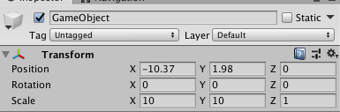
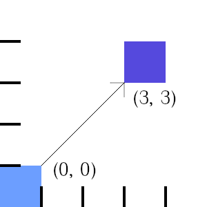
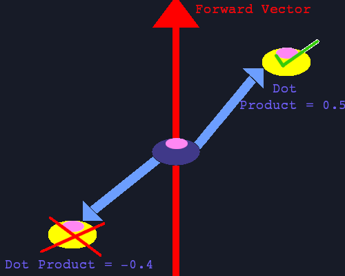
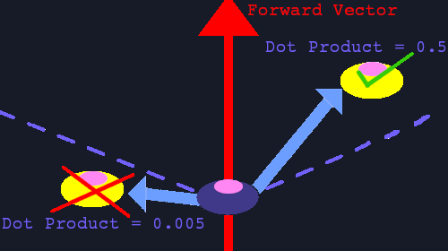

### What is a Vector?
In essence, a Vector is a mathematical unit that can consist of more than one value. Its important to distinguish between vectors in traditional mathematics and in game engines, in this tutorial I will be discussing the practical parts for game development only. Vectors have a “length” or “magnitude” (you can find out how to calculate that here) that can be used to quantify the vectors total size.

In game development, vectors have two or three dimensions (depending on whether you are making a 2D or 3D game) and are generally used to represent geometrical properties of objects within the game world (rotation, position, etc.).



I will be describing the following topics in the context of game development rather than theoretical maths, but many of the things discussed are obviously rooted there and studying both will give you a better foundation of understanding.

### Vectors for Positioning

In game development, the most common use of a vector is for positioning. Say I am creating a 2D game, then a positional Vector (0, 0) might indicate that a given object is at the center of the game world. Now, lets say that I want to manipulate the vector by adding to its position. This works just as you would expect – here is an example where a vector (2, 3) is added to our current one (it works as expected for subtraction).



Displacement that occurs when adding a Vector (3,3) to a Vector (0, 0)
Operations like multiplication or division can only be performed on Vectors using scalars, single values that we apply to all dimensions of the vector. For example, we can take the value 2 as our scalar. We can then multiply a vector (3, 3) by our scalar to get a vector (6, 6). This can be really useful for positioning as well, especially when we combine it with directional vectors.

### Vectors for Directions

Knowing the directions of objects can allow us to manipulate them in interesting ways. Vectors can also be used to indicate direction. A directional vector has one important property in game engines that distinguishes it from vectors used to represent other properties – it is always normalized. Normalized vectors have the property their length (or magnitude) is always equal to 1. The reason that this is desirable, is because we want to make sure that we have all our directional vectors standardized in some way to prevent unwanted behavior. Most game engines come with a function that lets us normalize a Vector.

#### Getting the Directional Vector pointing from one position to another

A common use case for directional vectors is to calculate the vector that tells us the direction of one object relative to another. Let’s take the simple example of moving one object (Object A) towards another (Object B). Our first step is to subtract the position from Object A (our origin) from the position of Object B (the position we want to have direction from our origin). Then, we just need to normalize our resulting Vector!

```
    public Transform otherObject; // This is set externally via the Unity GUI
    void Update(){
        float speed = 3.0f;
        Vector3 dirToObject = (otherObject.position - this.transform.position).normalized;
    }
```

#### Moving an Object along a particular Direction

Now, let’s say we want our Object A to move towards Object B. We know that we can multiply our vectors by scalars. Since we have our directional vector, we can start moving towards it by multiplying our directional, normalized vector by a speed scalar and continuously add the result to our object’s current position. Here is how this would look in the code for Unity:

```
public Transform otherObject; // This is set externally via the Unity GUI
void Update() {
    float speed = 3.0f;
    Vector3 movementDir = (otherObject.position - transform.position).normalized;
    transform.position += movementDir _ Time.deltaTime _ speed;
}
```

### Vectors to analyse relations between Objects (Dot Product)

The dot product can be used to multiply vectors, but is generally used in game development to determine the difference between vectors (again, something I’d suggest reading more on). In the case of directional vectors, that difference is very useful, because it gives us a measurement of the degree to which two vectors are pointing in the same direction! Our dot product can have values in the range -1 to 1, with 1 meaning that the two vectors are pointing in the exact same direction and -1 that they are pointing in opposite directions, while a value near 0 means that they are at a 90° angle (for two dimensional vectors that is). How is this useful?

#### Checking whether two Objects are facing one-another

Let’s say I am making a game where the player is trying to hide from some guards. I want to make sure that the guard can’t see my player i.e. the player is standing behind the guard. We already learned how to calculate the direction of one object to another, we need to subtract the position of the guard from the player’s and normalize the resulting vector.

If we want to see if our guard is facing the player, we are going to need the directional vector that represents the forward facing direction. We can calculate this using the previous methods, but fortunately the most common game engines (Unity, Unreal) offer methods out of the box that gives this vector. Now, we know that if our dot product has a value of 1, the two vectors are going to be facing the same direction. If our player is behind the guard, the dot product must be negative! It’s best shown with a diagram:



Right now, our guard has a perfectly horizontal line of sight. If we wanted to have something that is more cone-like as we are used to in most games, we can add a threshold that checks that the dot product is not at least over a certain value:



Here is some Unity code to replicate this:

```
public Transform otherObject;
// Start is called before the first frame update
void Start() {
    Vector3 dirTowardsOtherObject = (otherObject.position - transform.position).normalized;
    float dotProduct = Vector3.Dot(dirTowardsOtherObject, transform.forward);
    if (dotProduct > 0.1f) // our threshold is 0.1
    {
        Debug.Log("Can see object!");
    }
    else
    {
        Debug.Log("Cant see object!");
    }
}
```

Calculating the Angle between the two Vectors
Maths avid readers that went through the external link on the dot product and looked at the formula might also realize that the reason for our normalized value range of (-1 to 1) is because we are moving within the cosine range. For everyone else, the tldr is that we can use the acosine function on the dot product to calculate the angular difference between these two vectors. We just got to extend the previous code like this:

```
Debug.Log(Mathf.Acos(dotProduct) \* Mathf.Rad2Deg);
```

Conclusion
I hoped you enjoyed this short introduction to what you can do with vectors for game development! There are still a lot more things that I could cover (projections, interpolation, etc.), so please leave a comment if you would want to learn more.
