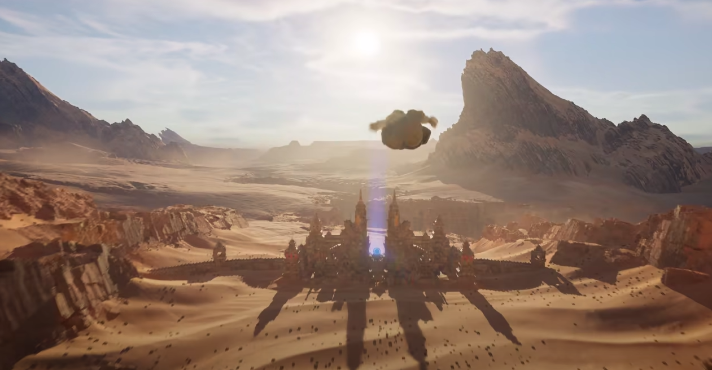

A game engine is the foundation of any video game, being the core software in
which games are developed. With most professional game engines open to the
public for free, it can be hard to decide which engine to choose for your next
project. This article will outline what we perceive to be the best game engines to for 2021 and
try to help you in making the decision of which engine to choose for future game
development.

## Unreal Engine 5

### Overview

**Pricing: Unreleased**  

**Developer: Epic Games**  

**Release Year: 2021**  

[Website](https://www.unrealengine.com/en-US/)  

Unreal Engine 4 has already had a huge impact on the games industry, with its
high fidelity graphics, yet fast “blueprint” visual scripting work flows putting both
power and convenience in the hands of indie developers. In addition, the code
for the engine was open source, allowing developers to make their own
modifications, something their biggest competitor Unity had never done.

*Unreal Engine 4's Tech Demo showed off lighting and effects that were groundbreaking for its time*

This year, Epic Games announced that they are bringing out a new version of
their engine, Unreal Engine 5. Unreal Engine 5’s improvements over its
predecessor will help developers make the most of the new hardware standards
set by the upcoming PlayStation 5 and Xbox Series X. Unreal Engine has been
known for pioneering graphically intensive games, from Unreal Tournament to
the recently released Final Fantasy VII Remake. As the engine is developed by
Epic Games, by using their engine and subsequently releasing to their Epic
Games Store you gain the benefit of having a lower share of your profits taken
upon release.

### Why its relevant in the Future

Unreal Engine 5 will introduce two major features to help developers create more
immersive games. The first is Lumen which will utilise Dynamic Global
Illumination to help in-game AI and detailed geometry react seamlessly to
changes in light without having to bake first. The second feature is Nanite which
will allow developers to make use of cinematic assets without having to adjust
them for the engine. This means no more worrying about high polygon counts
and promises to help developers implement “art that just works”. 

Further atmospheric improvements include the inclusion of better game audio, including
convolution reverb to simulate caves, sound field rendering and specialized
audio (something the PlayStation 5 has already been promoting it will make use
of with its Tempest Engine). On the gameplay side of things, animations are
meant to become smoother with new ‘fluid simulations’ and an improved
Niagara effects system is meant to better simulate swarm behaviour. Lastly, the
Chaos Physics System promises to not only create more realistic movement of
assets in the game, but help modify IK and body position to make player
animations, such as scaling a wall, more accurate with foot placement and
motion warping adapting to the more accurate assets promised through use of
the Nanite feature.

*The [Unreal Engine 5 Demo](https://www.youtube.com/watch?v=qC5KtatMcUw) showed us interactive and super high fidelity environments, made possible by nanite technology*

## Unity

### Overview

**Pricing: Free (if revenue or funding is less than $100K in last 12 months)**  

**Developer: Unity Technologies**  

**Release Year: 2005**  

[Website](https://unity.com/)  

Unity has become a staple for indie developers due to its free price, countless
online learning resources and a vast Asset Store to help small teams lacking
specific skills. It was also one of the first publicly available, commercial 3D
engines that focused on making game development accessible and easy for
everyone, which allowed it to gain a lot of popularity in its early years.

### Why its relevant in the Future

The reason Unity will be important in 2021 can be summed up into one phrase:
Virtual Reality. With Unity being “used to create over 60% of all AR/VR content”,
it will no doubt remain crucial in creating VR games in 2021. With greater
accessibility of VR devices and trends in greater expenditure in the VR [industry](https://www.forbes.com/sites/bernardmarr/2020/01/24/the-5-biggest-virtual-and-augmented-reality-trends-in-2020-everyone-should-know-about/ad3415f24a8d) 
in the upcoming future, more and more people will be
developing for VR. When looking at Unity’s roadmap for the [future](https://unity3d.com/unity/roadmap) there are many interesting features in
development and even more currently under investigation and being researched.

While full physical light support and visual scripting are things of the future,
generic IK currently in development and major shader and lighting improvements
currently in Beta, Unity is no doubt an engine that will only continue to improve. 
Taking a few lessons from Unreal Engine's playbook, they have focused on opening up 
more of the render pipeline for developers to tinker with and added visual shader scripting 
capabilities.

Its safe to say that while Unity has been falling behind slightly, they are learning from their mistakes and 
looking to make a comeback in 2021. Consistent aims at keeping its engine free for smaller developers and support by
the developers make Unity a safe bet for 2021 no matter what type of game one wishes to develop.

## Source 2

### Overview

**Pricing: Unreleased**  

**Developer: Valve**  

**Release Year: 2015**  

Source 2 is the predecessor to Valve’s Source engine, which has not seen major
updates since the release of 2004’s Counter Strike: Source. For its time, the
Source engine laid the graphical foundations for games that revolutionized 3D
gaming, for example the Half-Life 2 games series. It was also the first engine to
feature fully simulated game physics.

While Source 2 has already been used to develop games such as Dota 2, it was
the release of the critically acclaimed Half-Life Alyx that showcased what the
new engine is truly capable of.

*In the immersive world of Half-Life Alyx, even [bottles](https://www.youtube.com/watch?v=mVQNMmnIqMo) behave the way you expect them to thanks to Source 2 graphics*

#### Why its relevant in the Future

Source 2 is yet another engine that has potential to spur greater development in
the direction of Virtual Reality in 2021. With support for the Vulkan Graphical API
and Valve’s in-house physics engine Rubikon, its clear that this is a step up from
the now fairly outdated first Source engine. While Valve has made promises to
release the engine to the public for free, it remains uncertain to what extent the
public will have access. While Gary Newman, the creator of Gary’s Mod, has
announced that he will be working on a sandbox game based on the Source 2
engine, the general public has not gained access to the engine. If released it
would be likely that many turn to the engine to develop VR games, as it would
likely streamline Steam VR development. This would give Steam VR development
an edge over Oculus development, who’s most prominent aid for developers
currently is an asset in the Unity Store, rated at 3 out of 5 stars.

## GameMaker Studio 2

**Pricing: $39 (Creators License)**  

**Release Year: 2017**  

**Developer: Yoyo Games Ltd.**  

[Website](https://www.yoyogames.com/get)  

#### Overview

GameMaker is an enticing choice for many, due to its promises in easing the
barrier of entry into game development with its own streamlined, easy-to-learn
coding language and drag-and-drop functionality. GameMaker’s strength lies in
2D game development and quickly publishing game prototypes.

*Ease of use and accessibility lies at the core of GameMaker*

#### Why its relevant in the Future

While it may not be comparable to the powerhouse that will be UE5 and doesn’t
have the adaptability of Unity, GameMaker’s simplicity holds significant merit
and deserves a spot on this list, for the countless new Indie developers it
continues to [inspire to start their own games](https://www.yoyogames.com/blog/576/making-games-during-the-lockdown).

With pixel art becoming an increasingly popular art style for indie devs, its
seamless integration allowing devs to quickly animate sprites and work with
pixels as a unit and will continue to motivate up-and-coming indie devs.
Depending on what License you buy, you are free to publish to whichever
platform you wish, without incurring any extra charges from the developers of
GameMaker.

## Godot

**Pricing: Free**  

**Release Year: 2007**  

**Developer: Godot Community**  

[Website](https://godotengine.org/features)  

#### Overview

This game engine is another very popular choice for indie game developers,
since it incurs absolutely zero costs on the user and is compatible with visual
scripting. It is an open source engine, meaning that all the code is publicly
available and it can be modified at will. Just like Game Maker Studio, Godot
allows you to use pixels as a unit and animate sprites within the engine itself.
This has led to the development of some beautiful games such as the recently
released ‘Primal Light’, whose developers we had the honour of [interviewing](https://www.youtube.com/watch?v=AUK_VXUsZP0&t=536s) on
our weekly podcast.

#### Why its relevant in the Future

The fact that Godot offers a non-commercial, fully open and community driven
alternative in the game engine space alone makes it worthwhile to keep an eye
out for it. While it still lacks the features that are commonly seen in more mature
engines, they are quickly catching up. Features like physical based rendering
and virtual/augmented reality development support have already made their
way into the engine, however these might not be as mature as they are on other
products like Unity or Unreal.  

While programming in Godot is mainly done using its primary language called
‘GDScript’, the developers are currently working on implementing a wider range
of different languages, to help you use whichever language you are comfortable
with. The developers are currently seeking donations on their Patreon to help
expand their engine’s C## functionality. Another aspect that Godot’s developers
are working on right now are some aspects of the 3D graphics where Godot is
still quite behind.  

*Godot only recently got global illumination, a feature most other 3D engines had for a while*

Godot’s creators have always stated that they wish to develop for the long term,
ensuring that each feature they implement is done to the best of their ability and
to ensure compatibility and reduce need for alteration in the future. If you want
to find out more about the history and vision of Godot, I recommend listening to
this very interesting [podcast interview](https://softwareengineeringdaily.com/2020/04/06/godot-game-engine-with-juan-linietsky/) with Juan Linietsky, who is the person that started the Godot project.

Hope you enjoyed our list! Please leave a comment if you have your own speculations - we love hearing your thoughts!

