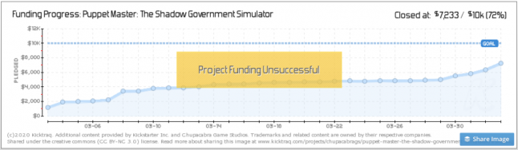
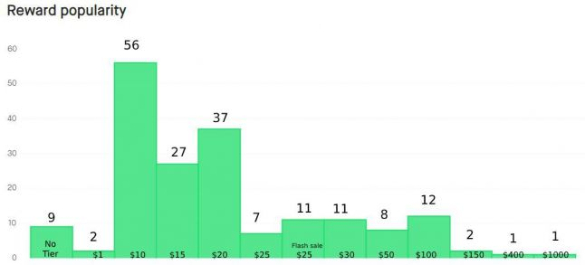
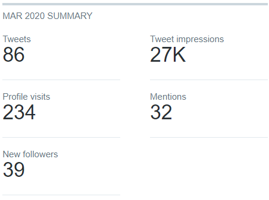
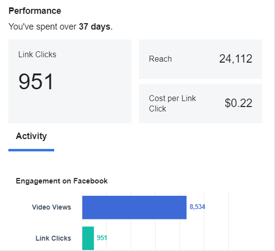
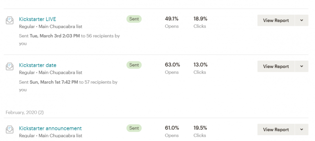
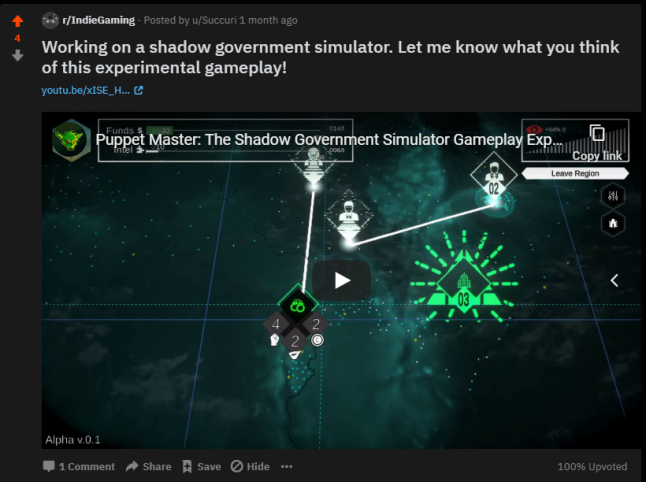
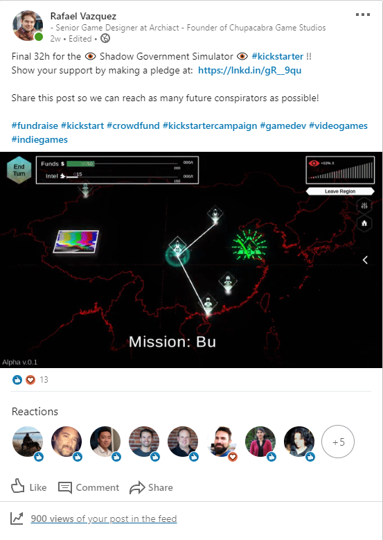
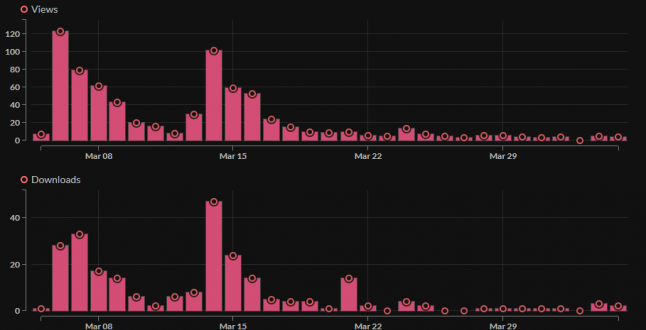
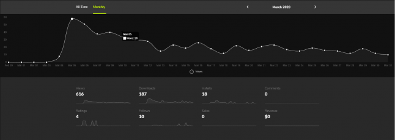

It's a bit of a truism that people tend to share success stories, but really learn more from failures. The games industry is not immune to this, and even though we all know what an average hit rate is for a studio; we don’t really hear a lot about the untold masses of game devs who are trying their best, but still fall short. Now it’s my turn to put my money where my mouth is and tell you all how my Kickstarter failed, where it went wrong and what could have been done differently.  During the journey I will share every last shred of data I have to give you a behind the scene look at the campaign.
  
Hi! I’m Rafa Vazquez! I’ve been a game designer for over 10 years working in companies of all shapes and sizes; from mobile and medical games to VR and consoles.  Just like a lot of you out there however, I always dreamed of making my own game; one where I got to control all the levers. With that goal in mind, I one day  asked my manager at Archiact Interactive to reduce me to part-time so I could dedicate some time to my own project.  They were extremely gracious and supportive and allowed me to take that gamble. 
  
Hence on January 1st,2019 I created Chupacabra Game Studios and started working on my very own indie game Puppet Master: The Shadow Government Simulator. It’s a puzzle/strategy game where you are the Illuminati, taking over nations via bribery/seduction/assassination. A game where you play chess vs the world’s governments from the shadows.

### Why Kickstarter? 

So why go through the trouble of a Kickstarter then? In my mind, a KS was a great way to validate if people were willing to spend money on the game. It was meant to be a go-no go gate for the project. I had budgeted that my game had so far cost me about 20k CAD (in lost salary) to make  and that it would take me about 3-4 more months to get it to market. That would cost around an extra 8k so, in my mind, if I could reach enough people to get 10k (the required budget + KS fees and taxes), then it would make a lot of sense to finish the game and launch it.  
   
The plan was to launch it in November of that year, but some contract work that came my way pushed it for a month. Unfortunately, that month is December, and I thought it was a terrible idea to launch a KS anywhere near Christmas. The date then changed to February 2020 (giving everyone’s wallets time to recover from the festivities). I decided to take the extra months to polish the game and do extra iterations on marketing material.
  
### The Campaign 
This is what my page looked like at the start of the campaign. 
  
I understand the importance of the first days to get momentum: the more people sign up in those first days, the more likely you are to be featured by KS and get in on that sweet, sweet organic traffic. 
  
So, a week before the campaign started, I emailed my mailing list; letting them know the campaign was about to begin and that I needed their support on day 1. Likewise, I sent messages on my Discord, Twitter and emailed a lot of press of different sizes (~30 sites that I knew would be interested in indie or strategy games). 
   
I also set up an account at [distribute()](https://dodistribute.com/) and [indieBoost](https://indieboost.com/), in order to help control keys that went out and allow smaller streamers and youtubers to ask for keys. 
  
Here’s what the full picture of the campaign looked like: 
  

  
You can find the chart in more detail at [Kicktraq](https://www.kicktraq.com/projects/chupacabrags/puppet-master-the-shadow-government-simulator/). Let’s take a closer look at my actions during the campaign. 

### Tiers

First off I’m sure you’re wondering about my tier strategy. You can check them out yourself at the campaing page, but I’ll give you the cliff notes version here.  There were $1, $10, $15, $20 (early bird), $25 $30, $50, $100, $150 (early bird), $250, $400 and $1000 tiers (all in CAD). 

Some notes on why I chose these tiers: 
  
- The $1 tier was made to help drive pledges, even for people who were on the fence about the project.  It has a total of 2 pledges, so I don’t think this was successful in that regard (I don’t think it hurt either). 
   
- $10 is the smallest tier that includes the game. I chose this because my aim was to sell the game for $15 bucks when fully finished, so I thought that the backers deserved a bit of a discount. 
   
- The $20 and $150 tier were copies of the $25 and $250 respectively. They were limited by number (200 and 25). These values were based off of 30% of my goal, as I was trying to get to that threshold as quickly as possible, and I thought scarcity would help reach that.Unfortunately, this might have hurt the campaign, as late comers still had plenty of opportunity to buy into the “early bird” deals. 
   
- The $25 tier was considered my main tier, I took special care to make it really juicy. This is because, according to my research, ~$20 is the average KS pledge for games. 
   
- There were 2 high tier supporters ($400-$1K), who were friends and family. That being, said they were still the largest portion of the pledges. 

### Marketing Channel Results

#### Twitter 
Before, during and after the campaign I tweeted at least once a day. For the most part they were tweets highlighting parts of the game, though I would tweet about other games and Kickstarters on occasion. After the second week I discovered the amazing tool [Buffer](https://buffer.com/), and was able to schedule up to 3 tweets a day at different times. In this area, the lack of art variety really hurt, and it was a struggle to come up with new ways of using the assets I already had to keep things interesting. In terms of traffic to the Kickstarter itself I got 163 visits from that source and 5 pledges. After a month of twets, these were the results:

#### Facebook 
During the start of the campaign I posted news about it on my Facebook page. Of course, my friends and family already knew about the campaign and it was an easy way for them to join in (more on that later). On top of that however, I ran a FB ad campaign during the whole thing. It started as a low-budget affair ($6.00 CAD a day) as I iterated on the ad and demographic itself.  That gave me around 30-50 page visits a day. 

The ad performed really well (3.9% clickthrough rate!), so there were a few days (March 10-12) where I bumped the budget to $20 a day, reaching more people per day (~110). However, I noticed an issue; these people, although they were visiting the site, weren’t pledging. I only got 10 pledges from the 830 people that visited the Kickstarter. 

#### Email 
During the months preceding the campaign, I used the open alpha as a way to get people to subscribe to my mailing list. The way to participate in the alpha was to join my Discord and then get a key via email sign up. Once the testing period ended, I gave away one track of the game’s soundtrack as a lead magnet for people to join the list. I would also take my iPad to game showcases and have it set to my website so every player would have an easy way to follow development if they chose so. This gave me what I felt at the time was a hefty number of people. 
  
During the campaign I used my mailing list to get my community (as small as it is) to support early. I sent an email on the ramp up to the campaign (one week before the start), as it was becoming imminent (three days before) and at day 0. After that I would keep them up to date about once a week. In the ramp up the campaign, my open rates were about 60%, while my click rates were between 10-20%. During the campaign itself, these dropped to 30-40% and 5-10% respectively.  

Unfortunately, I don’t have stats on how many of those turned into pledges; as the emails were sent before the campaign started and I didn’t have a way to create specific referral tags; however, looking at the MailChimp stats we can assume it was about 10-20 people.

#### Reddit 
One of the biggest suggestions I had going into the campaign was that I should show my game on reddit and direct people to the Kickstarter page from there. The idea would be to get people excited about the game and move forward from that. I took this to heart and heavily posted on reddit new content. First, I searched for reddits that would be interested in my type of game and themes and looked for which ones allowed for self-promotion (some are surprisingly harsh with respect to this). I found 25reddits that had to do with either indie, strategy games and crowdfunding. I even added in r/conspiracy for good measure. I posted in most subs the first days of the campaign and then spread out additional posts throughout the different subreddits so as to not saturate any single one. 
  
The best I response I got was 42 upvotes. It wasn’t directly tied to the campaign, but to a game design article I wrote about the game (more on that later ;) ). In total I had only 13 visitors from reddit and 0 backers. Given the effort it took, particularly to create new art assets to keep them relevant, and the low payoff, I stopped using this medium in the latter half of the campaign. 

This is what a typical post would look like. I would link to the KS in the first comment so as to not be too preachy. 

#### Gamasutra 
During the campaign I wrote a [Gamasutra post](https://www.gamasutra.com/blogs/RafaelVazquez/20200309/359272/5_Practical_game_design_tools_to_help_design_your_game.php) on the design process behind Puppet Master. Because the game has experimental gameplay, I thought it would be interesting for game developers to hear about it and perhaps entice them enough to share it or pledge. It also served as an additional news piece that I could share on other media (reddit, twitter, etc...). 

I got 31 people visiting directly from that piece of which, as far as I can tell, no one pledged. 

#### LinkedIn 
I’ve been in the industry for a while and have changed companies often. This means that one of the best ways I have to keep in touch with former colleagues and friends is through LinkedIn; so, I decided to leverage that. I made three main posts in linkedIn during the campaign: 

- On launch of the campaign (399 views, 57 likes) 
- One when I released my gamasutra article (62 views, 33 likes) 
- One 32h before closing the campaign (893 views, 13 likes) 

In total I had 50 people visit my campaign from this site and 4 pledges. 

#### Press 
About a week before the campaign I made a media push trying to get press interest in my game. I spent a couple of days going through different game news sites and twitter, looking for journalists that had reviewed similar games (such as Plague Inc) or that mentioned in their profile that they like indie strategy games. Unfortunately, I don’t personally know any journalists, so in all cases these were cold calls. I wrote a personalized email for about 28 different sites with a link to the demo and a [press kit](http://chupacabragamestudios.com/press/sheet.php?p=puppet_master), and did not hear back from any of them. Given the amount of time it took to do research and writing the emails, this was probably the least effective avenue for promoting the campaign. 

### Kickstarter Updates 
One piece of advice I heard the most before the campaign was to update backers consistently throughout the campaign. This, the idea went, would demonstrate how serious I was about the project, and pull in people who might have wishlisted the game (backers and people following the game get emails every time an update is posted). With this in mind, I posted 6 updates, trying to have one at the beginning and at the end of each week. I know other kickstarters use updates as a way to promote extra content (I.e. new levels, new characters), but given that I was the only person working on this, development completely stopped during the campaign. To get around this, most of my posts were either attempts to engage the audience by asking them questions, or to highlight behind-the-scenes aspects of the project I thought they’d find interesting.  

**There was one exception however: CATS!**

Due to how the game is structured, it is very easy for me to make factions and units. The idea was to make it extensible. After the campaign started, I decided to hastily make a faction which consisted solely of cats, and offer it as a unique KS reward. It was a fun gag that I thought some backers would enjoy, especially if one of the rewards was to be able to upload videos of their own pets. 

I called it the IllumiCATi update and priced the new tier ($25) at slightly above my main tier ($20), to see how many people would upgrade. I made sure to let everyone know that tiers above that included the new faction. I also made it a limited time 48h tier, to try and drive in new backers. I posted it in all channels, and then waited. 
  
The media push did result in more visitors to the page (164 as opposed to the average of ~80) and it did convince quite a few backers to upgrade; however, it didn’t increase the total number of backers significantly (6 new backers during the sale).  
   
In terms of engagement of the average KS update, I would get 4-7 likes and around 2-3 comments per update. Ironically, the most successful update was the one announcing the next steps after the failed campaign, haha. 
 

### Demos 
In the first few days of the campaign I released a demo on itch.io and gamejolt. As mentioned in the previous article these linked back to the campaign, but they were not mentioned on the campaign itself. I linked to KS in three main parts: the store page of the game, in the main menu and, once the demo is over, in a popup message that appeared before players.  

The itch data looked like this:

I had a total of 929 views and 317 downloads. In terms of engagement with the campaign however, I only received 30 visitors, none of which pledged. 
  
As per Game Jolt, during the month of March the stats look like this: 

  

With 53 more views added at the beginning of April (unfortunately Game Jolt doesn’t allow you to create custom ranges). According to Google Analytics, I got 5 visitors to my campaign page from that site, one of which pledged. 
  
One caveat with these figures is that people might have jumped around between sources. For example, they could have read on twitter about my Gamasutra article, from there wishlist on KS which then sent them a reminder email and then they pledged. I’m sure that happened, but I wouldn’t be able to track that. 

### Conclusion

That’s the long version of what my campaign looked like. Some marketing venues were hands down better than others, but at the end of the day there were not enough to bring the minimum amount of people to the campaign page for it to be successful. As you can see in the chart below, during most of my campaign I was under 100 visitors a day. The spikes we see are the start/end (as expected due to increased exposure on Kickstarter) and the increased Facebook ad (March 10-12), which drew more traffic but not more pledgers, and which I wouldn’t be able to sustain financially for an entire campaign. 
  
So, what did I learn from all this? What would I do differently if I did this again? Well, that will have to wait for next time. In the meantime, I want to hear your thoughts/opinions; please share them on my discord, twitter or comments (linked below) and we can keep chatting about the game, the kickstarter or life in general. You can also wishlist the game here:

<iframe src="https://store.steampowered.com/widget/1281190/" frameborder="0" width="100%" height="200"></iframe>

Happy Conspiring!  
Rafa 