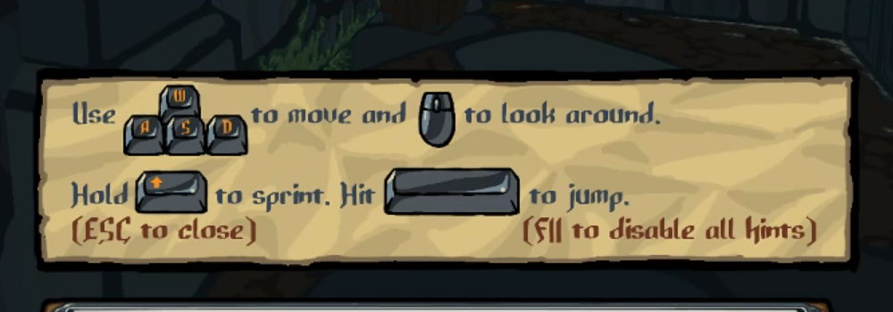

**What is your background and what led to you getting into game development?**  
  
I am currently an illustration student in the german city of Hamburg. Like most, I got into game development because I liked to play games as a kid and wanted to build my own. It’s also one of the reasons I got into art, I enjoy the fact that game development has a little bit of everything in there. Currently, I am looking for new opportunities as an employee at games companies once I finished developing Slasher’s Keep.
  
**Can you give us a time-laps of how Slasher’s Keep? How long did it take to develop?**  
  
Slasher’s Keep has been in development for a very long time, about 5 years. The reason it took so long was primarily due to the fact that I had miscalculated the amount of time and effort it would take to develop several aspects of the game. Even though I had thought that I was not doing something overly ambitious, I really had no concept of what that meant and ended up opening up a very large can of worms.
  
**You created a viral game called Double Hitler, which got featured by the likes of Pewdiepie and Markiplier. Were you able to maintain contact to some of those streamers that played your game?**  
  
Unfortunately, that was not the case. I actually developed Double Hitler for a class and it was a side project I had going on next to Slasher’s Keep. Even though it got lots of views, I didn’t feel like it had a big impact on my current game in terms of exposure, yet I like to mention that I am the developer when messaging press about it.
  
 

**What engine was used to develop the game and why?**  
  
I went with Unity because from my research, that was simply what I found a lot of people were using. I went to art school, so the way I learned to code was through some courses in high school and essentially by solving problems as I had to – this was a very effective manner of learning by doing, but also left me with some problems showing up later in development, where the less experienced approach I had to development began to show. I ended up making a lot of things more complicated than I had to.
  
**First person melee systems are not easy to design. How did you approach that when creating your game?**  
  
Initially, I struggled to get something going that was fun, at first the player had to swipe their mouse across the screen to simulate the attacks (mainly an attempt to do something novel). The biggest issue was that it really slowed down the game at every encounter, so I eventually scraped my initial design and took heavy inspiration from Dark Messiah, a game that had a very satisfying melee combat system. I went for a little bit of realism there, by forcing the player to actually connect their blade with the enemies when parrying, which I think works quite nicely. The angles at which enemies attack is also randomized, so that keeps parrying fresh and interesting. Inspiration from Dark Messiah also led to the inclusion of the sack smack, a player ability that allows them to force push enemies into traps using their inventory sack (in Dark Messiah, the player could kick enemies for a similar effect).
  
**What similar titles inspired the gameplay?**  
  
I mentioned that Dark Messiah was a big influence on the combat. People often think that other games influenced me as well, based on the similarity to titles they know, like the classic Doom or Daggerfall because of the 2D sprites in 3D, but that is almost just coincidental. A bigger inspiration was Hack Slash Loot, which I’d like to have played as a 3D live action game – so I just decided to make that!
  
**You mentioned the sack smack, I think that leads well into a discussion about how the environment plays an important role in the combat. The player can smack enemies into spikes, throw them down pits and use physics to crush them. How did you come up with this aspect of the game?**  
  
It came quite naturally after adding the sack slap ability and was honestly a godsend, because it helped add a lot of depth. It quickly became a core piece of the gameplay.
  

**The game is very challenging and has a steep learning curve. What did you do to teach the player and encourage gradual improvement at the game?**  
  
Player attention spans these days are very small. One thing I noticed when developing the game is that people often don’t want to spend time reading text to understand the game. For example, many early access players would complain that attacks had too little impact, not realizing that you can charge the attacks for stronger hits. It was then that I realized I need to implement a convenient system that would teach players the game without frustrating them and “forcing” them to read text. I created some animated pop ups that would show up early in the game, that would demonstrate actions the player can perform with the correlating commands underneath. I also considered adding a tutorial level, but realized that this would only lead to a small improvement in making players familiar with the game, while taking up a huge time to make.
  

Another thing I added was a small miniboss that appears at the end of each first floor. He is designed to force you to use your loot sack, teaching the player the importance of the environment for combat. A fun detail is that he is actually carrying a loot sack of his own and can throw you into the spikes as well.
  
  

**Can you go into details for some of the procedural generation in your game?**  
  
My initial thought was – random generation meant infinite content, so I wanted to add it to many aspects of the game. I quickly realized that to get something out of this type of system, you need to put a lot of effort in.
  
I began with generating rooms, initially just scattering random objects around and it just didn’t work well. My new approach was to creating different room types that had their own way of generating themselves, each had a unique gameplay aspect. This whole thing got very complicated and is very brittle, so my recommended approach would now be to just create prefab rooms where only small elements are swapped out, rather than going as in-depth as I did.
  
**You have a Diablo style inventory system but also full controller support. How did you get that feature to be accessible and work without the mouse?**  
  
The original Diablo went about it by replacing the entire inventory system for consoles, but I didn’t have that much time. Instead, I made sure that only items which you can interact with were actually select-able and allowed users to move the items around the grid using the joystick. 
  

**Your game uses 2D sprites for a lot of objects in the game. What made you choose that over going for 3D art? How did that impact the gameplay and design?**  
  
Initially, I thought that using 2D sprites in 3D would make things much easier and accelerate the development, especially given that I have a background in 2D art. Soon, this turn out to be false, because I found myself having to create multiple versions of enemies from the different possible perspectives that they could be facing the player. Another issue was with how the the objects began to look as the player go closer, sometimes I added additional sprites when this was the case. 
  
One way I found to cut corners here was by adding more round objects, which looked the same from all perspectives (hence why vases and slimes were easier to add to the game). 
  

Mirroring all enemy sprites cut down the number of art and complexity by a lot as well. Eventually, I created a system where I separated the arms from the body of some enemies so that I could animate them in 3D – this had to do with the mechanic that I talked about earlier, where the enemies attack has to actually line up with your own blade.

I also struggled to debug how the objects would look in 3D, so I began rendering the entire sprite sheet onto objects to give me that feedback a little bit faster. Either way, I began to cut down on this system by making certain objects 3D, like the various physics items. 
  
Either way, I’d say – if you are going for a visual style, you gotta go all the way. I thought initially that perhaps I could go into visual detail for some parts of the game, but cut corners on others. I think that this is a fallacy, because the most important part with any art style is consistency. That’s why a good idea in my opinion is to consider going with an abstract art style to begin with that is easier to make and stick with that.
  
Fun fact: the reason for the inventory sack being used over doing a kick like in Dark Messiah came from the need to save some time with the art – I didn’t want to create an animation for every type of pants there was as well!
  
**You mentioned that you did the coding and art by yourself – what about the audio?**  
  
I developed the audio myself as well. While composers often offered to create music for my game, I see a lot of indie games which end up with music that doesn’t quite fit and didn’t have the money anyway. By doing everything myself, I can make sure that I everything is on par with my exceptions and overall vision for the game. I actually recorded the string instruments myself, most of the other stuff was implemented electronically. As for the voice acting, I took inspiration from various actors and characters in shows that I watched. I taught myself the accents for each character!
    
**What was your experience with Early Access?**  
  
Initially, my goal was not to add anything new during early access and just focus on polish – but I ended up adding a whole lot more! New enemies, bosses, mechanics, etc. Many people have good ideas, often they are hard to implement cause folks aren’t as aware of the systems I have in place, but sometimes I figure out something similar to satisfy them. Feature creep is also a big culprit as well. 
  
One interesting thing I noticed is that people will have associations with your game (in my case, a common one was Daggerfall) and they will expect you to take the game down that route. Another example was Borderlands, which has multiplayer and so some naturally assumed my game should also have multiplayer (which by the way is NOT happening).
  
The only negative experience I had was where a player posted in the Steam community page of my game that I had abandoned it, because I didn't post for one week. I am someone who deals well with criticism, but in this case it felt justified to delete the post, simply because it was a blatant lie that would prevent others from buying the game. I could be wrong for doing that, but it felt like the right thing to do!