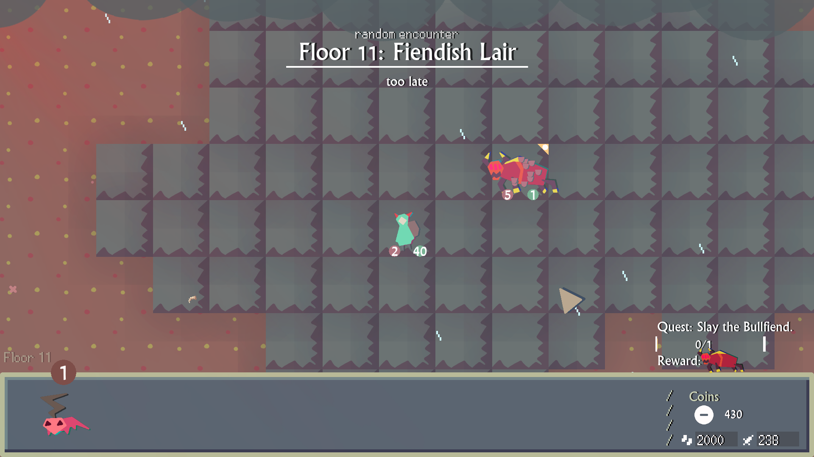
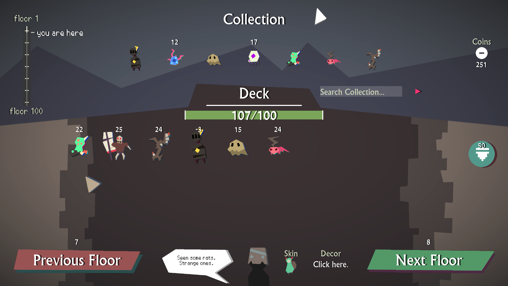
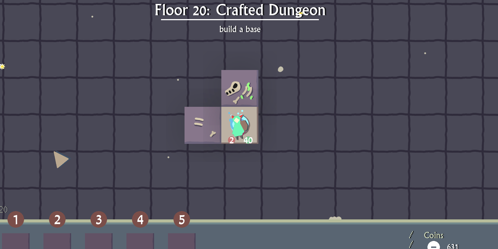

## Can you tell us about your background and how you got into game development? ##
  
I’ve always been a gamer all my life, I played with the gameboy as a kid andmoved on to pc. After player I messed around with programming and pixels. I released my first game in 2019 and it was a big project that took a long time to make. Right now, I’m developing games more as a hobby. 

## Ufflegrim is your latest Game, can you share what it is about? ##

In the game you control a hero who has access to a deck of monsters that you can spawn, each with their own abilities. The monsters can also be played using a secondary mode, which makes them create an effect on the selected tile. Monsters in your deck are also going to appear as enemies in the game world, your main objective is to get to the end of each level without being killed by enemy creatures. The levels are procedurally generated, combat is turn based.

## Please give us a short overview of how long it took you to create the game. ##
  
I had the idea for Ufflegrim in 2015, but in 2016 I started developing my first game which took till early 2019 to release. After that I started working on Ufflegrim. So all in all it took about a year till release, though I intended it to come out much sooner. 

## What tools did you use to develop it? ##
  
The game is created in Game Maker Studio 2, for the art I used GIMP. 

## How did you come up with the art style? ##
  
The art style was simple yet quick to produce, because I am only a 1 man team. Another concern was the need to outsource art to a third party, which didn’t happen but in that case, I wanted to make sure it was easier to reproduce. That’s how I ended up with the paper art style, I added a shadow effect later on to give the flat look some more depth. 

## What made you create a classic Roguelike style Game? ##
  
The tactics focus was always there, it was inspired by the old ultimata grid based games and not actually the original rogue. Those experiences grew my appreciation for the grid based turn based genre, which I wanted to have as the foundation for my game. The idea to add roguelike elements i.e. procedural generation came from the fact that I was burnt out after my first game, which was open world and required me to add a lot of handmade content along with some world building. Adding procedural level generation felt like a great way to cut down on that, while still having a good amount of content that the player can explore.

## Can you explain how you came up with the Creature Synergies and Systems? ##
  
During my earlier project, I learned that if you have a common elements between several components in a game, then it makes it easier to create a connection between these. By adding the typing system, I was able to implement a system that allowed me to add different interactions and strategy to the monster interactions.

## How did you try to mitigate the importance of luck in your game, so that the player feels like they have more control? ##
  
The deck of card cycles through every card ie. you see every card at least once before it resets, so it prevents you from getting duplicates. This was a design decision meant to add some predictability. Creatures are also prevented from spawning near you, so that you can devise a meaningful strategy before entering combat. Having the player to start with at least one card was also really important to prevent unfair situations, as you can at least start tanking a bit of damage with that creature while you draw new cards.

## Creatures can be summoned or used as an Effect - how did you come up with and balance this System? ##  
  
The game takes inspiration from other card games like hearthstone and such, these games have spell and monster cards. You aren’t really playing cards from your hand though, its more about playing the cards from the player so there is a spatial constraint that needs to be considered. To mitigate the limitations of space that can occur on the grid, I decided to combine the two types of cards. This gives the player more choice and makes the cards more versatile, while helps reduce some of that reliance on variance we talked about previously.

##  In Ufflegrim, the player has to hit enemies to draw new cards. What was the design idea behind this mechanic? Did you try other things? ##
  
I did try quite a few different methods of drawing cards, like drawing a card when you walk etc. The problem with these approaches was that they encouraged cheap tactics that usually revolved around a the player trying to draw all their cards outside of combat. Having to attack the enemy adds an element of risk and forces to the player to be more proactive.

## “Deckfill” is a way to constrain the way that players create their decks. How were the points assigned? ##
  
The idea is to limit cards that are too powerful, the player needs to have a minimum of 100 deckfill and this limit was used to make deck building more challenging. There is a big variance in the strength of different monsters, so as a penalty for adding some of the most powerful, the player needs to reduce the consistency of their deck by adding a lot of them (strong monsters generally have lower deckfill). On an interesting side note, deckfill is also tied to monsters spawn rate.

## There is also a feature that lets you handcraft your own dungeon. What role does this serve in improving the player experience? ##   
  
Beta testers wanted to get more ways to spend your coins and increase the value of unlockables. I was looking for some useful and engaging way that lets players sink money, so I ended up with a mode that lets players craft their own dungeon from some of the game tiles. This dungeon can then be used for the survival mode.

## You mentioned testing – how exactly did you proceed there and what was the result? ##   
  
I had 2 main testing waves, alpha and beta. For the alpha, I got  a lot of great feedback and it ened up being one of the biggest reasons for delaying the game. It made me realised that I needed to add more content and smooth out some of the mechanics. The beta was also useful, but primarily helped me discover bugs and didn’t have such a drastic impact on the direction of the game itself.

## Is there anything you learned or tips that you want to give to fellow game developers? ##   
  
Both games I have now released on Steam reinforced that if you standardize things, it gets much easier to build mechanics that make sense. If you set certain rules or constraints, then you can start building things around them, which appear naturally and feel intuitive to the player. That said, you should keep things generic and open enough that you can easily add stuff on top of what you have, but consistent and specific enough so you can make certain assumptions when creating new things.

