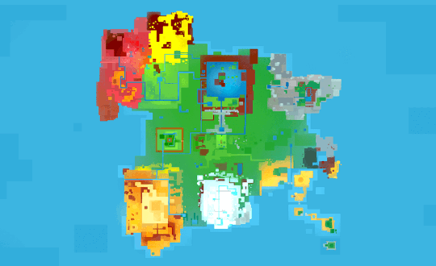

Woodle Tree 2 is a 3D platformer reminiscent of the classics that emerged on consoles like the N64. In this interview, programmer Fabio Ferrara from Chubby Pixel discusses the inspiration behind the design of the game, as well as some of the performance challenges his team had to overcome. 

<iframe src="https://store.steampowered.com/widget/1173740/" frameborder="0" width="100%" height="200"></iframe>

**Can you tell us about the size of your team and each persons background (also, what their job was on the team)? How did you guys meet and decide to develop a game together?**

The team is composed of 3 dedicated team members and several external collaborators. The 3 main figures are: Fabio Ferrara (Game Developer, programmer), Giulia Airoldi (Illustrator and artist), Eric Ferrari (sound designer). We met at University and decided to start our own indie game development studio after we graduated.

**Can you guys gives us a brief time lapse of the development, so that we can get an idea of how much time was spent at each stage – from conception to releasing on steam.**

Regarding the development of the game, it took about 2 years from coming up with the idea to releasing on Steam. The concept of the game only took us about 1 month to come up with, since the main foundation was set in the first game of the series. The level design was probably the hardest and most time intensive part to develop. Since we designed an open world this time, we took almost 8 months to finish the environments.

**What made you choose to design a game based on old school platformers and what games of those days inspired the design of the Woodle Tree games the most?**

The decision to base the game on old school platformers came from the fact that we believe that some of the best gameplay mechanics are still to be found in those games (two of the major inspirations are Mario 64 and Banjo & Kazooie).

**What elements of old school 3d platformer game design will players find in Woodle Tree 2, what will they find that it does differently? How did you guys decide on where to innovate and where to borrow from other games?**

The open world, a multiplayer mode and the challenging yet rewarding platforming levels are some of the features we are most proud of. We also added collectibles that you can use to customise your character and his house. One of our main objectives with this collectables system was to make sure it encouraged discovery, without being too frustrating. The most challenging innovation we implemented is the open world free exploration: we don't know of a similar platformer game that offers this level of exploration.

**The first game came out in 2014 and was well received. What did you guys learn from that game and how have you applied those lessons in terms of the execution and design to the second part?**

We mainly developed the 2nd chapter of the game based on the feedback that we got from the players of the first game: we improved the camera controls and the character movements. We also added a multiplayer mode for up to 4 players, tried to explore more of the story and the game world itself.

**One of the most noticeable differences between the first a second game in the series is that the shaders now give the game a much glossier, brighter and more colorful look. How did you guys come up with and develop this new style?**

One interesting aspect of this new graphic style is that it's based on a performance improvement: since the game is open world and needs to run smoothly on all consoles, we decided to remove all the real time shadows in the game. This gave the game a much brighter and colorful loook! It also adds to the authenticity and character of the game, since the graphic art style and techniques used were similar to the those from the games that inspired us and the hardware limitations that were present at the time they were developed.

**What tools did you use to make Woodle Tree 2? How satisfied were you with your choice?**

We used Unity3D, it is the game engine we use for all our other games. We've been using it for years, so we're experts who know how to get the most out of it and have a lot of awareness in regards to it its capabilities and limits. That said, I wouldn't suggest using it to develop an open world game: it has been a real challenge to keep the performance stable!

**Have you guys ever considered working with a publisher?**

We never had a publisher for our games, since we would like to remain 100% independent. This gives you a lot more freedom, but surely has its negative aspects: if you fail, there is always that risk that you'll not be able to develop your next game.

**What parts of the development went well, what parts would you have done differently given what you know now?**

I have to say that there was a lot of uncertainty as to how the game would end up and if it would be possible to run on Nintendo Switch. But in the end, I'm really proud of the game: the only thing I would have done differently was to add a lot more content before releasing it!